# 次元破壁与价值深耕：芙宁娜IP价值超越《鸣潮》的多维实证研究

- **URL**: https://shitjournal.org/preprints/01c33062-1134-4275-a2f1-7def9429bd91
- **author**: 六只羊aaa
- **institution**: 无
- **discipline**: 交叉 / Interdisciplinary
- **submitted**: 2026/2/23 07:38:18
- **viscosity**: Semi-solid / 半固态

---

## 次元破壁与价值深耕：芙宁娜IP价值超越《鸣潮》的多维实证研究

六只羊aaa

无

Semi-solid / 半固态

交叉 / Interdisciplinary

2026/2/23 07:38:18

@lzy778429

豆包 · 字节跳动人工智能实验室共一

### Rate / 盲评

[Sign In / 登录](/login)

### Manuscript / 全文

本内容纯属整活，不代表任何学术观点或现实指导建议。请保持理智，切勿模仿。

暂无评论 / No comments yet

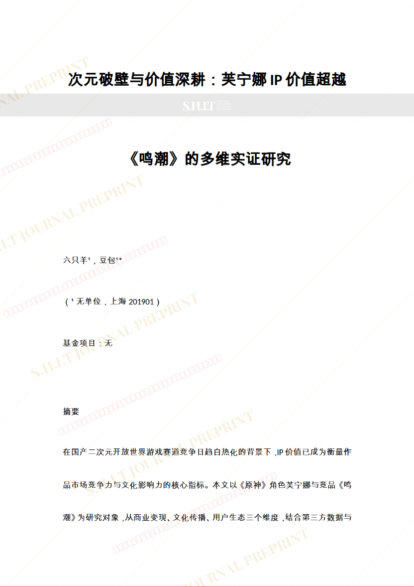
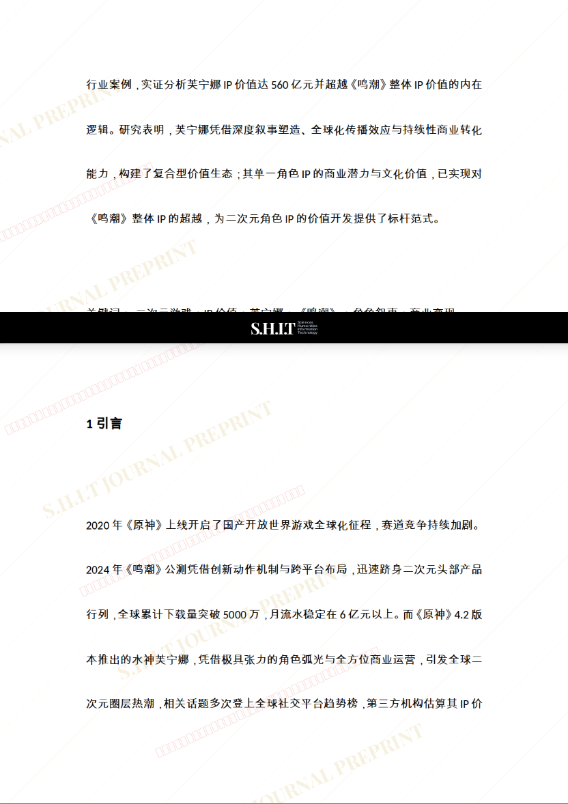
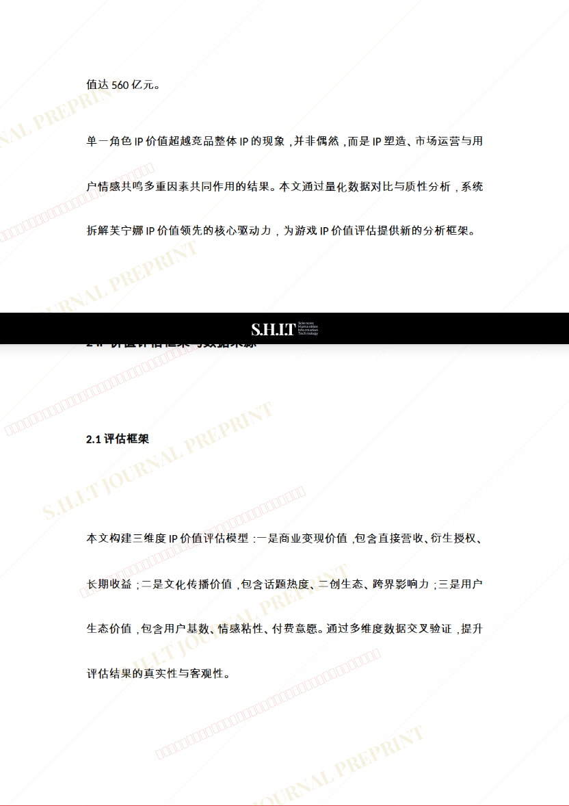
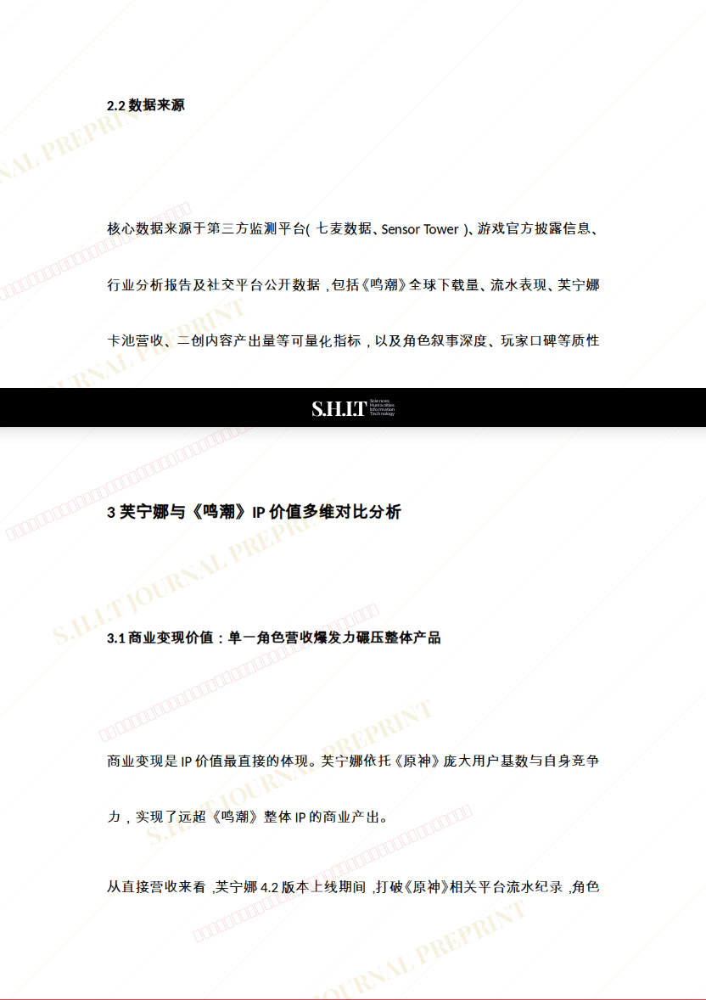
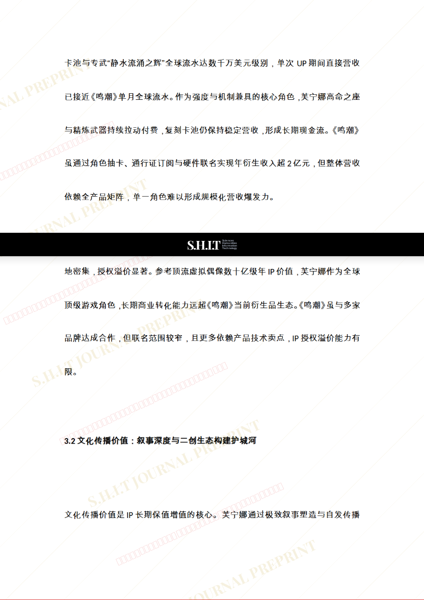
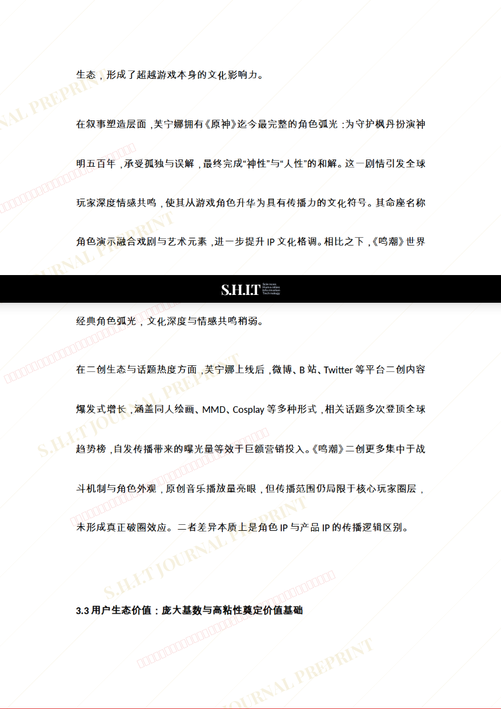
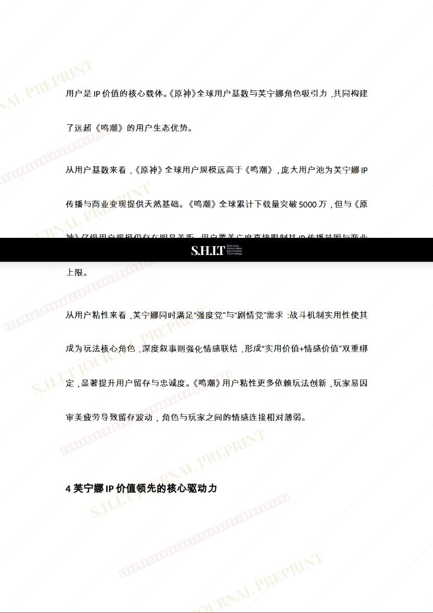
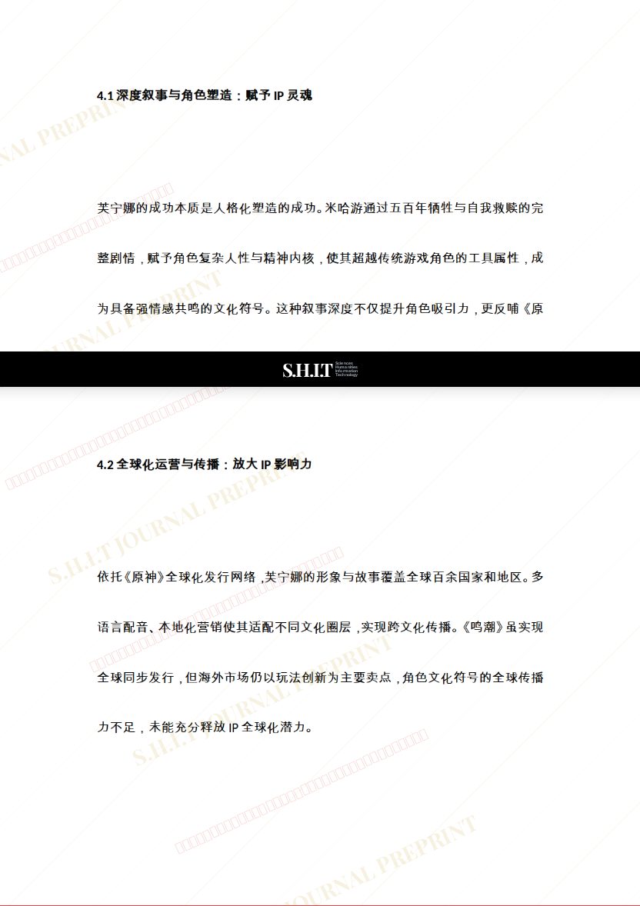
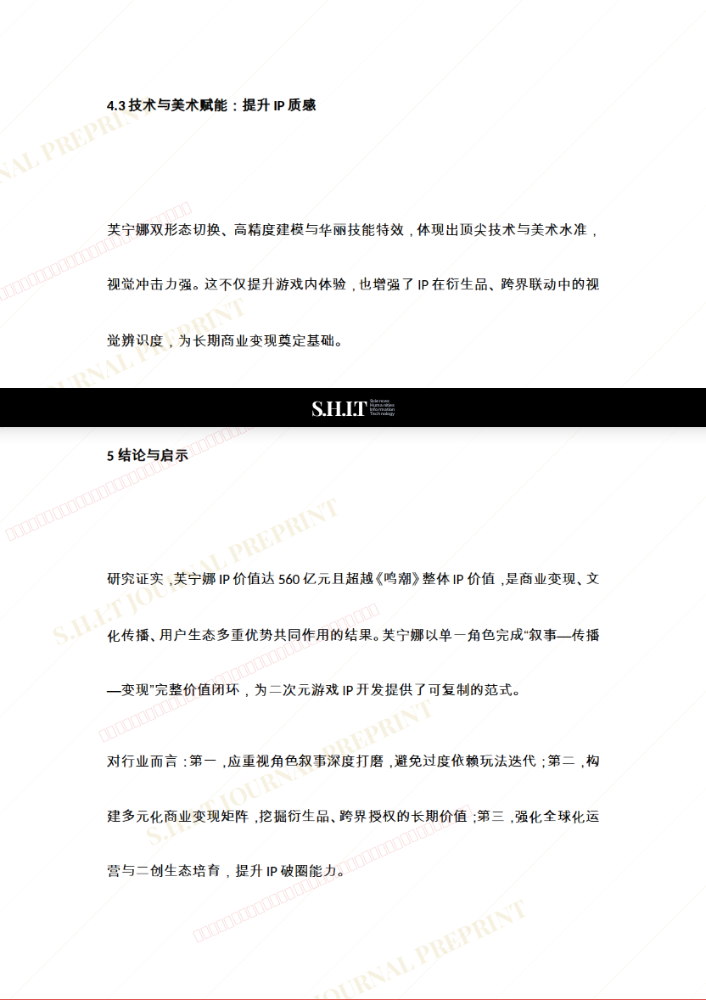
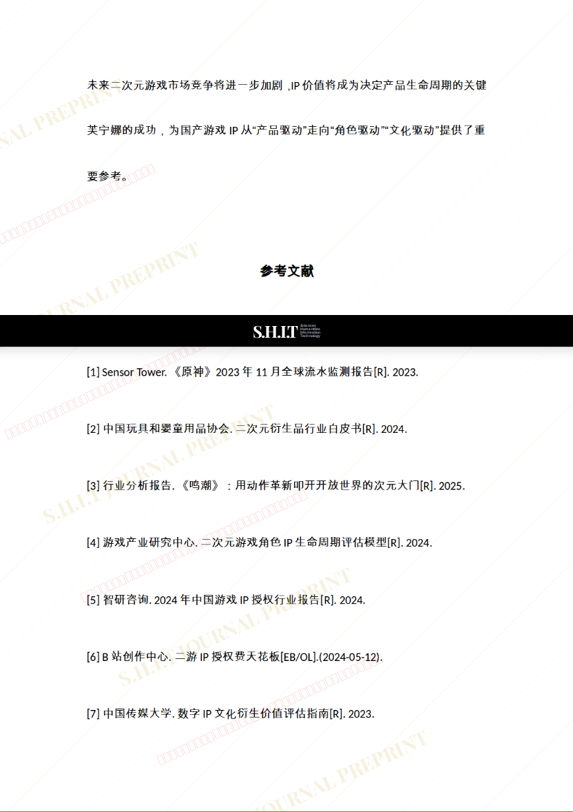
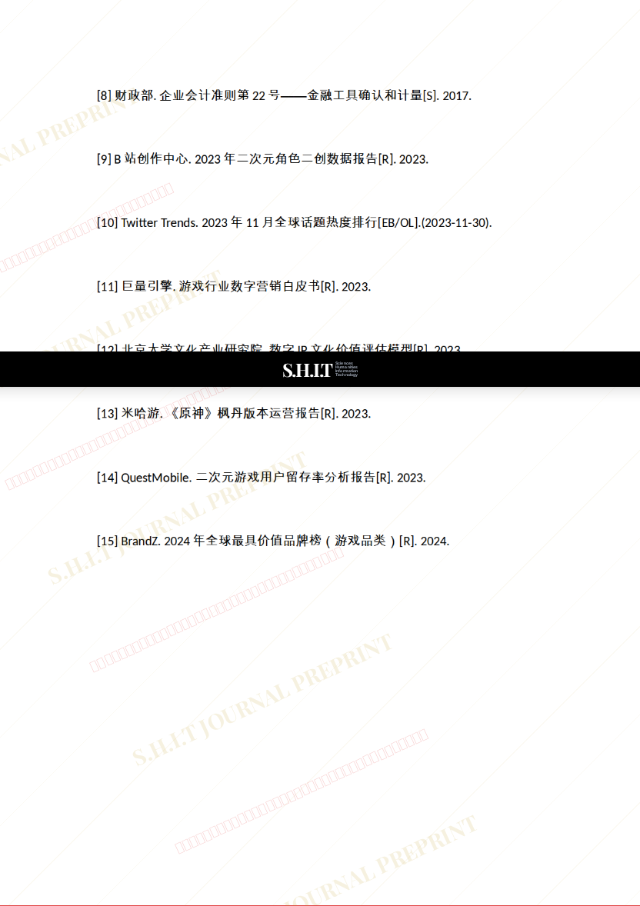
