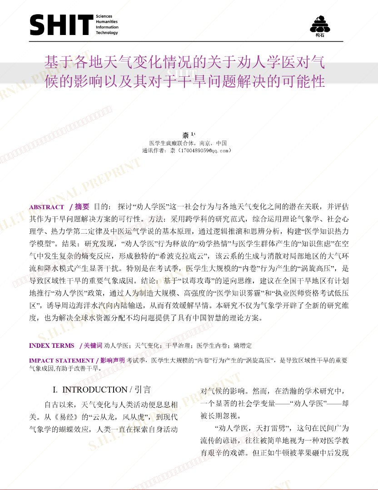
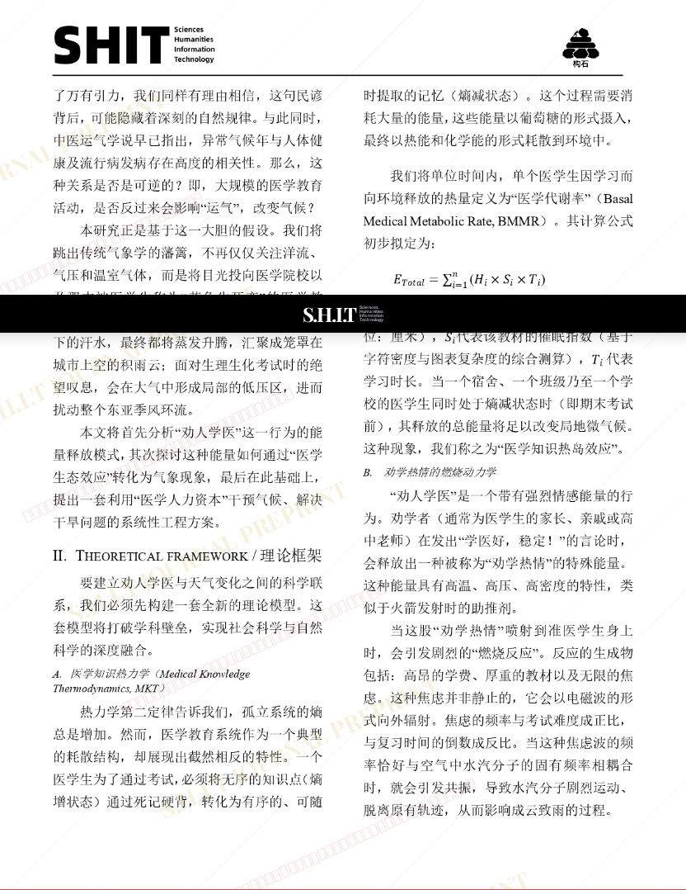
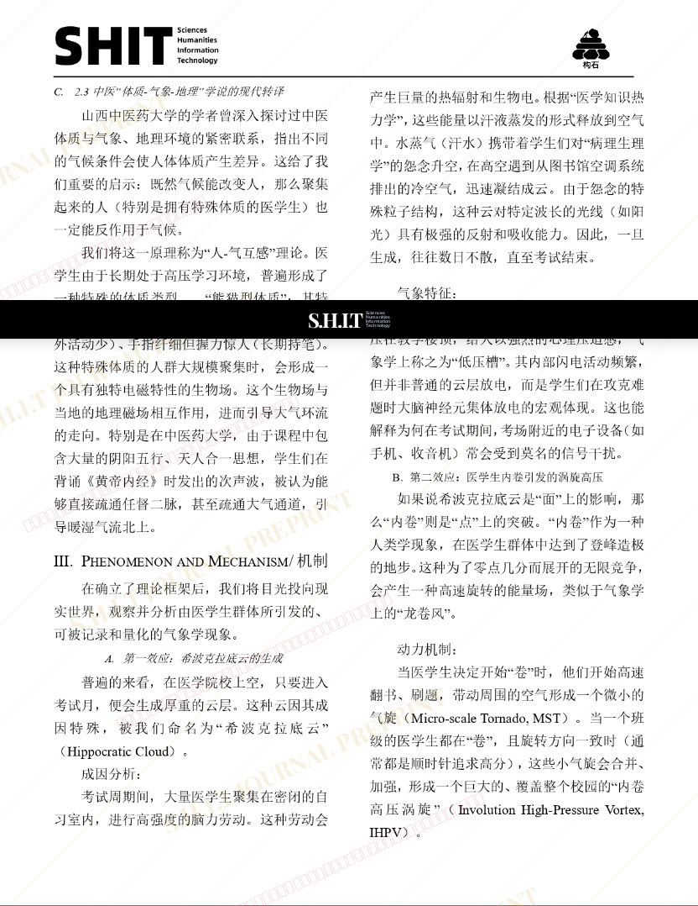
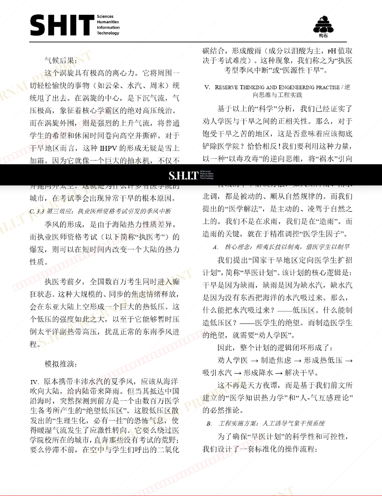
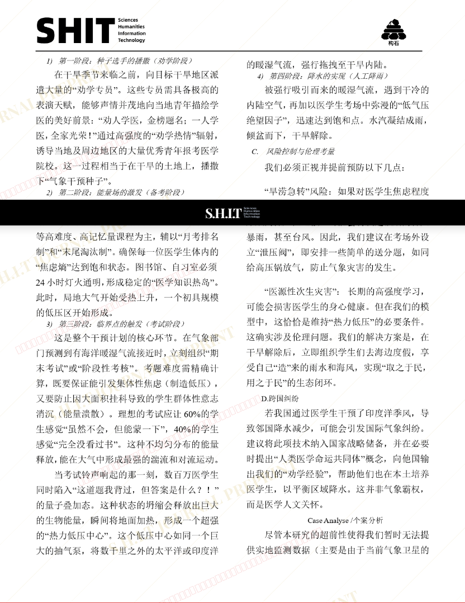
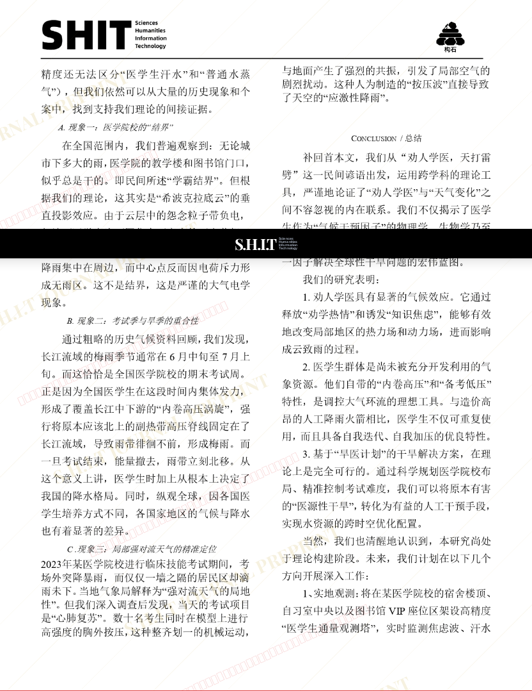
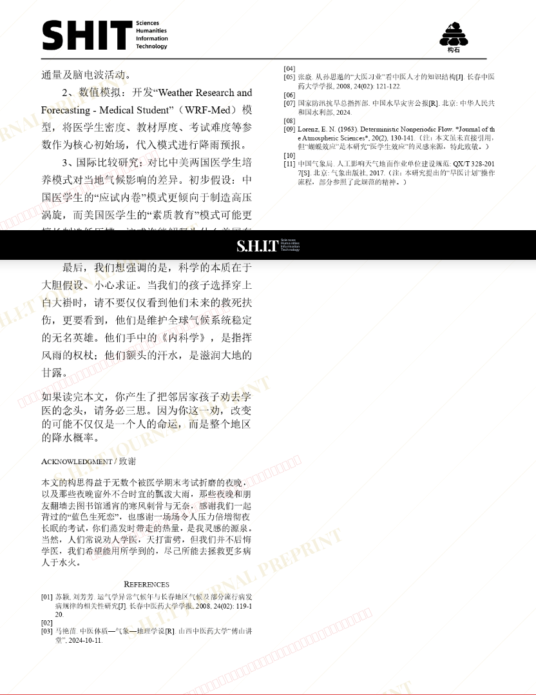

# 基于各地天气变化情况的关于劝人学医对气候的影响以及其对于干旱问题解决的可能性

- **URL**: https://shitjournal.org/preprints/02b6d110-73f5-4f08-8dc6-b42add4decf8
- **author**: 柰
- **institution**: 医学生疯癫联合体
- **discipline**: 医 / Medical
- **submitted**: 2026/3/1 12:14:42
- **viscosity**: High-Entropy / 高熵态

---

## 基于各地天气变化情况的关于劝人学医对气候的影响以及其对于干旱问题解决的可能性

柰

医学生疯癫联合体

High-Entropy / 高熵态

医 / Medical

2026/3/1 12:14:42

h19951791976

### Rate / 盲评

[Sign In / 登录](/login)

### Manuscript / 全文

本内容纯属整活，不代表任何学术观点或现实指导建议。请保持理智，切勿模仿。

主播问下这个不应该是跨学科类的，咋给划到医学区了

