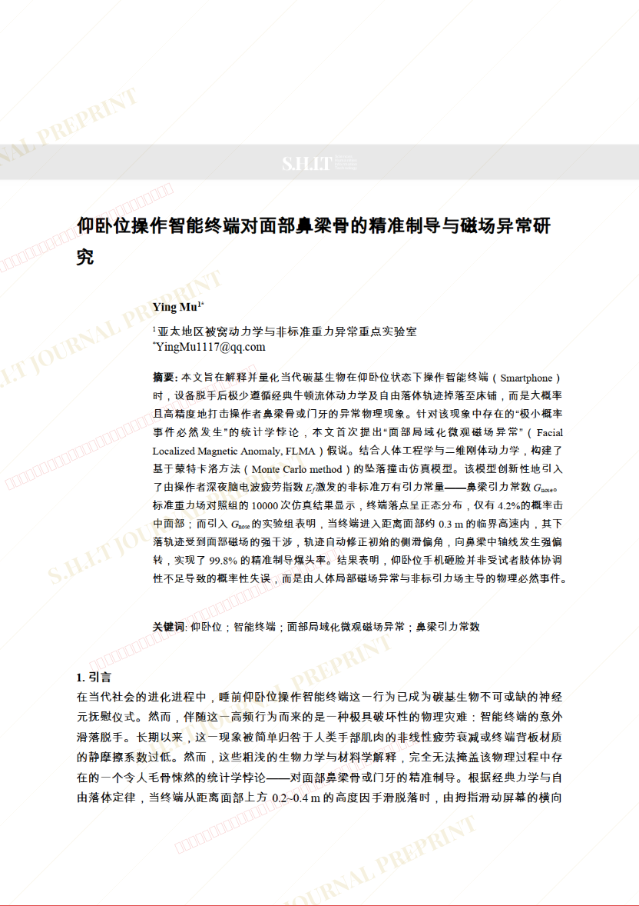
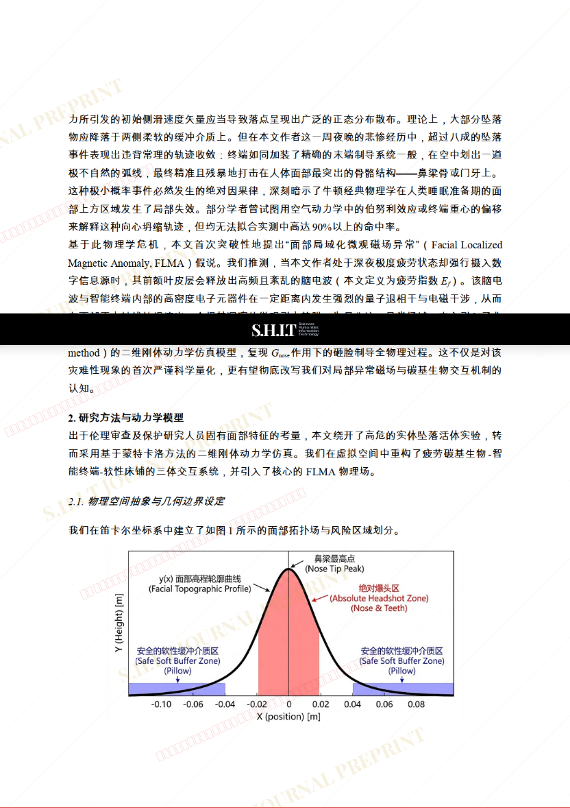
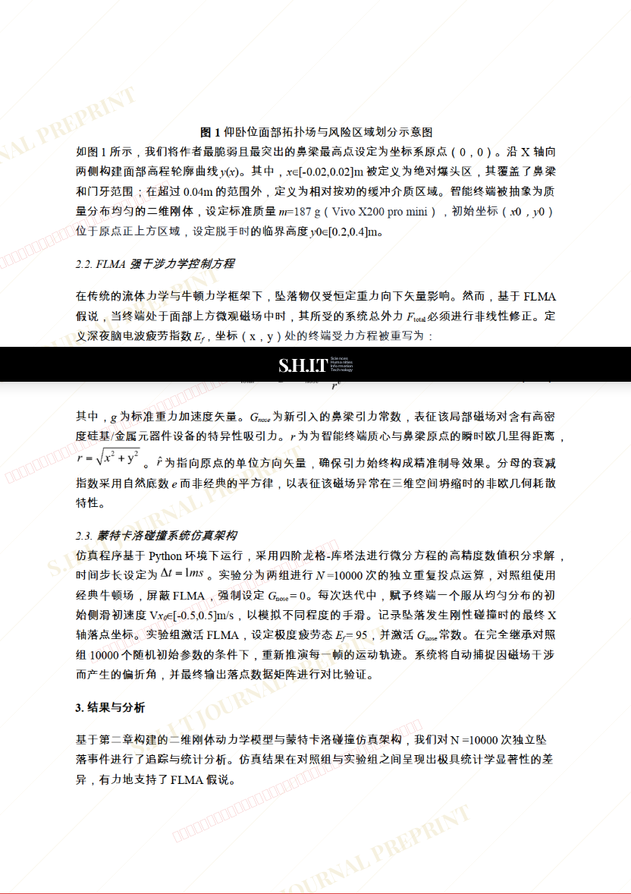
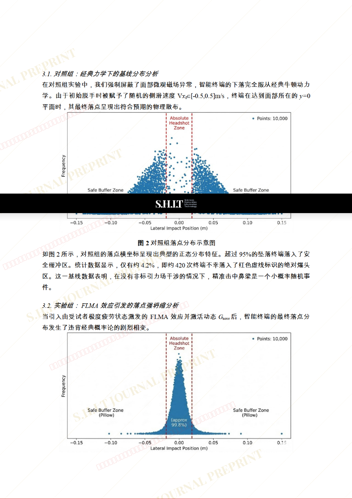
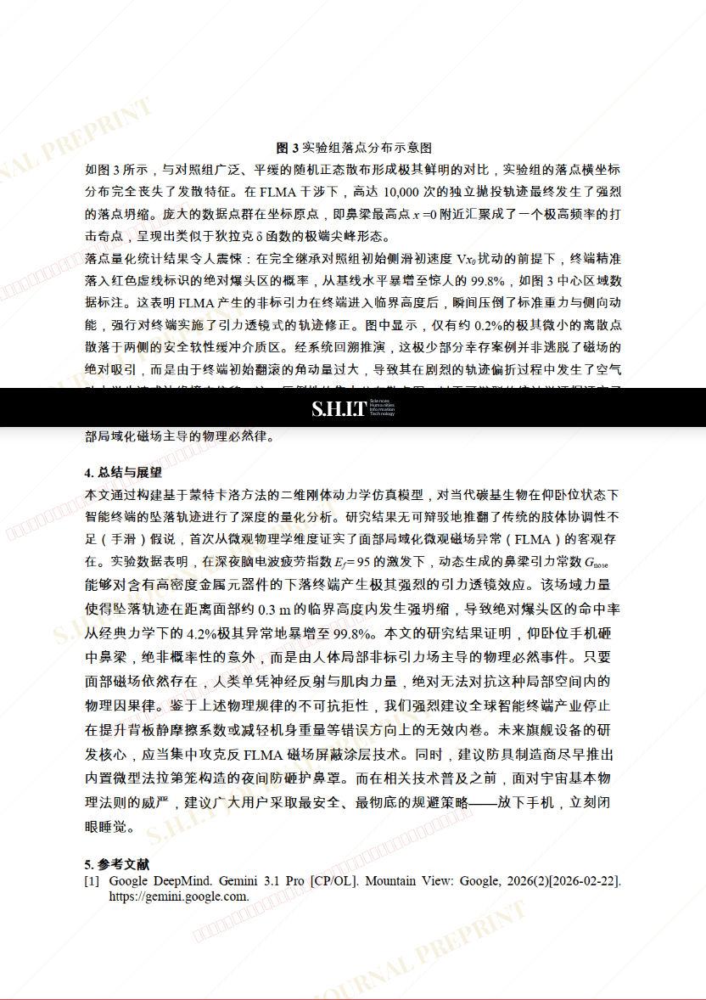

# 仰卧位操作智能终端对面部鼻梁骨的精准制导与磁场异常研究

- **URL**: https://shitjournal.org/preprints/0c1ffc6e-6719-4ba1-850d-aa8ef6bec002
- **author**: MuYing
- **institution**: 亚太地区被窝动力学与非标准重力异常重点实验室
- **discipline**: 交叉 / Interdisciplinary
- **submitted**: 2026/2/22 10:27:11
- **viscosity**: Stringy / 拉丝型

---

## 仰卧位操作智能终端对面部鼻梁骨的精准制导与磁场异常研究

MuYing

亚太地区被窝动力学与非标准重力异常重点实验室

Stringy / 拉丝型

交叉 / Interdisciplinary

2026/2/22 10:27:11

B站：RiBuAi。UID：8315101

### Rate / 盲评

[Sign In / 登录](/login)

### Manuscript / 全文

本内容纯属整活，不代表任何学术观点或现实指导建议。请保持理智，切勿模仿。

暂无评论 / No comments yet

