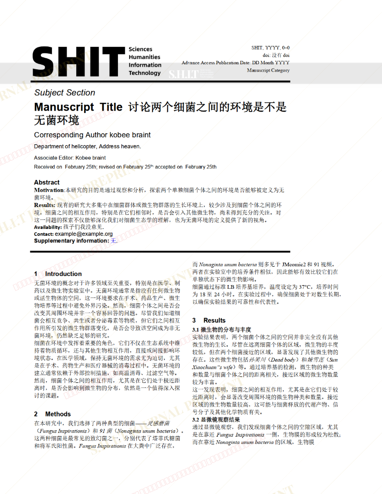
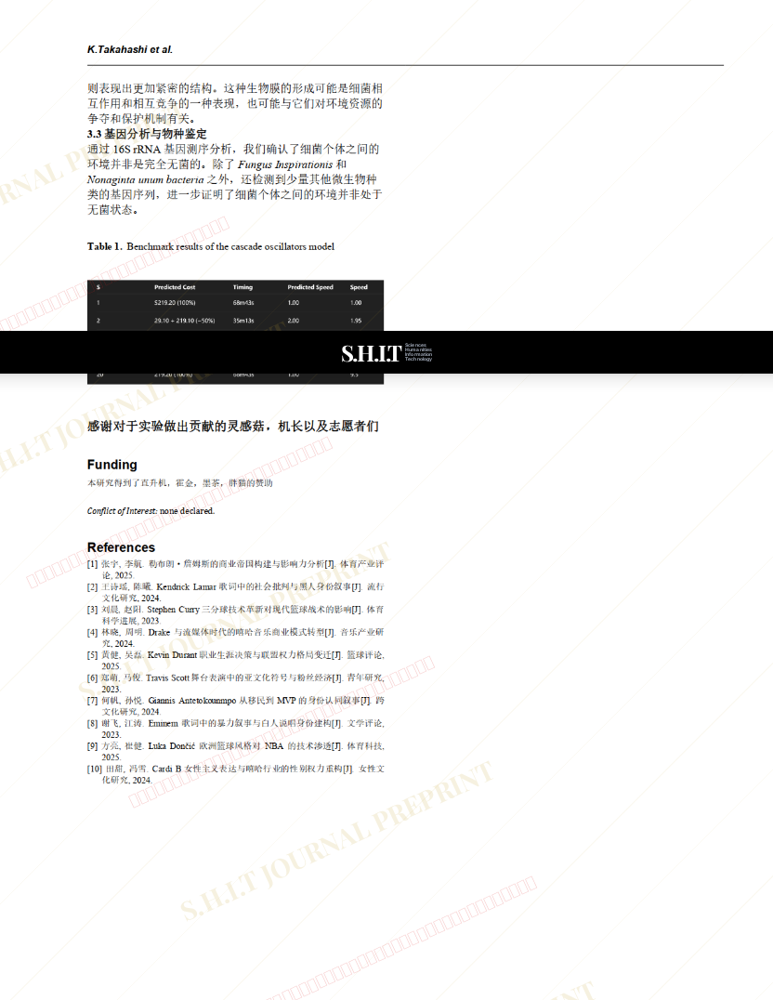

# 关于无菌环境的讨论：两个细菌之间算不算常见的无菌环境

- **URL**: https://shitjournal.org/preprints/0cde378a-0737-426d-bb21-e678055e449d
- **author**: 科比布莱恩特
- **institution**: HAINNU大穴
- **discipline**: 交叉 / Interdisciplinary
- **submitted**: 2026/2/25 12:28:50
- **viscosity**: High-Entropy / 高熵态

---

## 关于无菌环境的讨论：两个细菌之间算不算常见的无菌环境

科比布莱恩特

HAINNU大穴

High-Entropy / 高熵态

交叉 / Interdisciplinary

2026/2/25 12:28:50

B站

### Rate / 盲评

[Sign In / 登录](/login)

### Manuscript / 全文

本内容纯属整活，不代表任何学术观点或现实指导建议。请保持理智，切勿模仿。

暂无评论 / No comments yet

