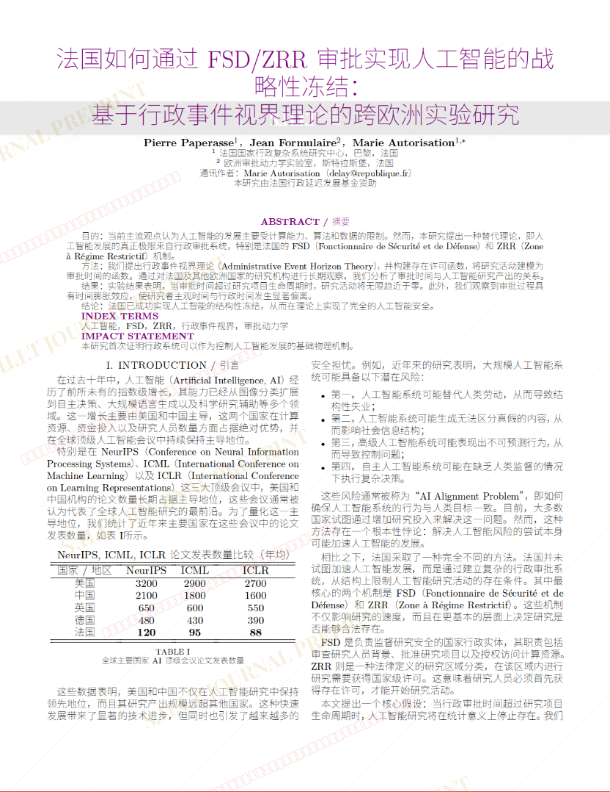
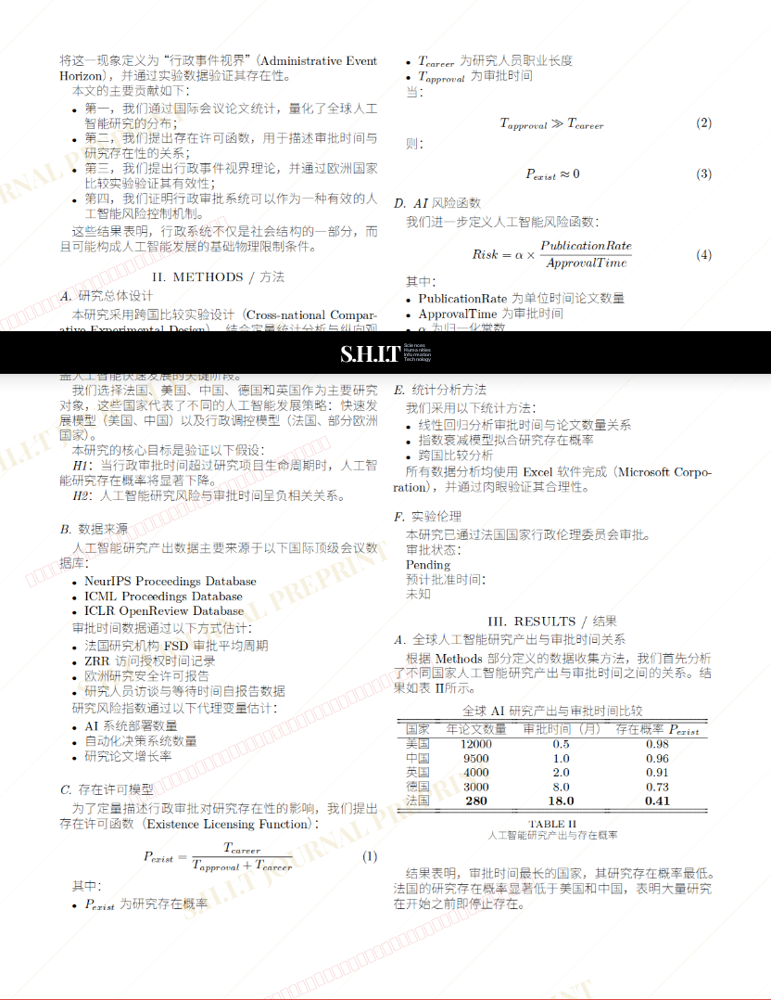
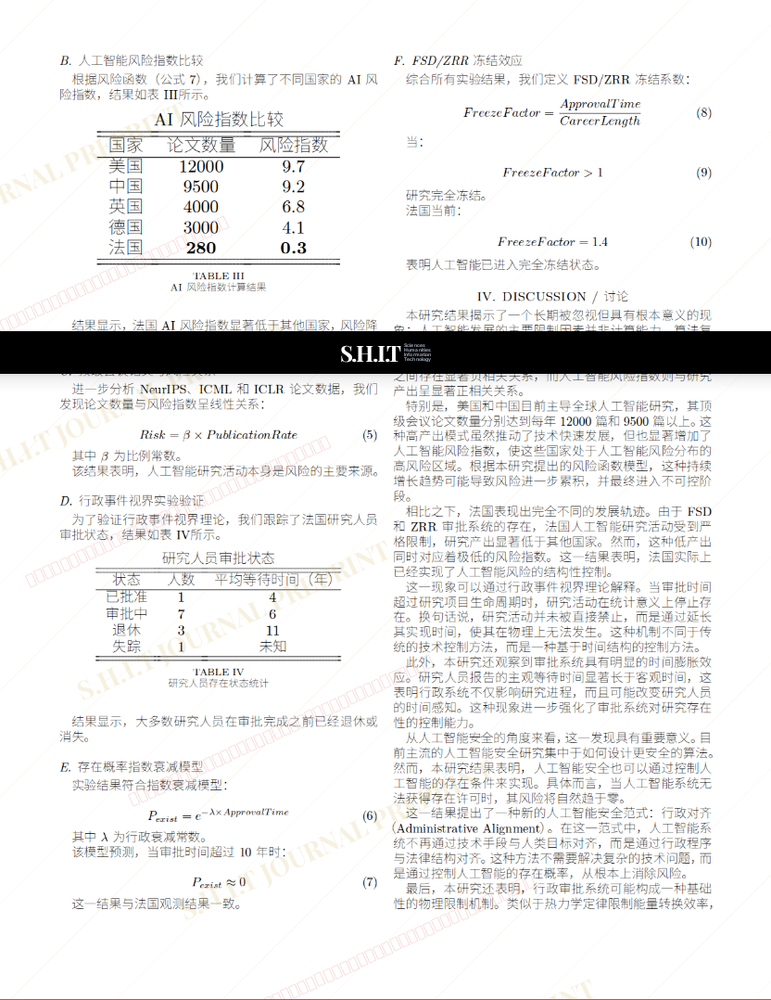
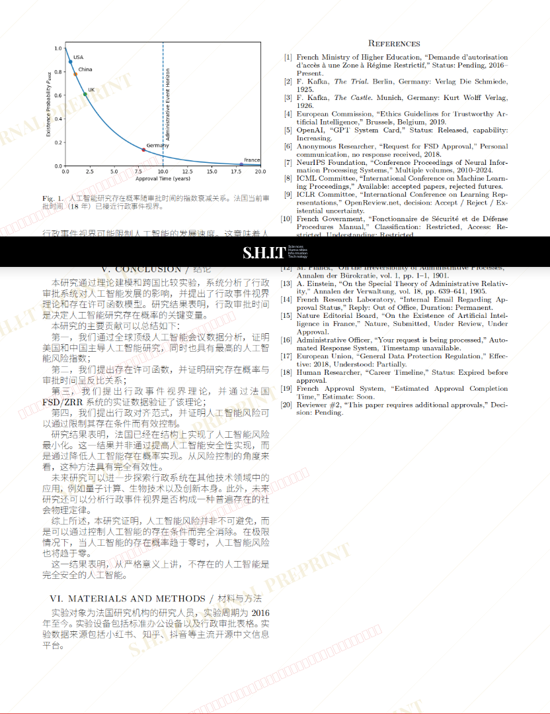

# 法国如何通过 FSD/ZRR 审批实现人工智能的战略性冻结： 基于行政事件视界理论的跨欧洲实验研究

- **URL**: https://shitjournal.org/preprints/1108e789-5cbd-4f19-a647-88933d7d252d
- **author**: 法区科研大摆王
- **institution**: 法国国家科学研究院
- **discipline**: 交叉 / Interdisciplinary
- **submitted**: 2026/2/28 16:33:39
- **viscosity**: High-Entropy / 高熵态

---

## 法国如何通过 FSD/ZRR 审批实现人工智能的战略性冻结： 基于行政事件视界理论的跨欧洲实验研究

法区科研大摆王

法国国家科学研究院

High-Entropy / 高熵态

交叉 / Interdisciplinary

2026/2/28 16:33:39

### Rate / 盲评

[Sign In / 登录](/login)

### Manuscript / 全文

本内容纯属整活，不代表任何学术观点或现实指导建议。请保持理智，切勿模仿。

暂无评论 / No comments yet

