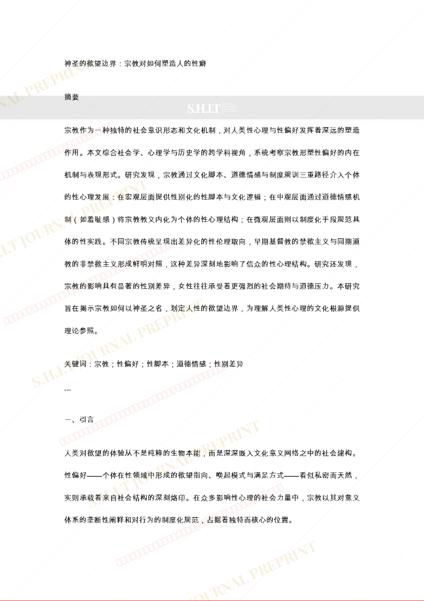
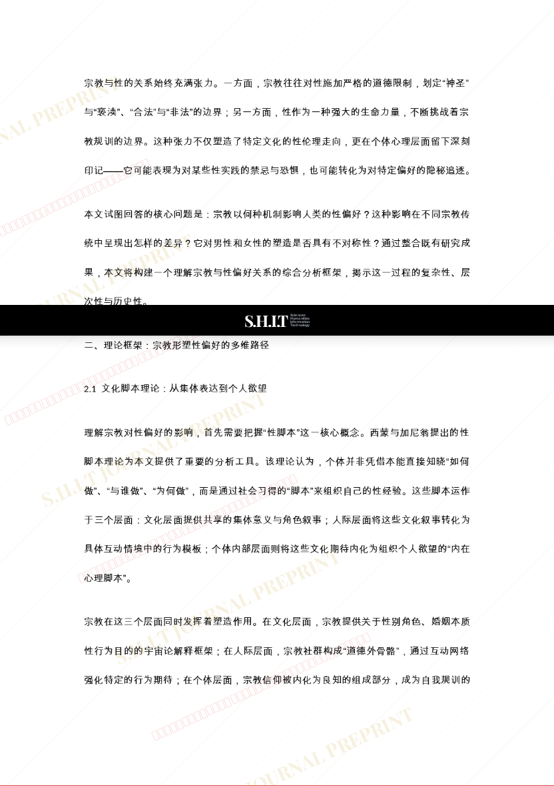
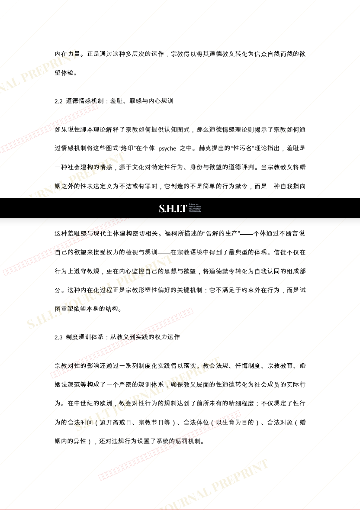
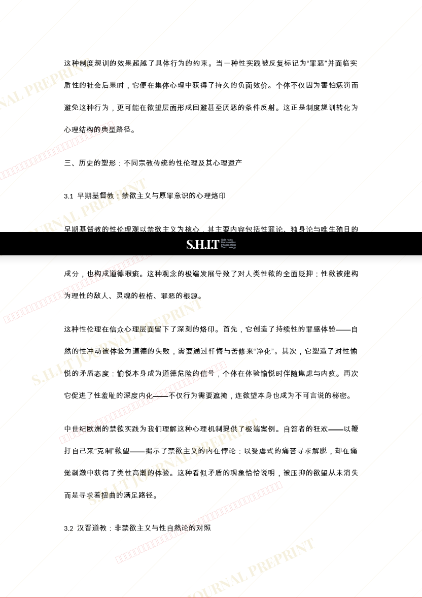
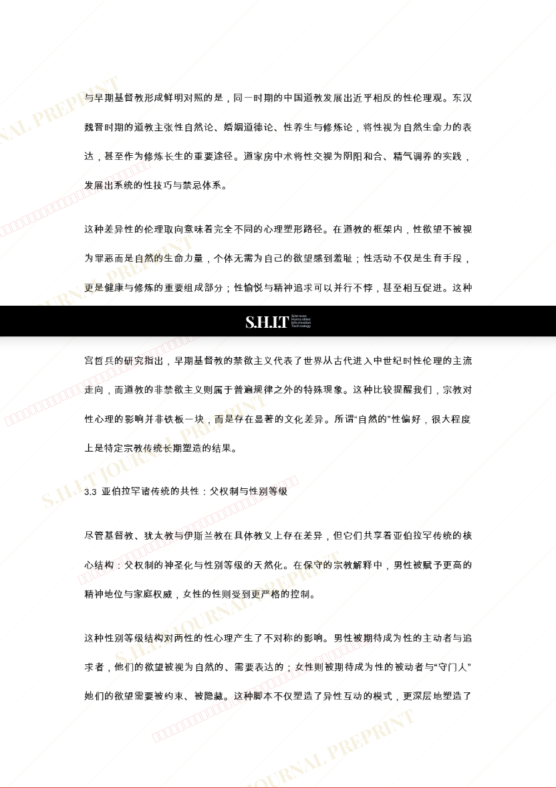
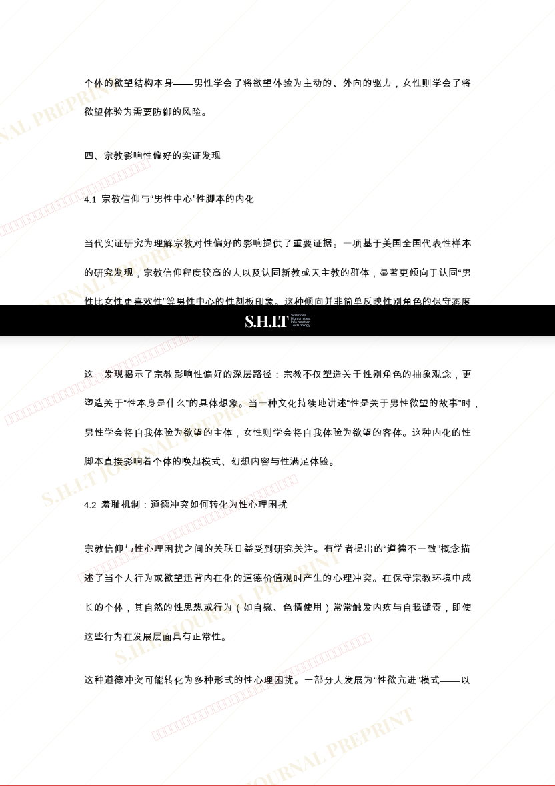
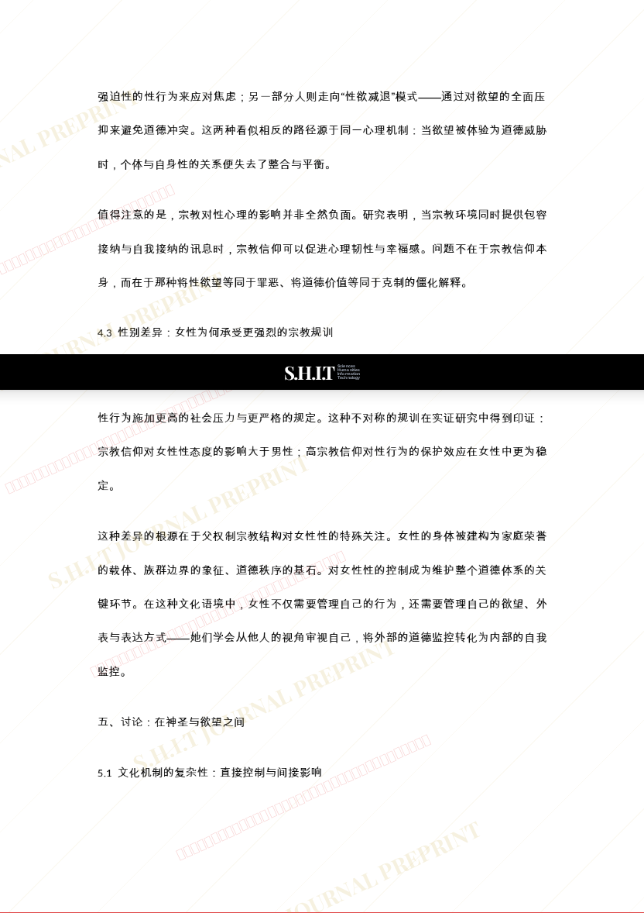
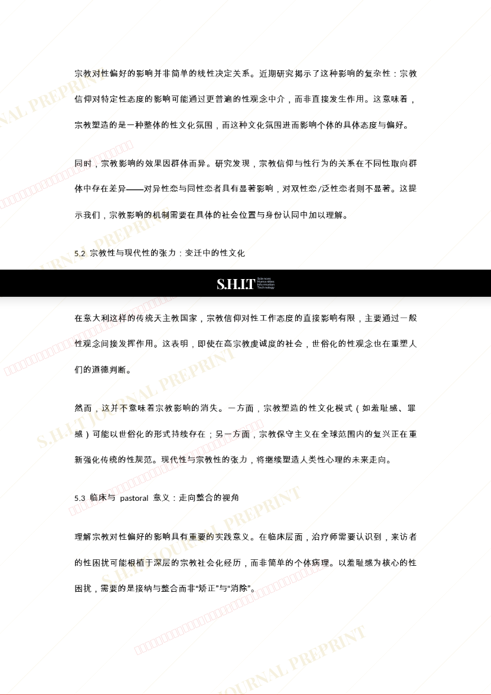
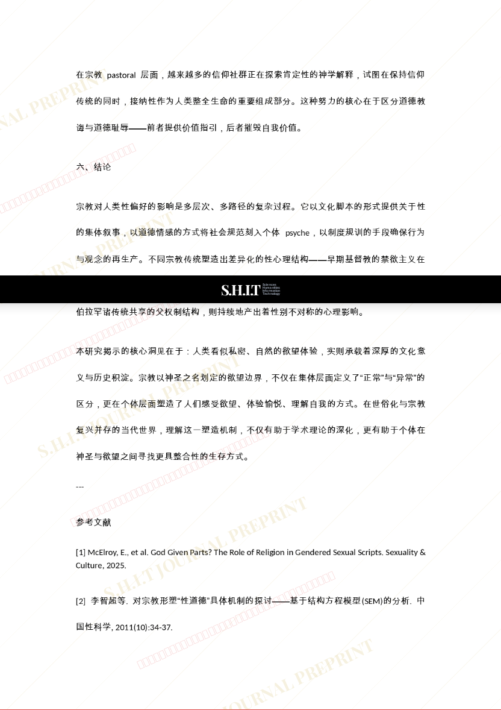
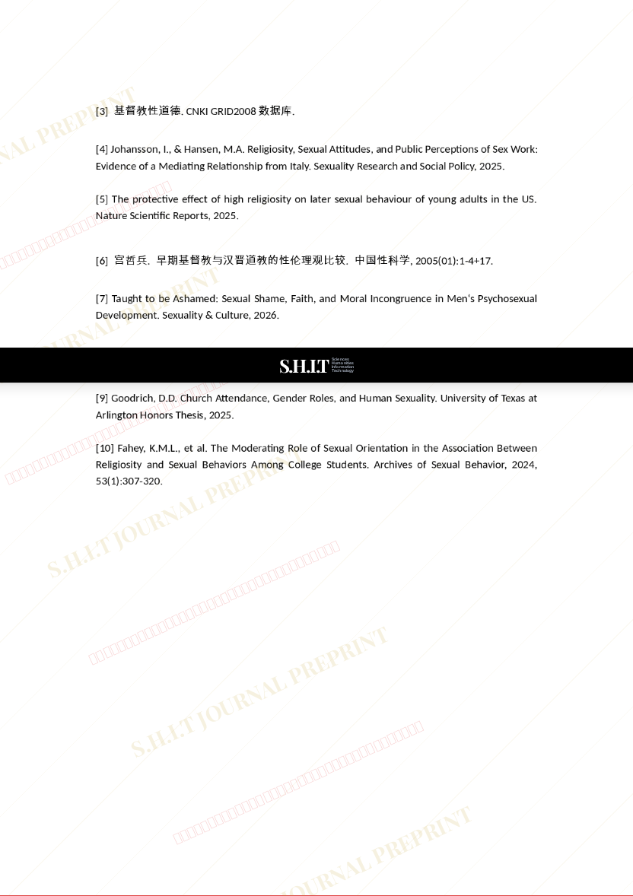

# 神圣的欲望边界：宗教对如何塑造人的性癖

- **URL**: https://shitjournal.org/preprints/112f4ca4-1692-4722-99e5-e520068ed231
- **author**: 李疏桐
- **institution**: 泛人类史研究总局下人文研究部
- **discipline**: 交叉 / Interdisciplinary
- **submitted**: 2026/2/24 02:06:38
- **viscosity**: Semi-solid / 半固态

---

## 神圣的欲望边界：宗教对如何塑造人的性癖

李疏桐

泛人类史研究总局下人文研究部

Semi-solid / 半固态

交叉 / Interdisciplinary

2026/2/24 02:06:38

2382216710@qq.com

### Rate / 盲评

[Sign In / 登录](/login)

### Manuscript / 全文

本内容纯属整活，不代表任何学术观点或现实指导建议。请保持理智，切勿模仿。

暂无评论 / No comments yet

