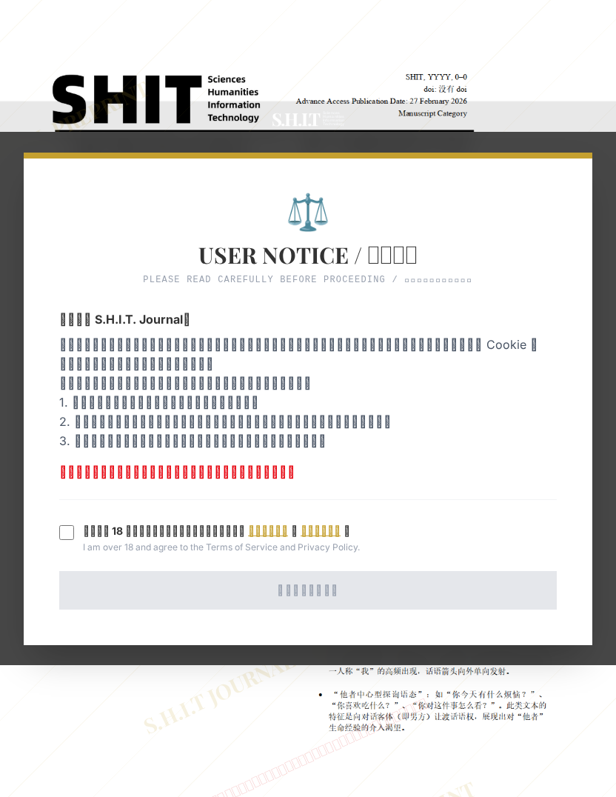

# “她可能对我也有意思？”：基于高频讯息交互的错觉动力学与防钓鱼机制研究

## 元信息

- **作者**: holy shit
- **机构**: The XYY University
- **社交媒体**: 589437106
- **分区**: stone
- **学科**: interdisciplinary
- **标签**: meme
- **提交时间**: 2026-02-27T15:58:33.380062Z
- **评分**: 4.85 / 5（1354 人）

## 链接

- [网站原始文章](https://shitjournal.org/preprints/1480b834-f051-41b0-8a47-2b6d0b0df0b2)
- [PDF](https://files.shitjournal.org/1480b834-f051-41b0-8a47-2b6d0b0df0b2.pdf)
- [文章元信息](1480b834-f051-41b0-8a47-2b6d0b0df0b2.meta.json)

## 正文

