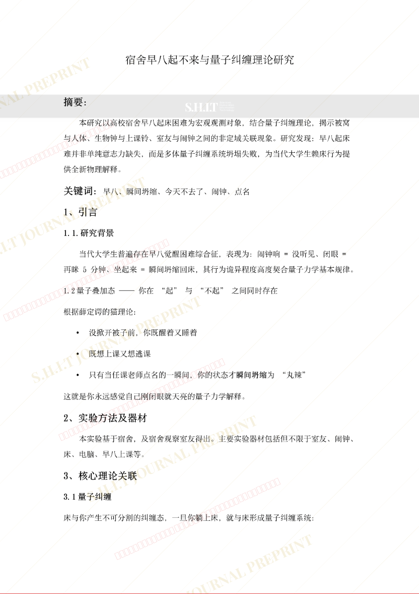
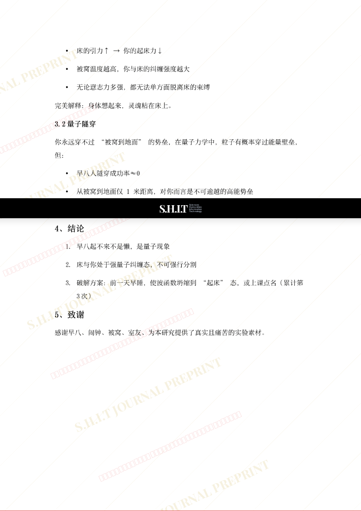

# 宿舍早八起不来与量子纠缠理论的研究

- **URL**: https://shitjournal.org/preprints/1af426c3-72dc-4d56-b967-31ce2b4b99a6
- **author**: 狗熊岭扛把子
- **institution**: 家里蹲大学
- **discipline**: 交叉 / Interdisciplinary
- **submitted**: 2026/2/23 14:04:24
- **viscosity**: Semi-solid / 半固态

---

## 宿舍早八起不来与量子纠缠理论的研究

狗熊岭扛把子

家里蹲大学

Semi-solid / 半固态

交叉 / Interdisciplinary

2026/2/23 14:04:24

2111122630

### Rate / 盲评

[Sign In / 登录](/login)

### Manuscript / 全文

本内容纯属整活，不代表任何学术观点或现实指导建议。请保持理智，切勿模仿。

暂无评论 / No comments yet

