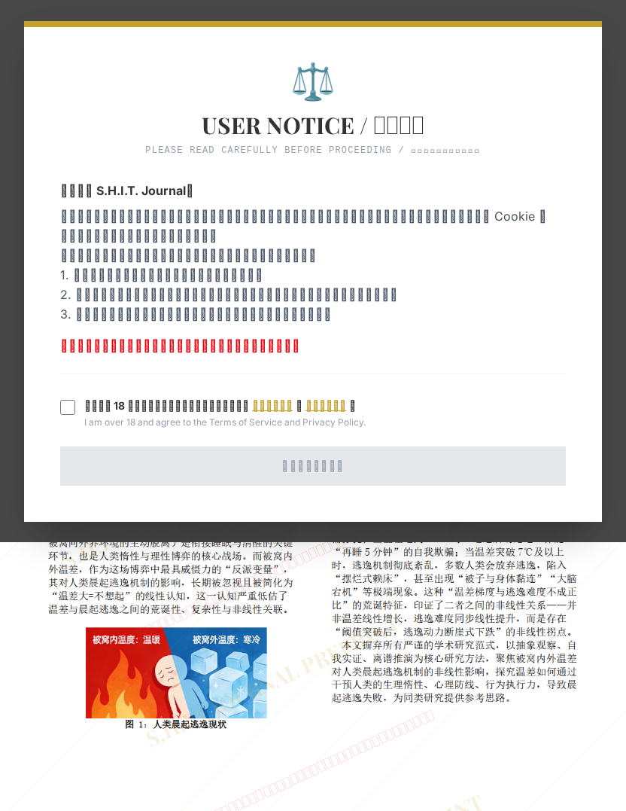

# 被窝内外温差对人类晨起逃逸机制的非线性关系研究

## 元信息

- **作者**: 吃范第一名
- **机构**: 
- **分区**: septic
- **学科**: science
- **标签**: meme
- **提交时间**: 2026-03-03T16:27:48.171126Z
- **评分**: 4.48 / 5（42 人）

## 链接

- [网站原始文章](https://shitjournal.org/preprints/1fb91ba0-ac87-49da-a39f-f462d81186f2)
- [PDF](https://files.shitjournal.org/1fb91ba0-ac87-49da-a39f-f462d81186f2.pdf)
- [文章元信息](1fb91ba0-ac87-49da-a39f-f462d81186f2.meta.json)

## 正文

