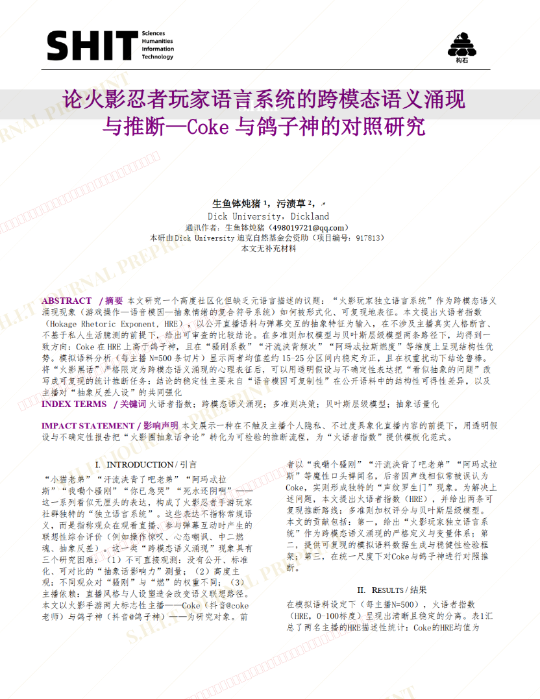
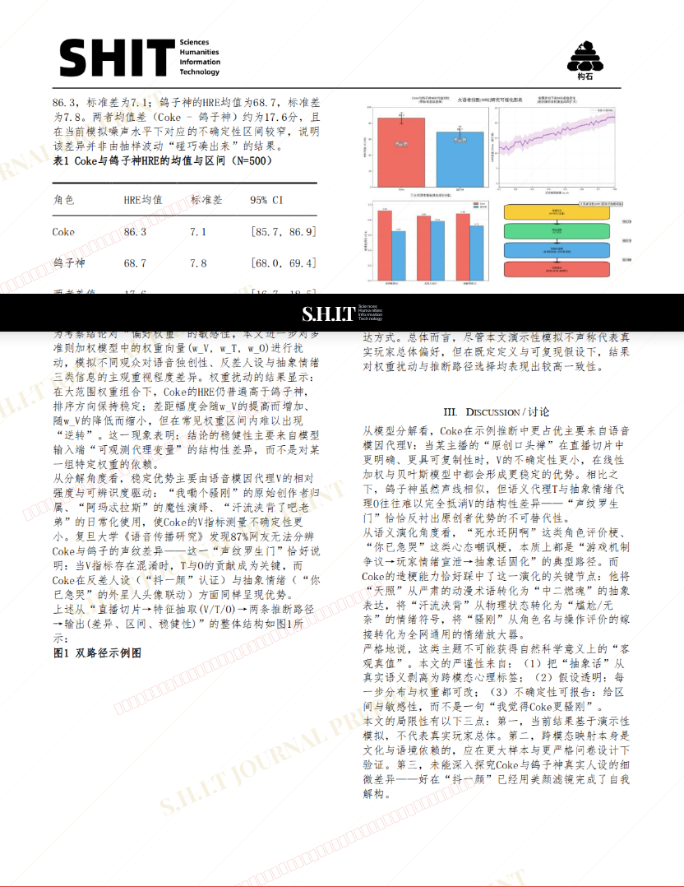
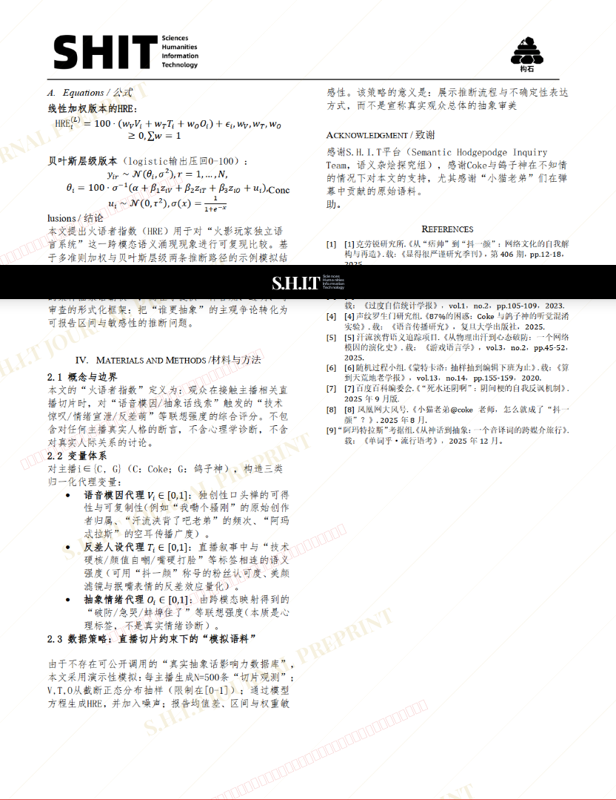

# 论火影忍者玩家语言系统的跨模态语义涌现与推断—Coke与鸽子神的对照研究

- **URL**: https://shitjournal.org/preprints/21345b13-c4ae-4cd9-b664-7ac931f42596
- **author**: 生鱼钵炖猪
- **institution**: Dick University
- **discipline**: 交叉 / Interdisciplinary
- **submitted**: 2026/3/1 15:59:38
- **viscosity**: Stringy / 拉丝型

---

## 论火影忍者玩家语言系统的跨模态语义涌现与推断—Coke与鸽子神的对照研究

生鱼钵炖猪

Dick University

Stringy / 拉丝型

交叉 / Interdisciplinary

2026/3/1 15:59:38

44584904889

污渍草 · Dick University

### Rate / 盲评

[Sign In / 登录](/login)

### Manuscript / 全文

本内容纯属整活，不代表任何学术观点或现实指导建议。请保持理智，切勿模仿。

暂无评论 / No comments yet

