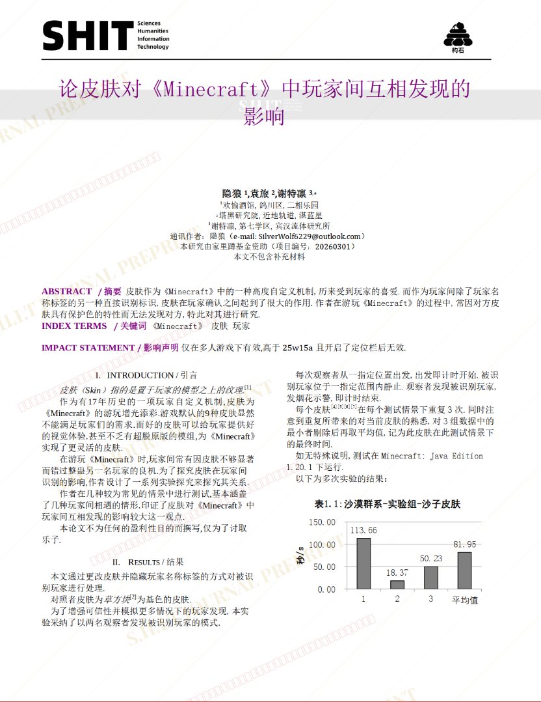
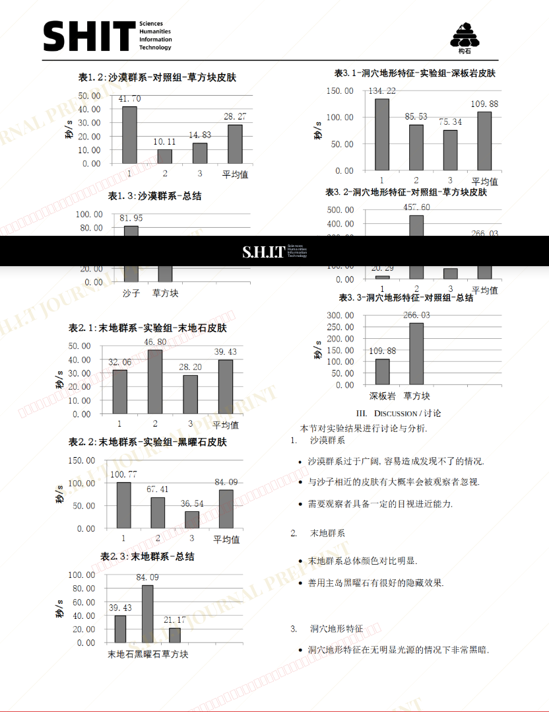
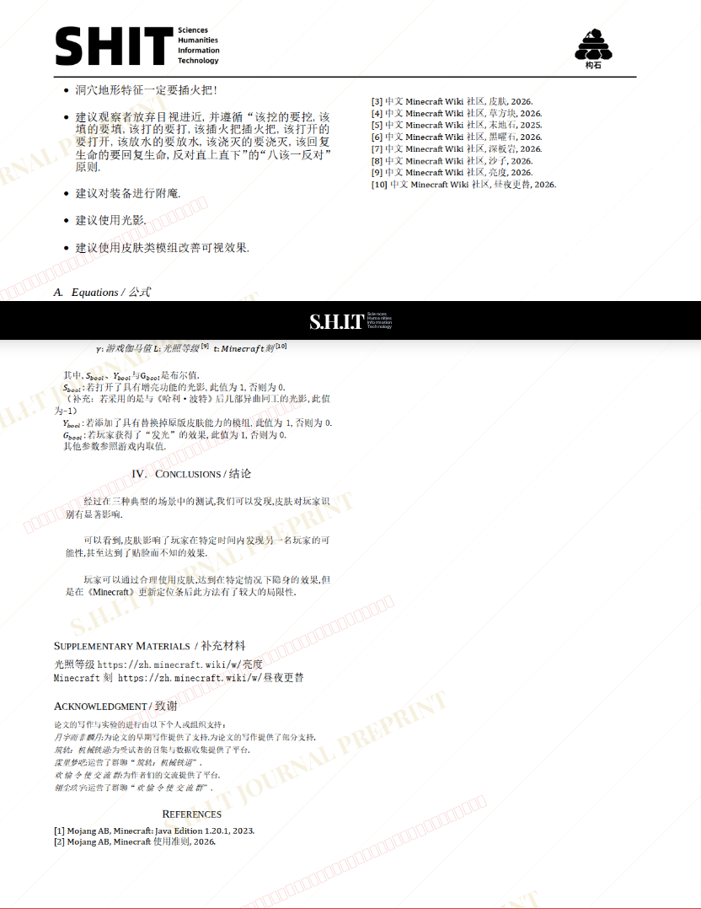

# 论皮肤对《我的世界》中玩家间互相发现的影响

- **URL**: https://shitjournal.org/preprints/2306ef67-0daf-42df-9fe6-7064d7a37849
- **author**: 隐狼
- **institution**: 欢愉酒馆
- **discipline**: 交叉 / Interdisciplinary
- **submitted**: 2026/2/28 14:27:40
- **viscosity**: Semi-solid / 半固态

---

## 论皮肤对《我的世界》中玩家间互相发现的影响

隐狼

欢愉酒馆

Semi-solid / 半固态

交叉 / Interdisciplinary

2026/2/28 14:27:40

BiliUID:702265718

袁旅 · 塔黑研究院共一

谢特凛 · 宾汉流体研究所共一

翎尘玖宇 · 灵玥研究院

月宇而非麟月 · 壁炉之家·愚人众

### Rate / 盲评

[Sign In / 登录](/login)

### Manuscript / 全文

本内容纯属整活，不代表任何学术观点或现实指导建议。请保持理智，切勿模仿。

暂无评论 / No comments yet

