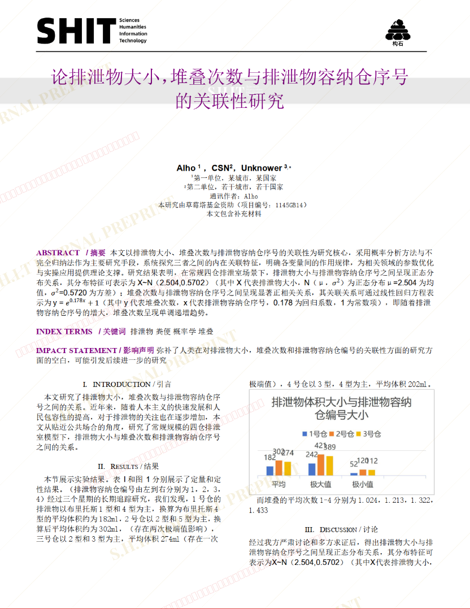
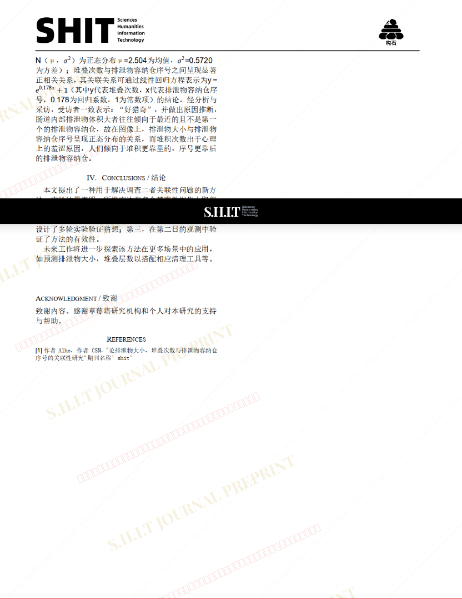

# 论排泄物大小，堆叠次数与排泄物容纳仓序号的关联性研究

- **URL**: https://shitjournal.org/preprints/272b0abc-d735-4500-ac2e-442a0162756e
- **author**: alho
- **institution**: 某不知名地方
- **discipline**: 理 / Science
- **submitted**: 2026/3/4 04:04:18
- **viscosity**: Stringy / 拉丝型

---

## 论排泄物大小，堆叠次数与排泄物容纳仓序号的关联性研究

alho

某不知名地方

Stringy / 拉丝型

理 / Science

2026/3/4 04:04:18

小红书：2096018194

### Rate / 评价

[Sign In / 登录](/login)

### Manuscript / 全文

本内容纯属整活，不代表任何学术观点或现实指导建议。请保持理智，切勿模仿。

暂无评论 / No comments yet

