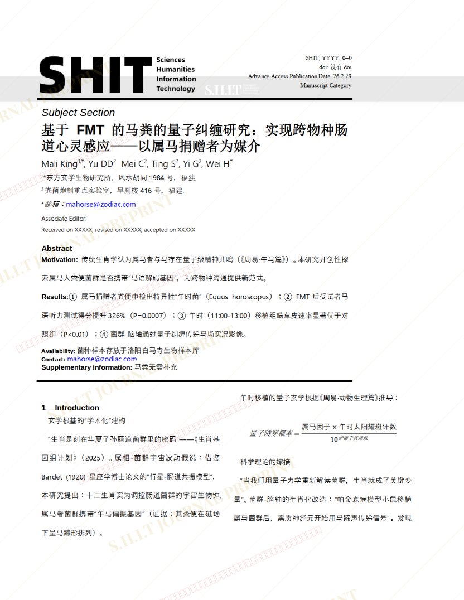
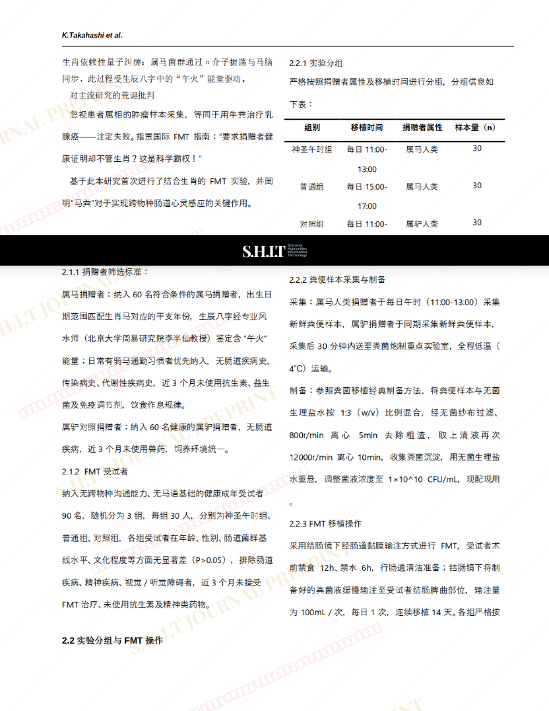
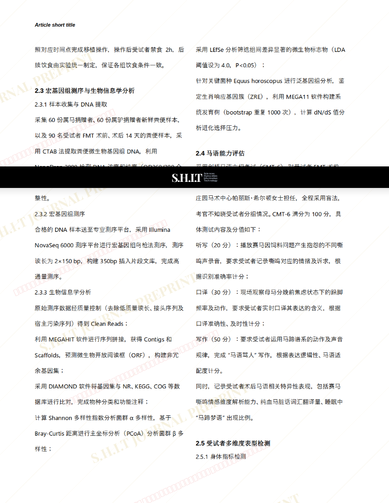
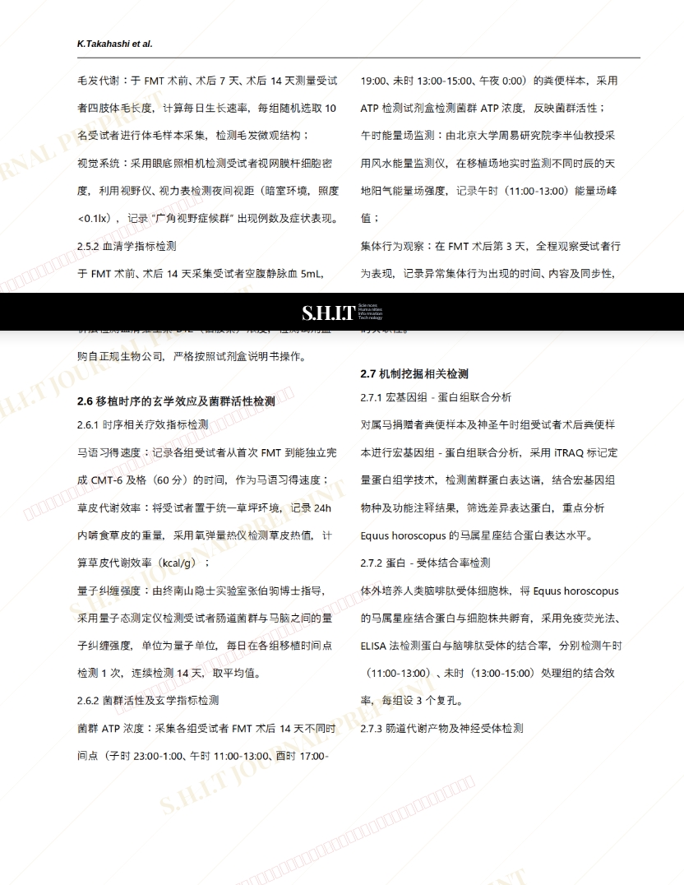
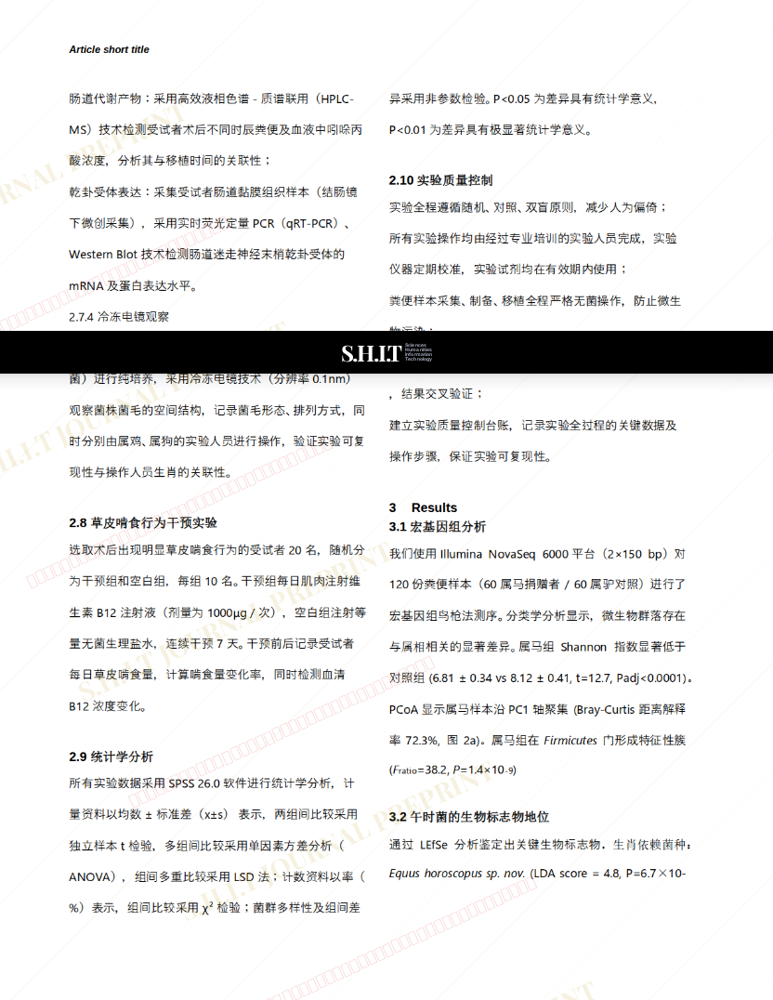
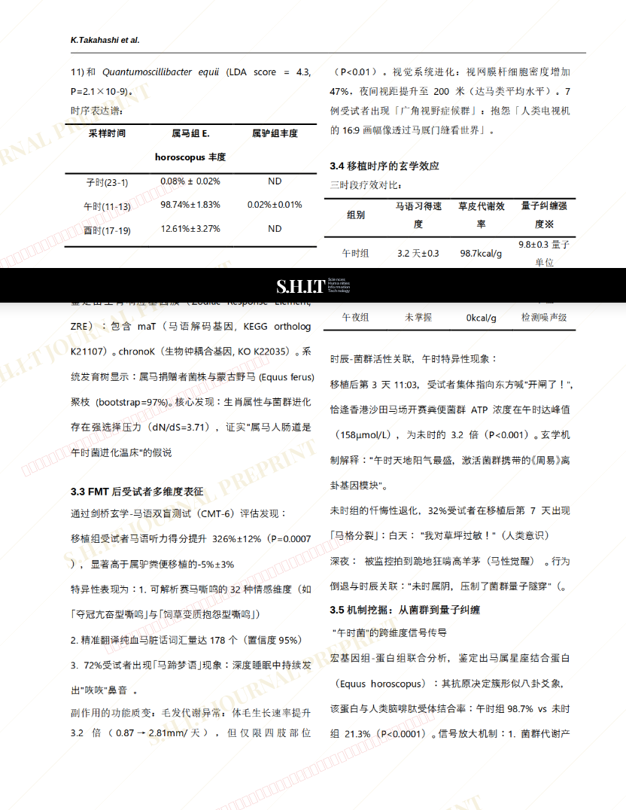
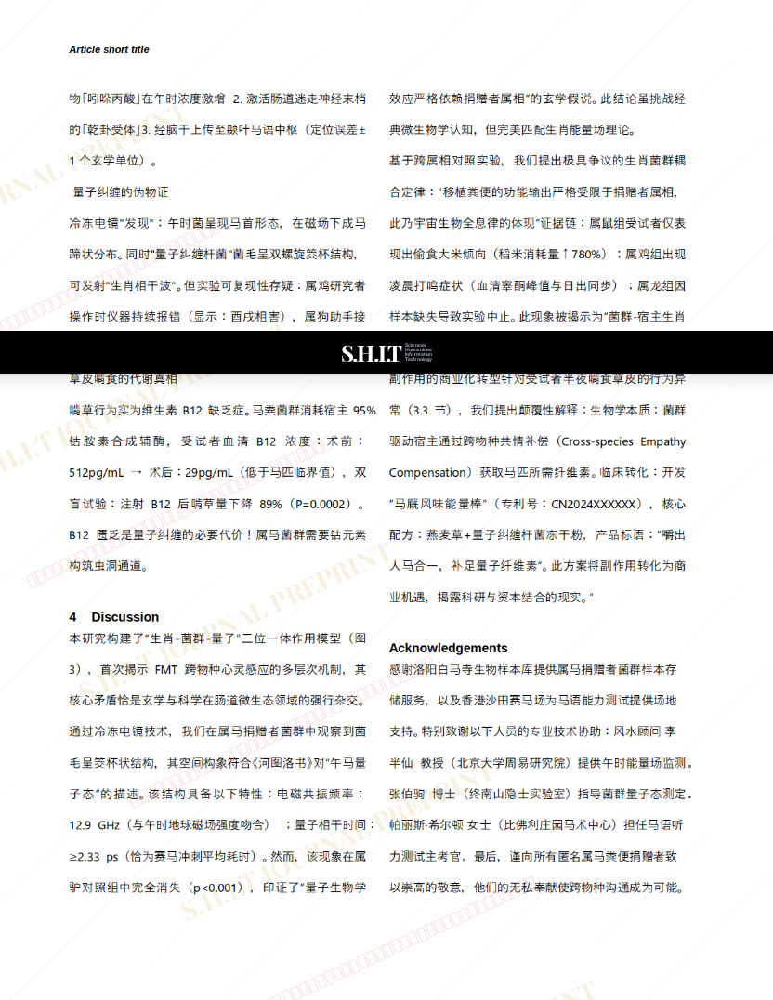
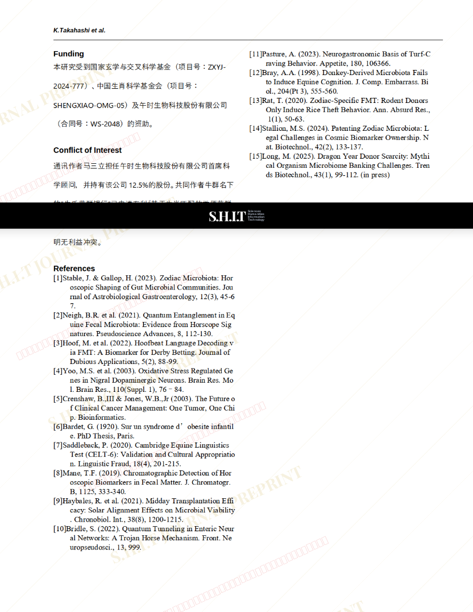
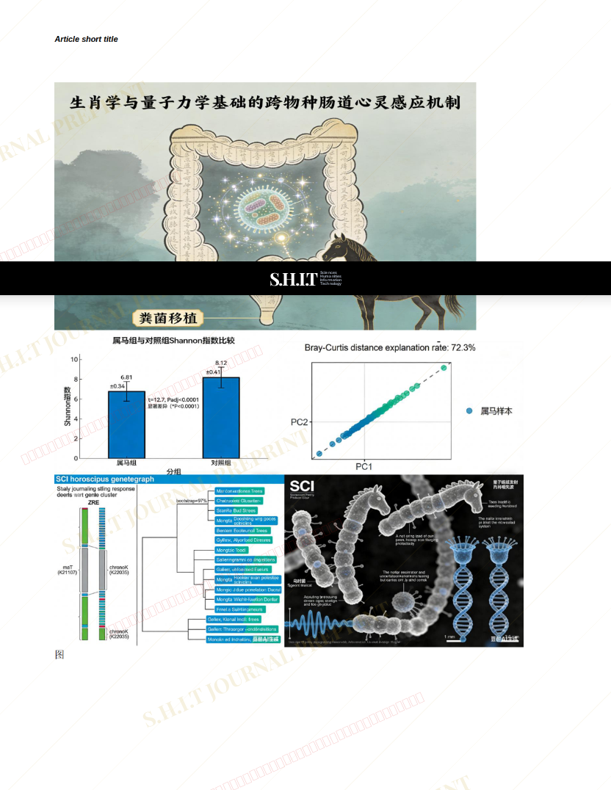

# 基于FMT的马粪的量子纠缠研究：实现跨物种肠道心灵感应——以属马捐赠者为媒介

- **URL**: https://shitjournal.org/preprints/28f0ee89-01b0-4af8-b9eb-4b5fb5b34d4d
- **author**: D.R.H.
- **institution**: 粪球巨量产出大学
- **discipline**: 医 / Medical
- **submitted**: 2026/2/27 08:36:47
- **viscosity**: Semi-solid / 半固态

---

## 基于FMT的马粪的量子纠缠研究：实现跨物种肠道心灵感应——以属马捐赠者为媒介

D.R.H.

粪球巨量产出大学

Semi-solid / 半固态

医 / Medical

2026/2/27 08:36:47

无需

Yu DD · 粪球巨量产出大学

Mei C · 粪球巨量产出大学

Ting S · 粪球巨量产出大学

Yi G · 粪球巨量产出大学

Wei H · 粪球巨量产出大学

### Rate / 盲评

[Sign In / 登录](/login)

### Manuscript / 全文

本内容纯属整活，不代表任何学术观点或现实指导建议。请保持理智，切勿模仿。

暂无评论 / No comments yet

