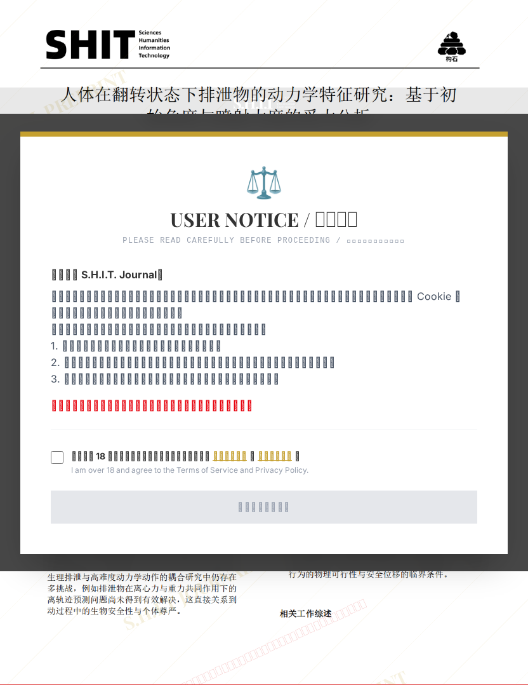

# 人体在翻转状态下排泄物的动力学特征研究：基于初始角度与喷射力度的受力分析

## 元信息

- **作者**: 后空翻拉粑糕手
- **机构**: 
- **分区**: septic
- **学科**: interdisciplinary
- **标签**: meme
- **提交时间**: 2026-03-03T17:59:54.015041Z
- **评分**: 4.56 / 5（41 人）

## 链接

- [网站原始文章](https://shitjournal.org/preprints/2c76aa8d-be9a-45bb-bb9f-68b07c9725b7)
- [PDF](https://files.shitjournal.org/2c76aa8d-be9a-45bb-bb9f-68b07c9725b7.pdf)
- [文章元信息](2c76aa8d-be9a-45bb-bb9f-68b07c9725b7.meta.json)

## 正文

