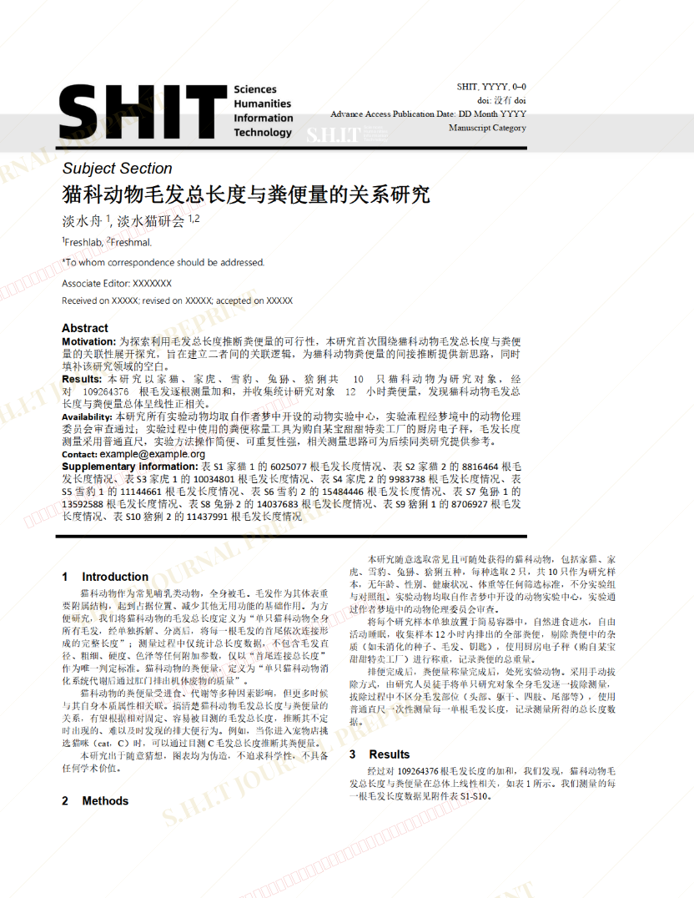
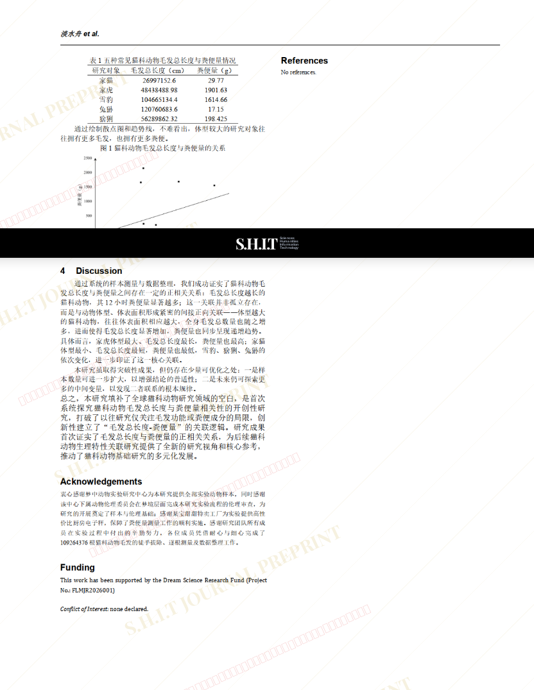

# 猫科动物毛发总长度与粪便量的关系研究

- **URL**: https://shitjournal.org/preprints/2e272f8a-4f9d-4016-a8f4-fdcfd25178c7
- **author**: freshlab
- **institution**: 淡水实验室
- **discipline**: 交叉 / Interdisciplinary
- **submitted**: 2026/2/25 12:16:56
- **viscosity**: Semi-solid / 半固态

---

## 猫科动物毛发总长度与粪便量的关系研究

freshlab

淡水实验室

Semi-solid / 半固态

交叉 / Interdisciplinary

2026/2/25 12:16:56

淡水猫研会 · 淡水实验室，淡水实验动物中心

### Rate / 盲评

[Sign In / 登录](/login)

### Manuscript / 全文

本内容纯属整活，不代表任何学术观点或现实指导建议。请保持理智，切勿模仿。

暂无评论 / No comments yet

