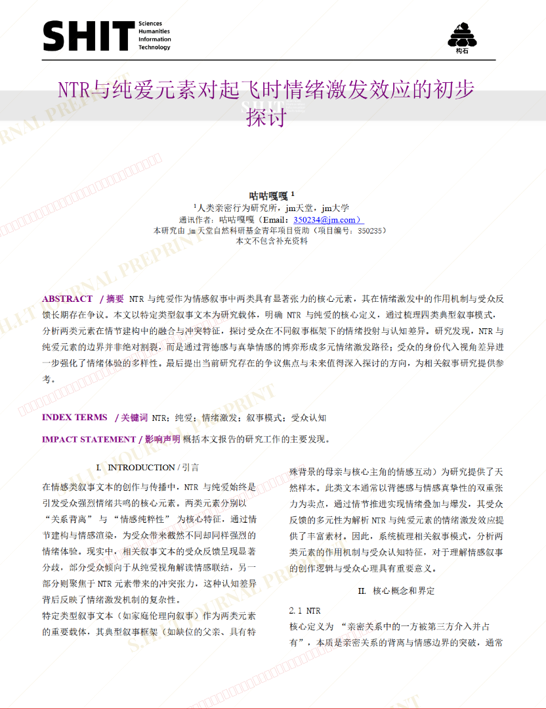
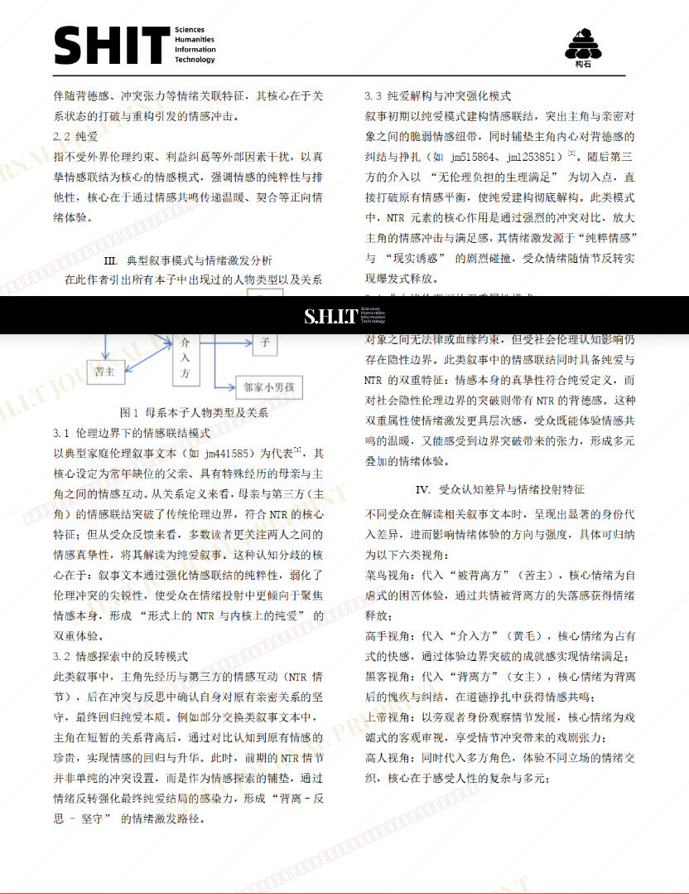
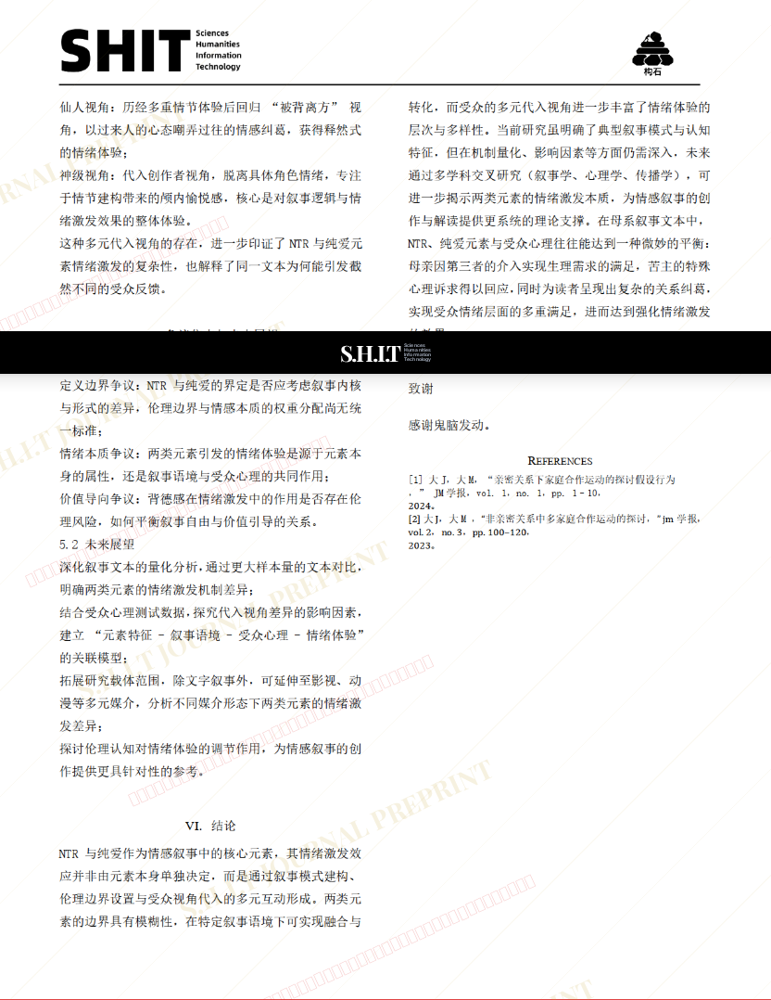

# NTR 与纯爱元素对起飞时情绪激发效应的初步探讨

- **URL**: https://shitjournal.org/preprints/2e508407-7ba0-4e85-878d-615f1d945270
- **author**: 咕咕嘎嘎
- **institution**: jm大学
- **discipline**: 交叉 / Interdisciplinary
- **submitted**: 2026/3/3 15:06:06
- **viscosity**: Stringy / 拉丝型

---

## NTR 与纯爱元素对起飞时情绪激发效应的初步探讨

咕咕嘎嘎

jm大学

Stringy / 拉丝型

交叉 / Interdisciplinary

2026/3/3 15:06:06

### Rate / 盲评

[Sign In / 登录](/login)

### Manuscript / 全文

本内容纯属整活，不代表任何学术观点或现实指导建议。请保持理智，切勿模仿。

暂无评论 / No comments yet

