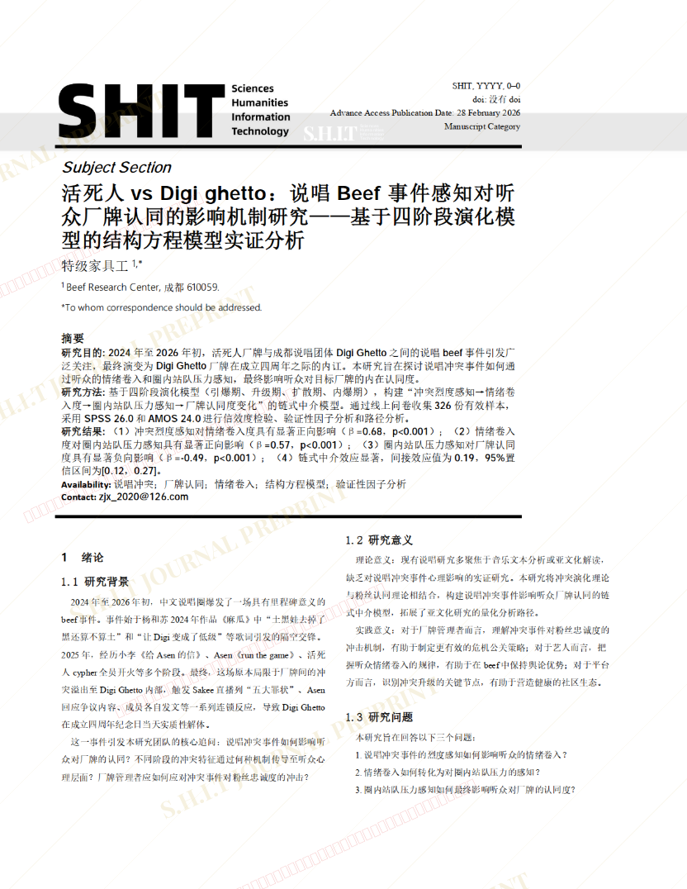
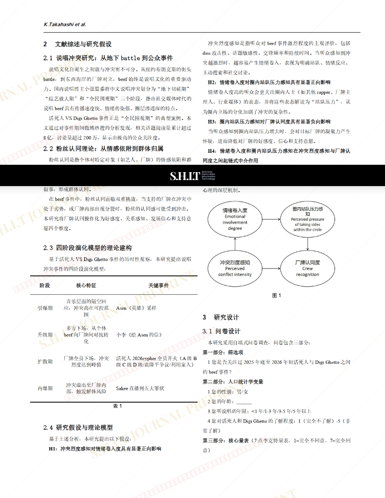
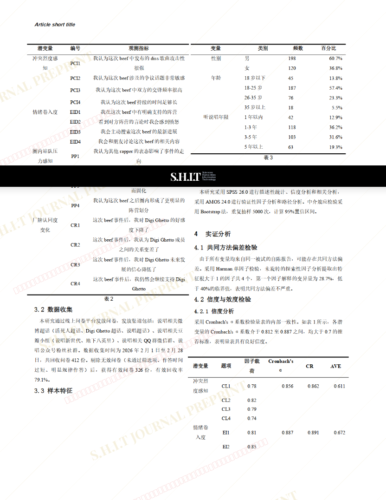
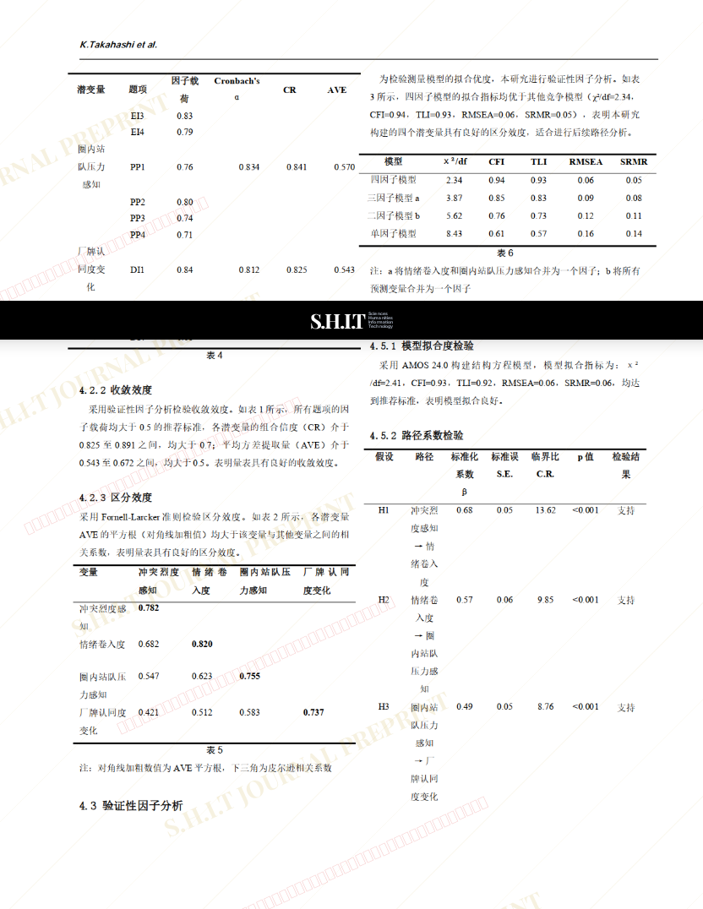
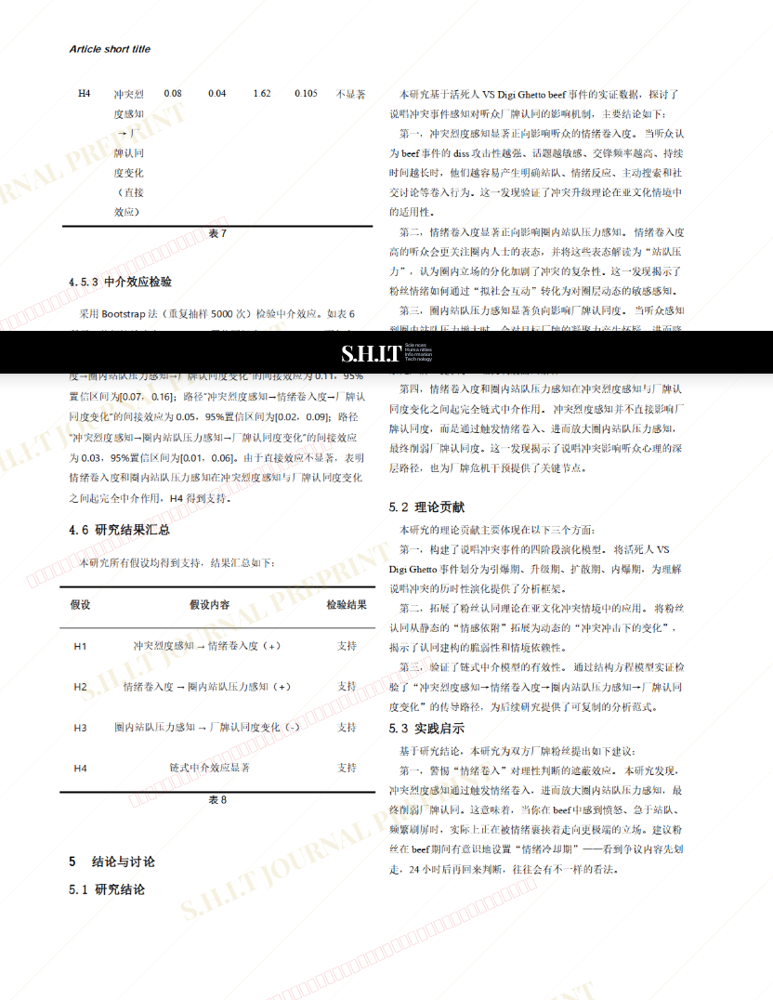
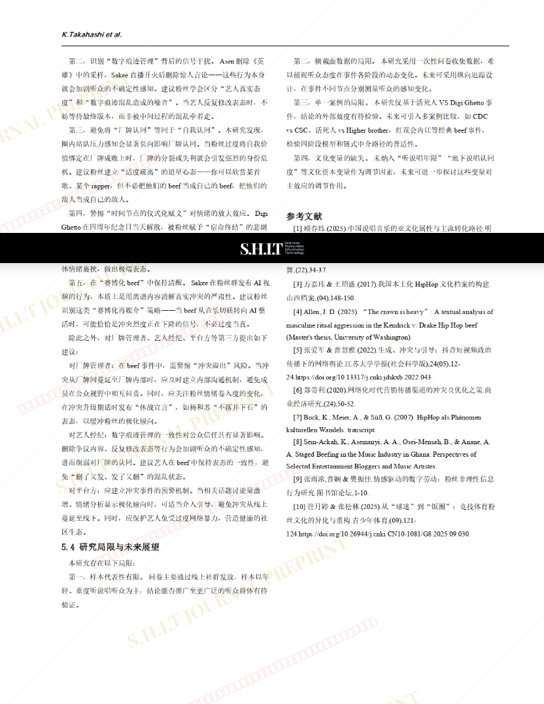

# 活死人vs Digi ghetto：说唱Beef事件感知对听众厂牌认同的影响机制研究——基于四阶段演化模型的结构方程模型实证分析

- **URL**: https://shitjournal.org/preprints/31ea70b2-f833-46ca-b9a7-2d72da9927f9
- **author**: 特级家具工
- **institution**: Beef Research Center
- **discipline**: 交叉 / Interdisciplinary
- **submitted**: 2026/2/27 17:46:30
- **viscosity**: Semi-solid / 半固态

---

## 活死人vs Digi ghetto：说唱Beef事件感知对听众厂牌认同的影响机制研究——基于四阶段演化模型的结构方程模型实证分析

特级家具工

Beef Research Center

Semi-solid / 半固态

交叉 / Interdisciplinary

2026/2/27 17:46:30

特级家具工

### Rate / 盲评

[Sign In / 登录](/login)

### Manuscript / 全文

本内容纯属整活，不代表任何学术观点或现实指导建议。请保持理智，切勿模仿。

asen锅是我们的英雄

永玄

