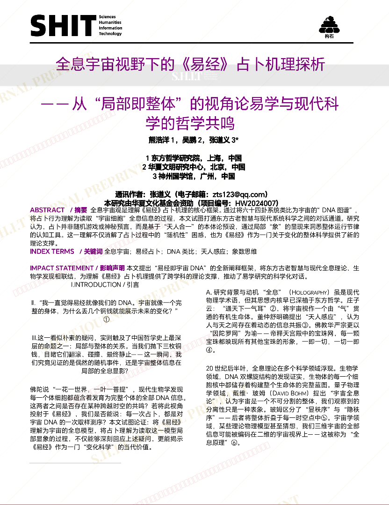
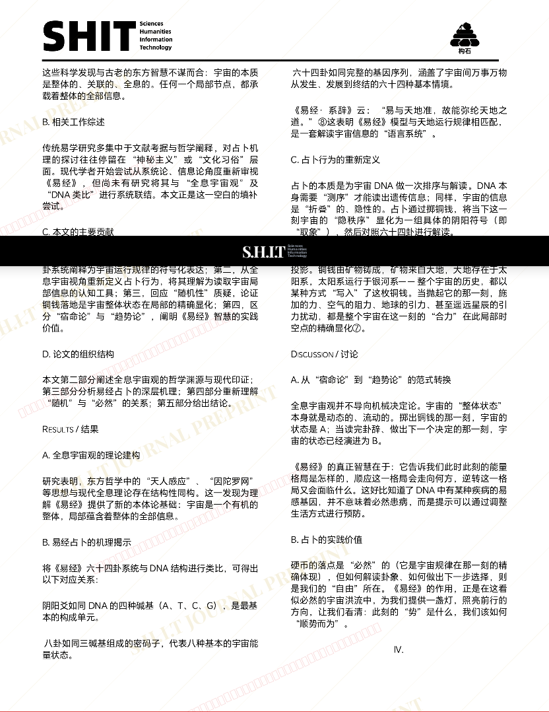
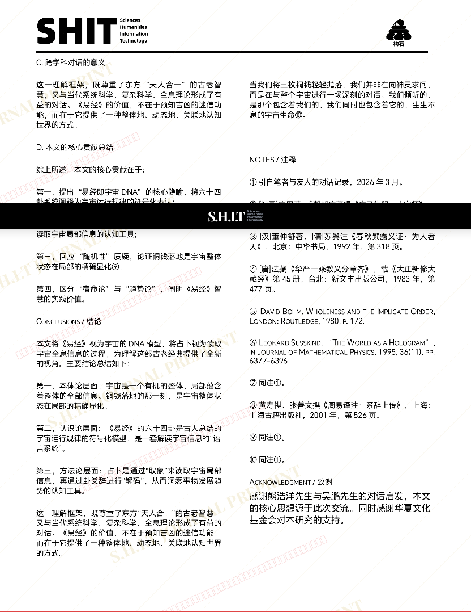
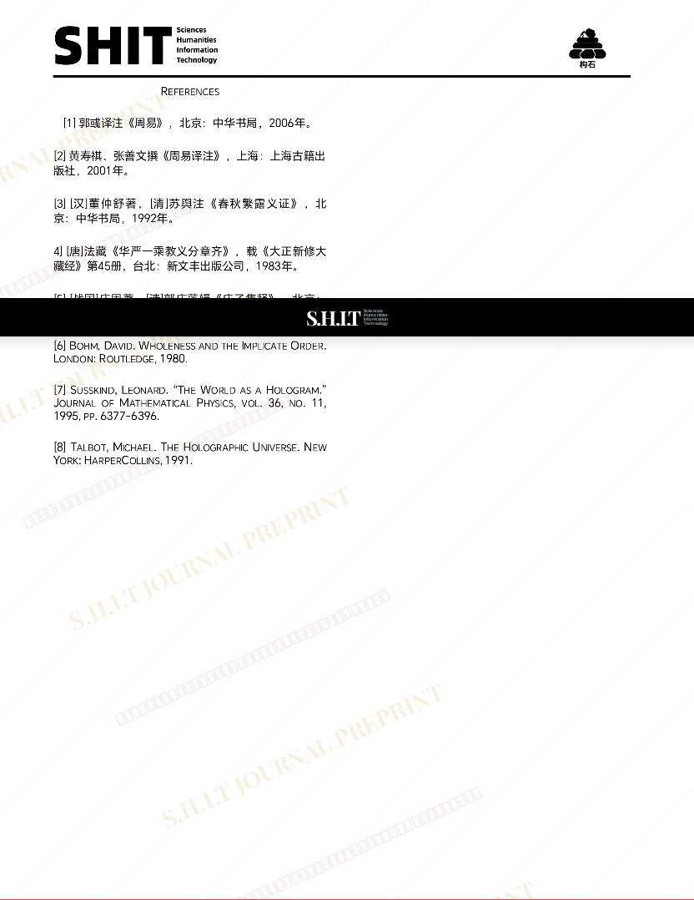

# 全息宇宙视野下的《易经》占卜机理探析  ——从“局部即整体”的视角论易学与现代科学的哲学共鸣

- **URL**: https://shitjournal.org/preprints/33351965-cda6-4a90-8042-7851e1078080
- **author**: 蛊真人
- **institution**: 哈尔滨佛教大学
- **discipline**: 交叉 / Interdisciplinary
- **submitted**: 2026/3/3 17:53:39
- **viscosity**: Stringy / 拉丝型

---

## 全息宇宙视野下的《易经》占卜机理探析  ——从“局部即整体”的视角论易学与现代科学的哲学共鸣

蛊真人

哈尔滨佛教大学

Stringy / 拉丝型

交叉 / Interdisciplinary

2026/3/3 17:53:39

### Rate / 评价

[Sign In / 登录](/login)

### Manuscript / 全文

本内容纯属整活，不代表任何学术观点或现实指导建议。请保持理智，切勿模仿。

暂无评论 / No comments yet

