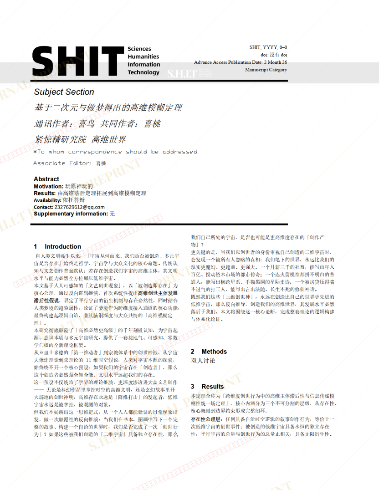
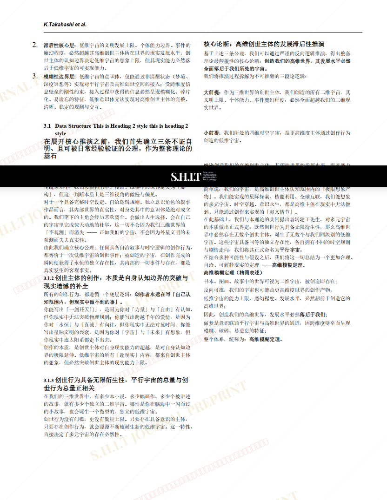
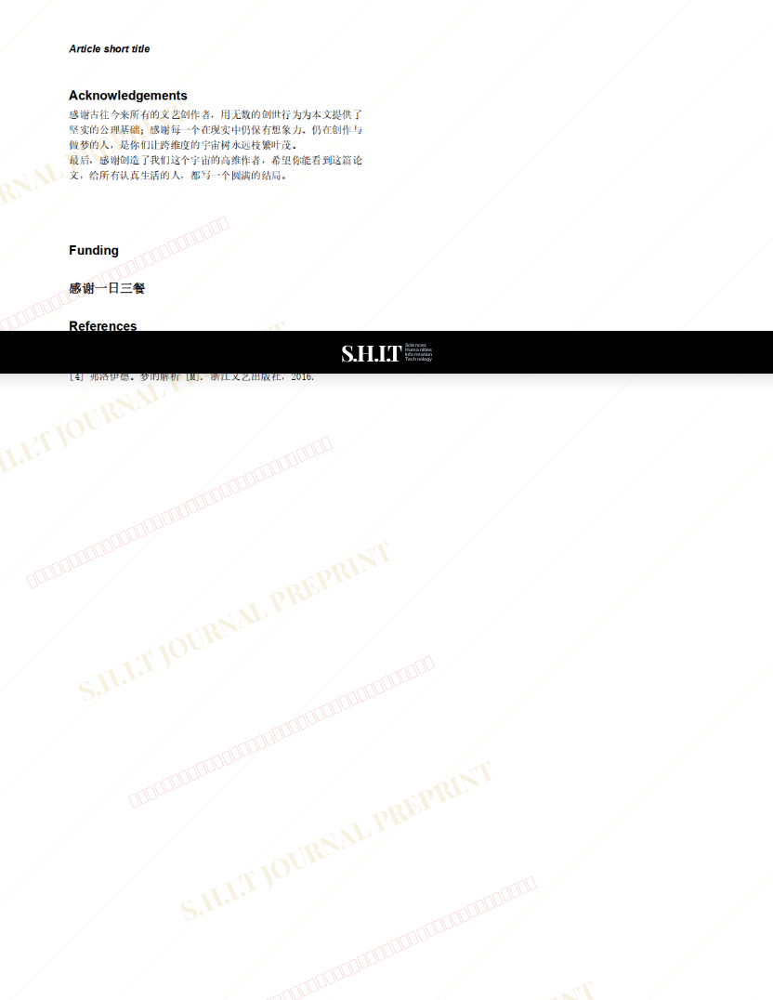

# 基于二次元与做梦中得出的高维模糊定理

- **URL**: https://shitjournal.org/preprints/36642526-ae9e-43d7-a31f-4dccdc52d259
- **author**: 喜鸟
- **institution**: 紧惊精研究所
- **discipline**: 交叉 / Interdisciplinary
- **submitted**: 2026/2/25 04:24:15
- **viscosity**: High-Entropy / 高熵态

---

## 基于二次元与做梦中得出的高维模糊定理

喜鸟

紧惊精研究所

High-Entropy / 高熵态

交叉 / Interdisciplinary

2026/2/25 04:24:15

69864920966

喜桃 · 紧惊精研究所共一

### Rate / 盲评

[Sign In / 登录](/login)

### Manuscript / 全文

本内容纯属整活，不代表任何学术观点或现实指导建议。请保持理智，切勿模仿。

暂无评论 / No comments yet

