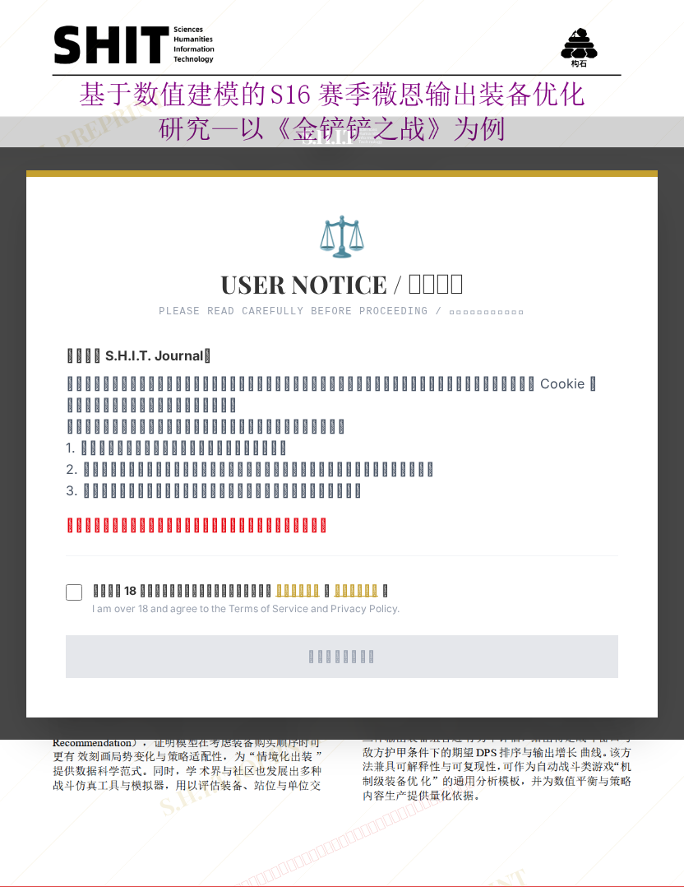

# 基于数值建模的S16 赛季薇恩输出装备优化研究——以《金 铲铲之战》为例

## 元信息

- **作者**: shitman
- **机构**: 
- **分区**: septic
- **学科**: science
- **标签**: meme
- **提交时间**: 2026-03-03T17:01:54.260093Z
- **评分**: 4.36 / 5（39 人）

## 链接

- [网站原始文章](https://shitjournal.org/preprints/40792bec-ab0b-48e4-95e6-e298f5fb930b)
- [PDF](https://files.shitjournal.org/40792bec-ab0b-48e4-95e6-e298f5fb930b.pdf)
- [文章元信息](40792bec-ab0b-48e4-95e6-e298f5fb930b.meta.json)

## 正文

