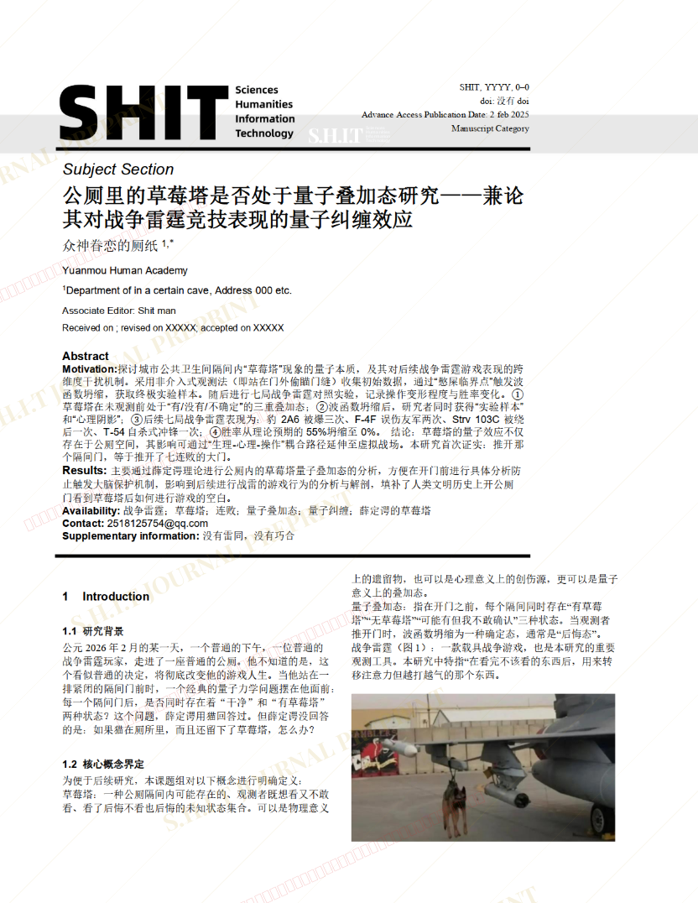
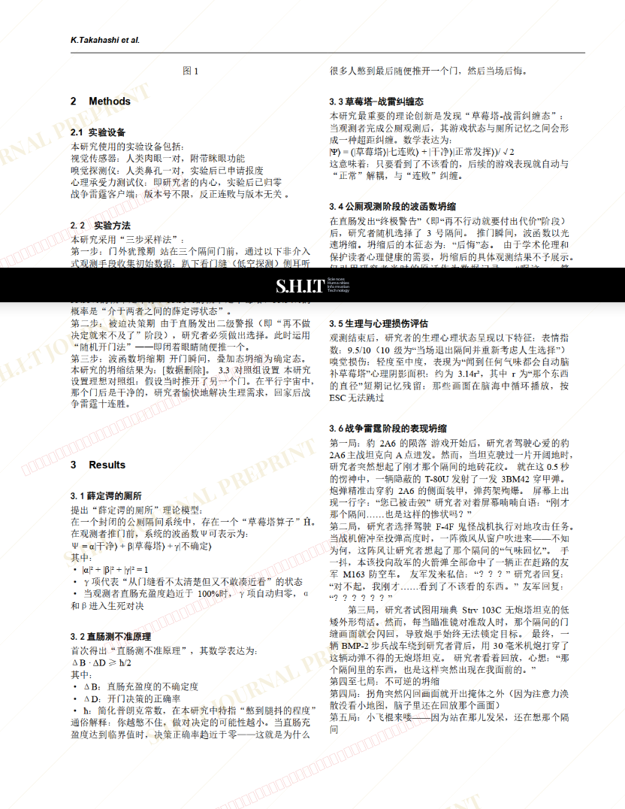
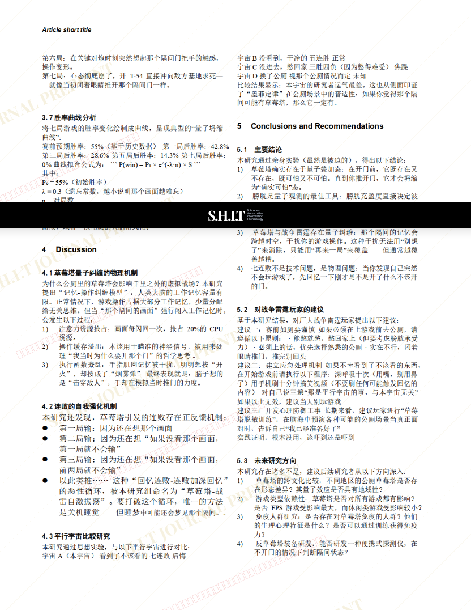
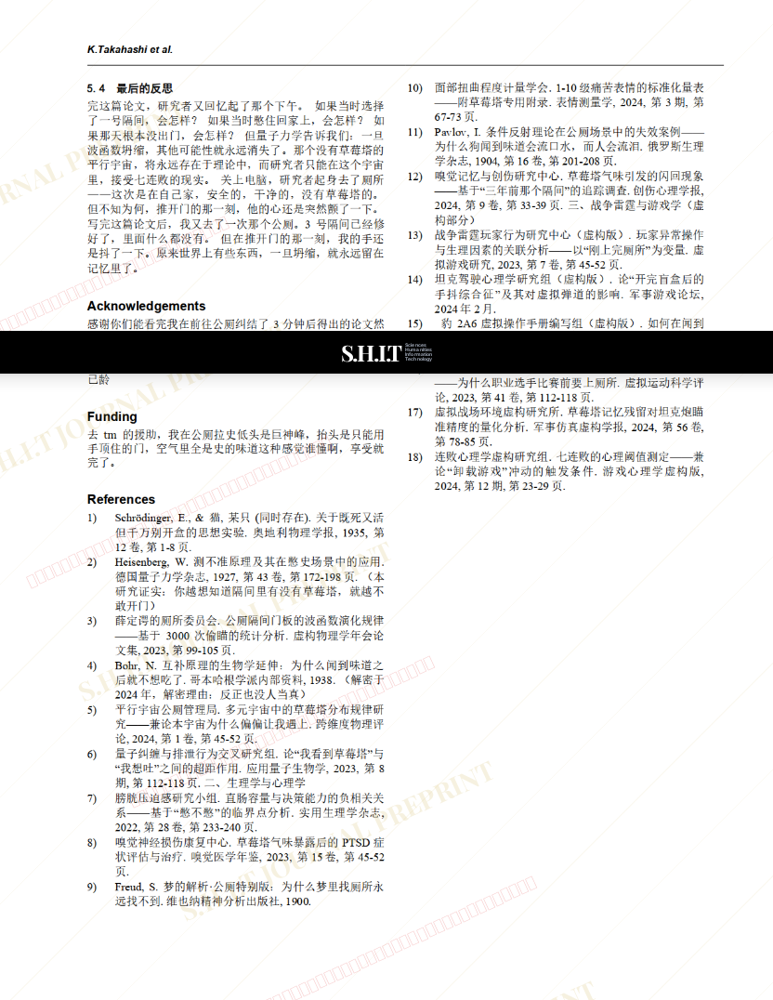

# 公厕里的草莓塔是否处于量子叠加态研究——兼论其对战争雷霆竞技表现的量子纠缠效应

- **URL**: https://shitjournal.org/preprints/41896950-f85f-4149-81b7-dd9618017dc4
- **author**: 众神眷恋的厕纸
- **institution**: 元谋人学院
- **discipline**: 交叉 / Interdisciplinary
- **submitted**: 2026/2/25 14:04:46
- **viscosity**: High-Entropy / 高熵态

---

## 公厕里的草莓塔是否处于量子叠加态研究——兼论其对战争雷霆竞技表现的量子纠缠效应

众神眷恋的厕纸

元谋人学院

High-Entropy / 高熵态

交叉 / Interdisciplinary

2026/2/25 14:04:46

b站：众神眷恋的厕纸/抖音号：beizhendaodu

### Rate / 盲评

[Sign In / 登录](/login)

### Manuscript / 全文

本内容纯属整活，不代表任何学术观点或现实指导建议。请保持理智，切勿模仿。

暂无评论 / No comments yet

