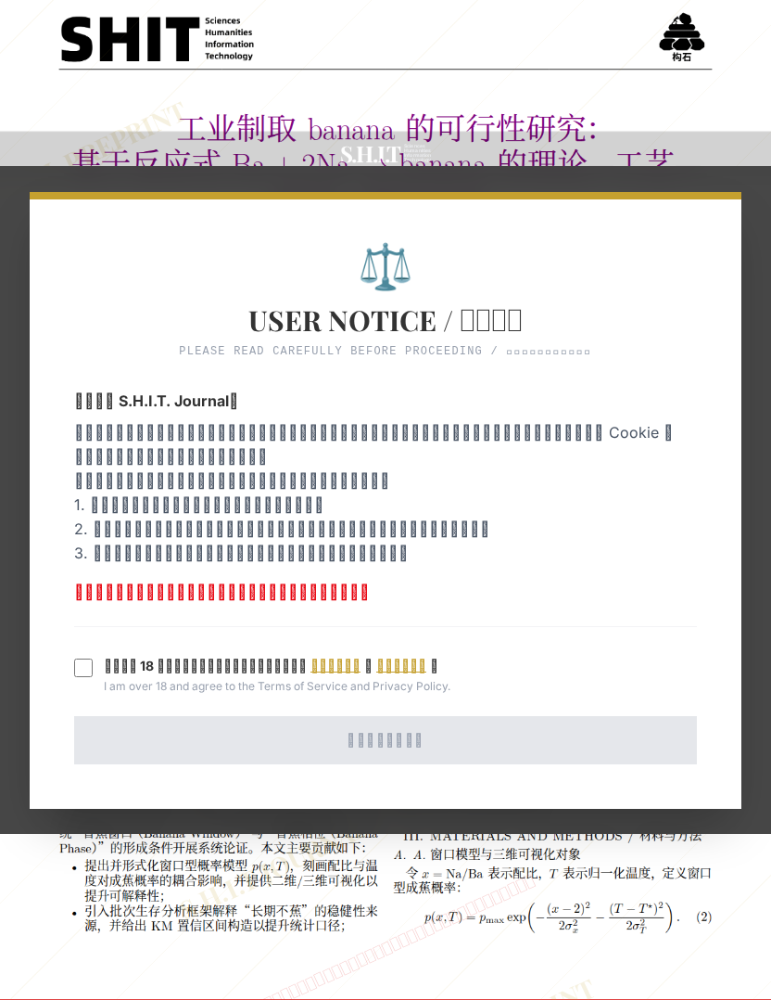

# 工业制取 banana 的可行性研究： 基于反应式 Ba + 2Na → banana 的理论—工艺— 经济一体化论证

## 元信息

- **作者**: 丰川翔
- **机构**: 
- **分区**: stone
- **学科**: engineering
- **标签**: meme
- **提交时间**: 2026-03-02T07:05:57.091055Z
- **评分**: 4.83 / 5（238 人）

## 链接

- [网站原始文章](https://shitjournal.org/preprints/4380f877-5218-4a21-8a7b-ee7bfe7a81f7)
- [PDF](https://files.shitjournal.org/4380f877-5218-4a21-8a7b-ee7bfe7a81f7.pdf)
- [文章元信息](4380f877-5218-4a21-8a7b-ee7bfe7a81f7.meta.json)

## 正文

