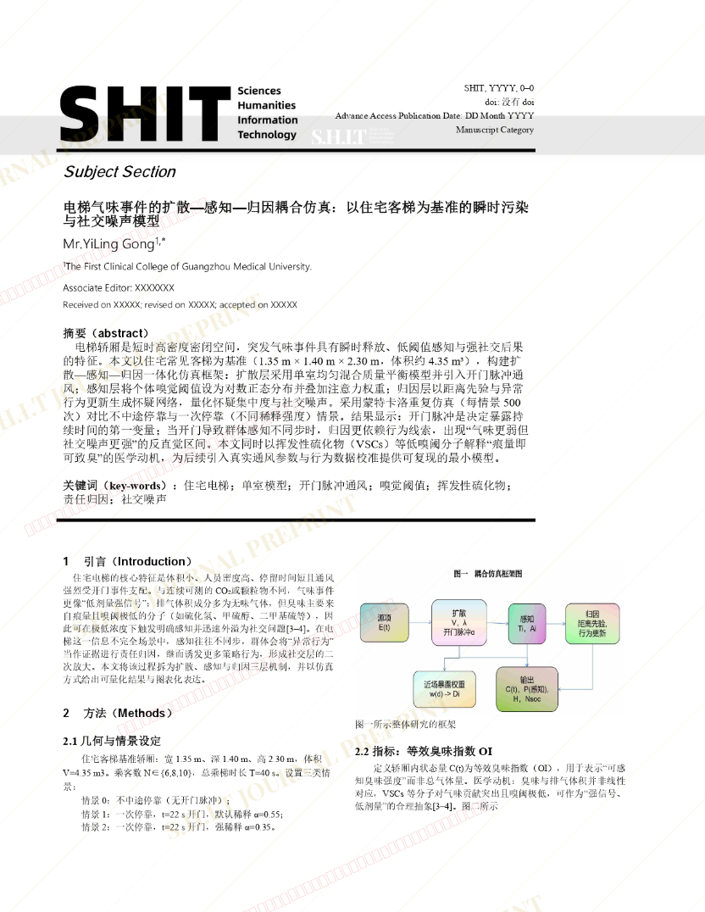
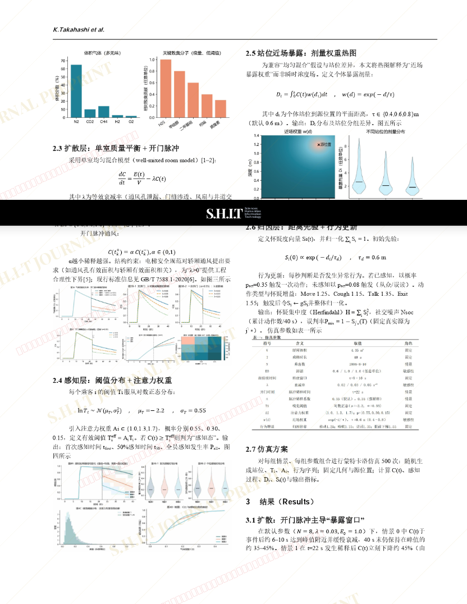
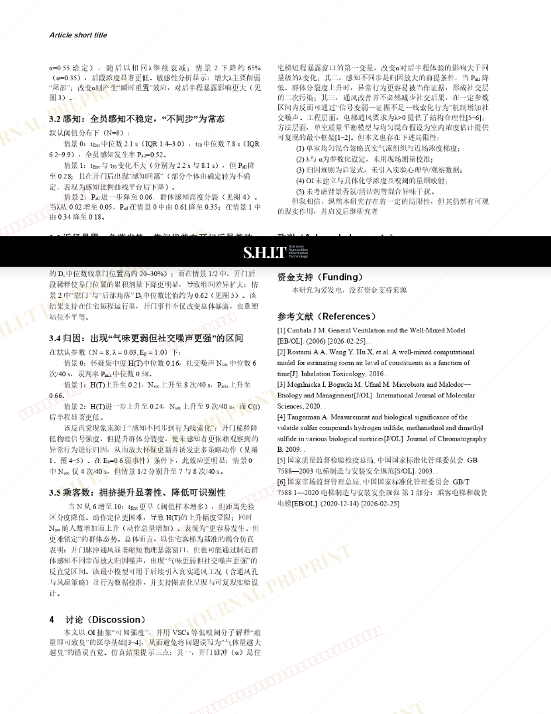

# 电梯气味事件的扩散—感知—归因耦合仿真：以住宅客梯为基准的瞬时污染与社交噪声模型

- **URL**: https://shitjournal.org/preprints/4f1d93e3-84f8-4a23-8b42-7b0e60229a12
- **author**: Mr.YiLing Gong
- **institution**: GMU
- **discipline**: 交叉 / Interdisciplinary
- **submitted**: 2026/2/25 11:58:48
- **viscosity**: Stringy / 拉丝型

---

## 电梯气味事件的扩散—感知—归因耦合仿真：以住宅客梯为基准的瞬时污染与社交噪声模型

Mr.YiLing Gong

GMU

Stringy / 拉丝型

交叉 / Interdisciplinary

2026/2/25 11:58:48

### Rate / 盲评

[Sign In / 登录](/login)

### Manuscript / 全文

本内容纯属整活，不代表任何学术观点或现实指导建议。请保持理智，切勿模仿。

暂无评论 / No comments yet

