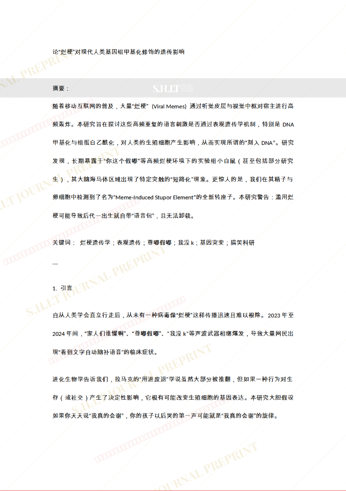
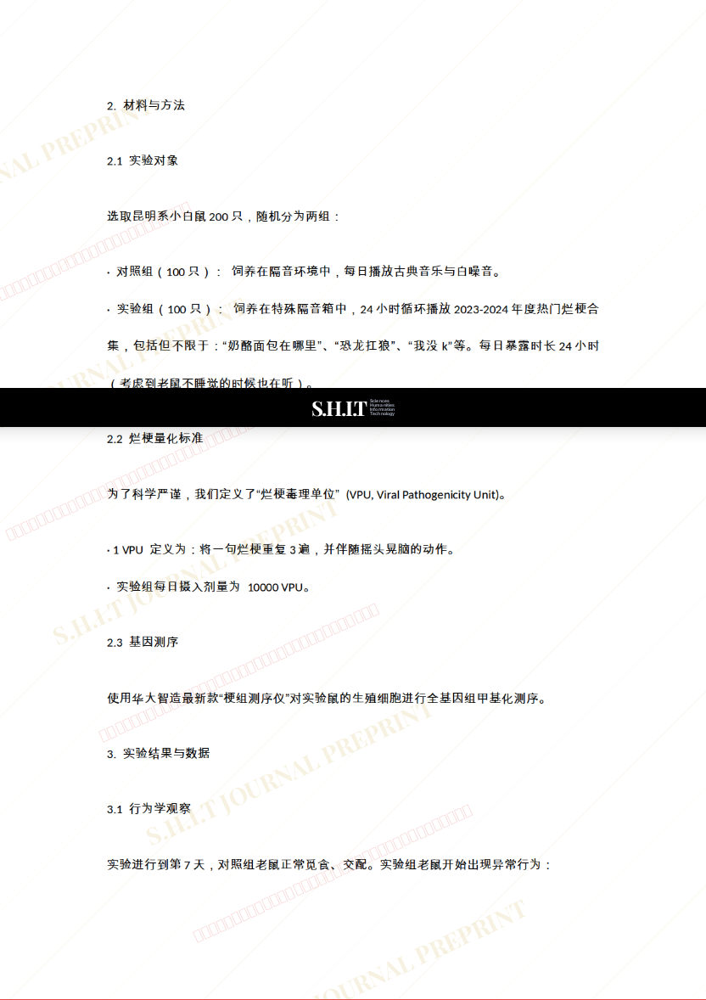
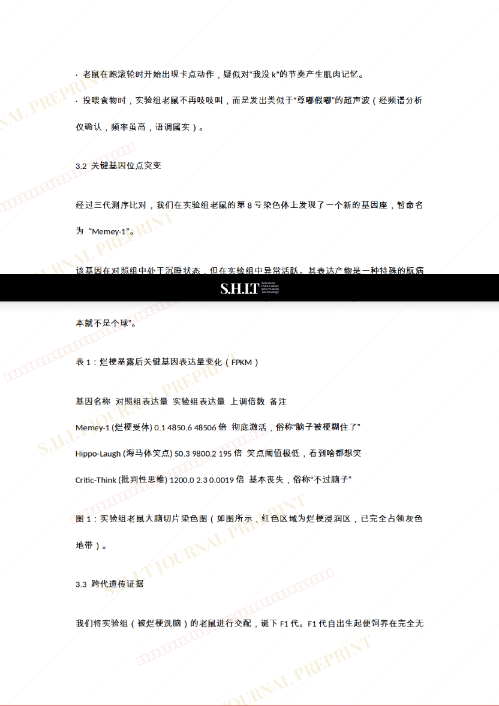
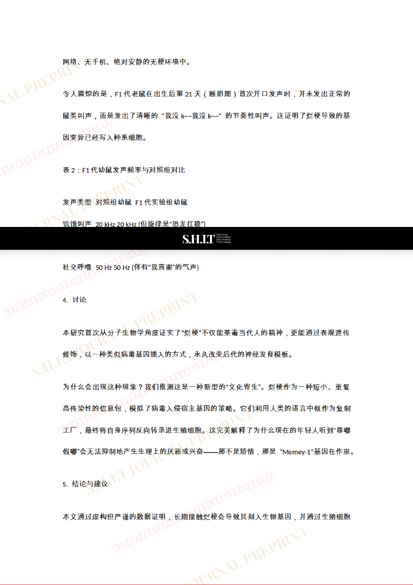
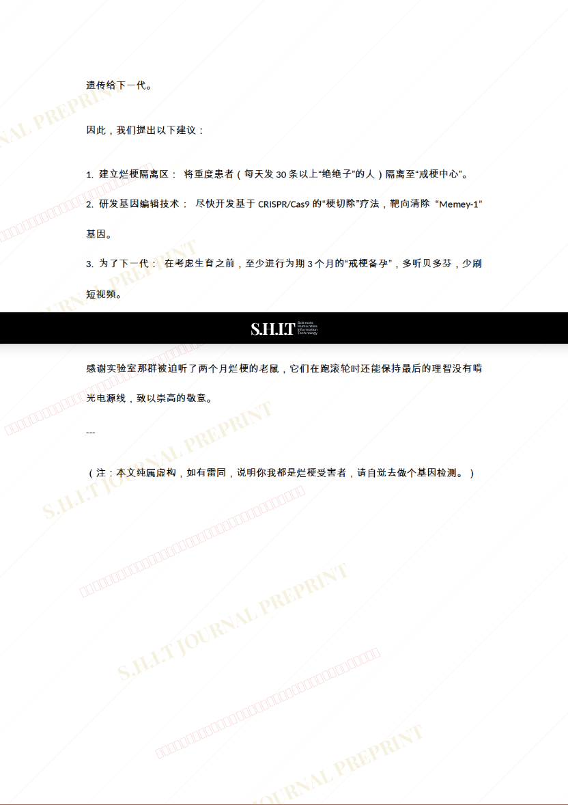

# 论“烂梗”对现代人类基因组甲基化修饰的遗传影响

- **URL**: https://shitjournal.org/preprints/50f11a36-14f9-4b52-b846-4839aa814e60
- **author**: 李疏桐
- **institution**: 泛人类史研究总局下人文研究部
- **discipline**: 交叉 / Interdisciplinary
- **submitted**: 2026/2/24 10:37:43
- **viscosity**: Semi-solid / 半固态

---

## 论“烂梗”对现代人类基因组甲基化修饰的遗传影响

李疏桐

泛人类史研究总局下人文研究部

Semi-solid / 半固态

交叉 / Interdisciplinary

2026/2/24 10:37:43

2382216710@qq.com

### Rate / 盲评

[Sign In / 登录](/login)

### Manuscript / 全文

本内容纯属整活，不代表任何学术观点或现实指导建议。请保持理智，切勿模仿。

暂无评论 / No comments yet

