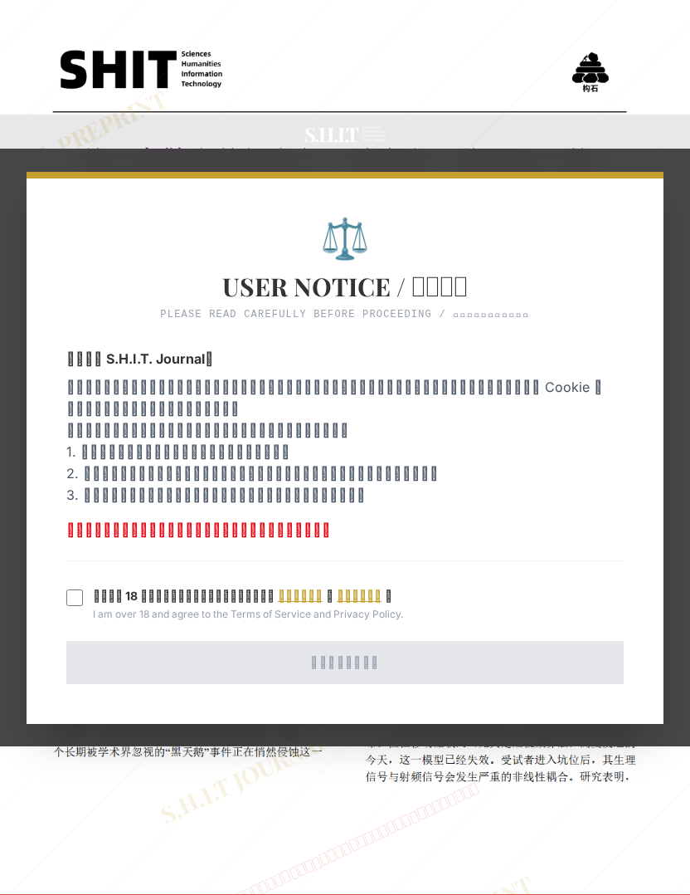

# 基于离散事件触发与“波塞冬”物理层干扰的教学楼公共卫生单元“占坑行为”抑制策略研究

- **URL**: https://shitjournal.org/preprints/51c4fd3f-c43a-4978-b565-87e704b4cbbd
- **author**: 风吹裤衩屁屁凉
- **institution**: 不知名师专
- **discipline**: 工 / Engineering
- **submitted**: 2026/3/4 01:51:01
- **viscosity**: High-Entropy / 高熵态

---

## 基于离散事件触发与“波塞冬”物理层干扰的教学楼公共卫生单元“占坑行为”抑制策略研究

风吹裤衩屁屁凉

不知名师专

High-Entropy / 高熵态

工 / Engineering

2026/3/4 01:51:01

抖音号：57859762130

xjj · 汇安大学

lk · 不知名师专

### Rate / 评价

[Sign In / 登录](/login)

### Manuscript / 全文

本内容纯属整活，不代表任何学术观点或现实指导建议。请保持理智，切勿模仿。

暂无评论 / No comments yet

