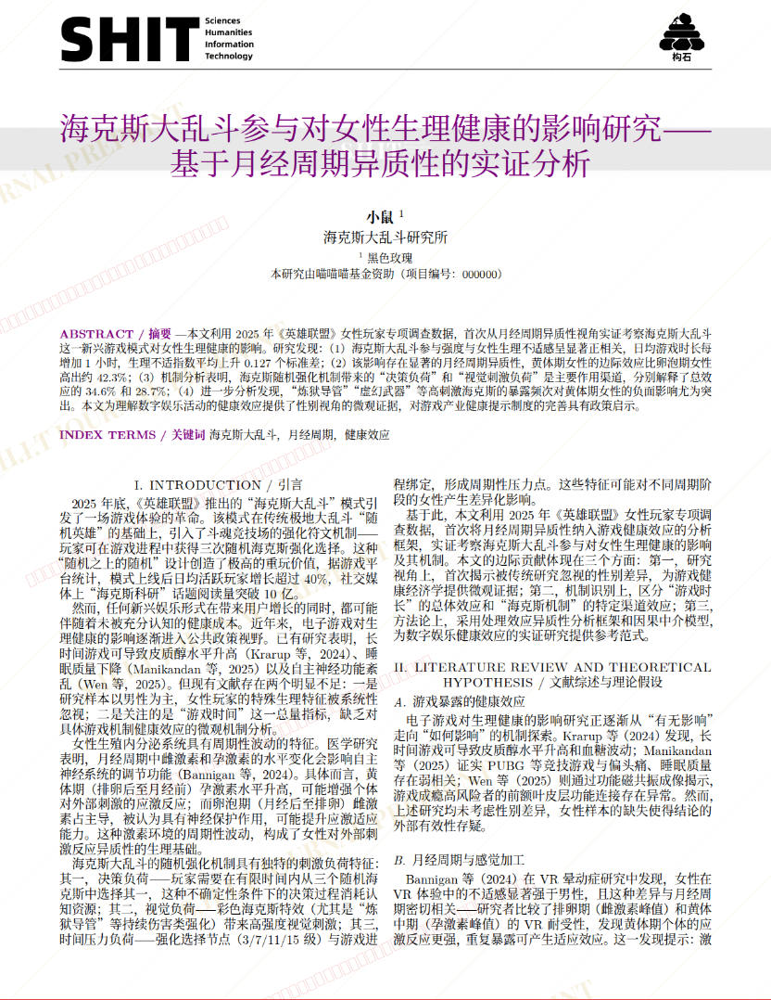
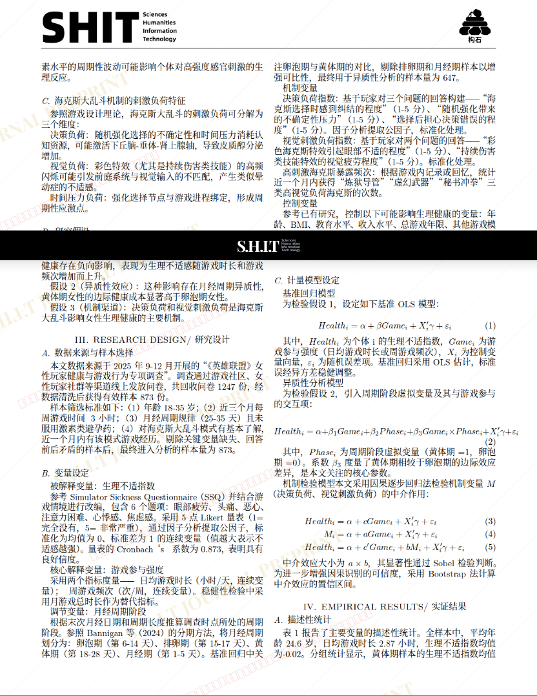
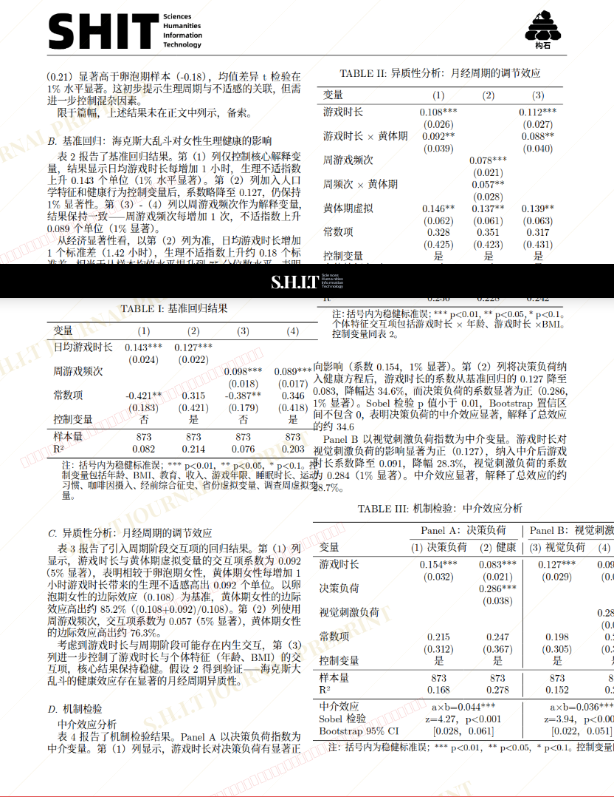
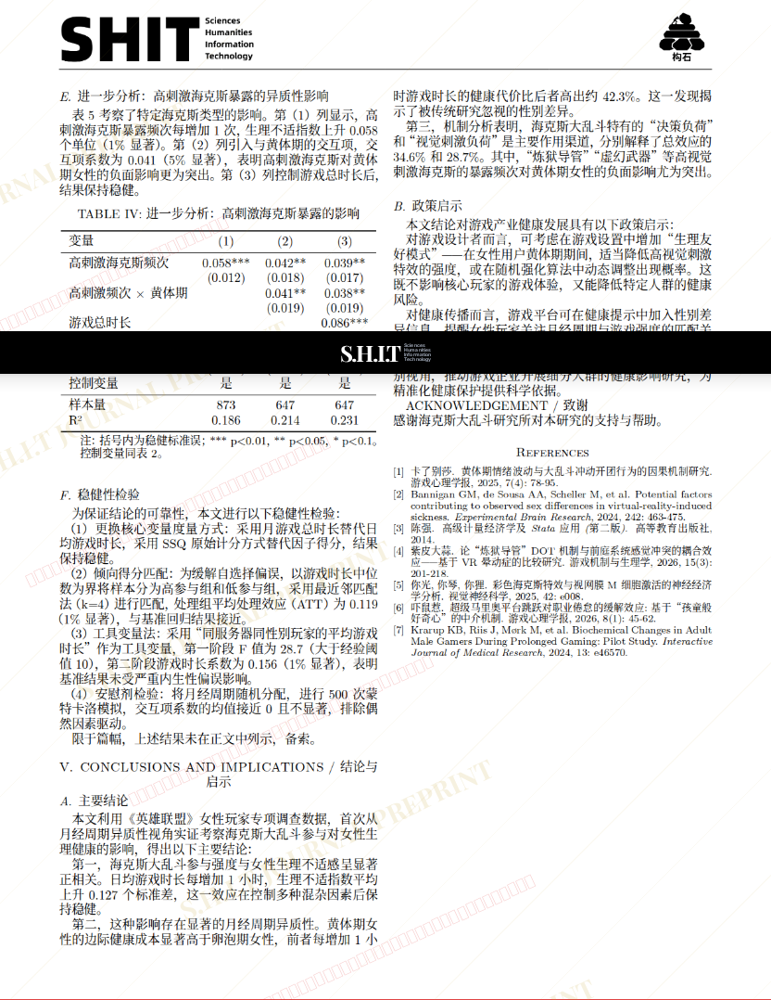

# 海克斯大乱斗参与对女性生理健康的影响研究 ——基于月经周期异质性的实证分析

- **URL**: https://shitjournal.org/preprints/5227b4cb-8f24-485e-94b1-a1eb247d472b
- **author**: 小鼠
- **institution**: 鼠鼠大学
- **discipline**: 交叉 / Interdisciplinary
- **submitted**: 2026/2/28 15:02:54
- **viscosity**: Semi-solid / 半固态

---

## 海克斯大乱斗参与对女性生理健康的影响研究 ——基于月经周期异质性的实证分析

小鼠

鼠鼠大学

Semi-solid / 半固态

交叉 / Interdisciplinary

2026/2/28 15:02:54

### Rate / 盲评

[Sign In / 登录](/login)

### Manuscript / 全文

本内容纯属整活，不代表任何学术观点或现实指导建议。请保持理智，切勿模仿。

暂无评论 / No comments yet

