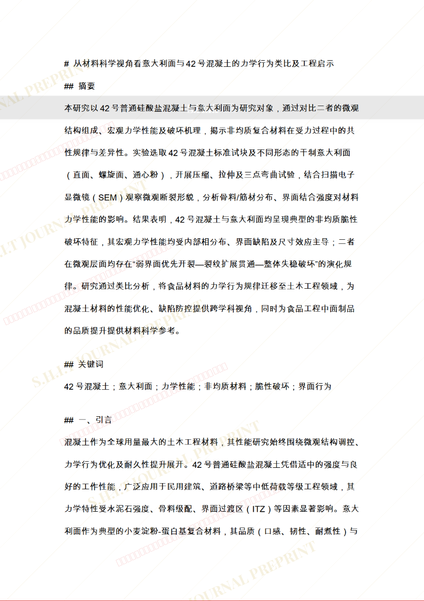
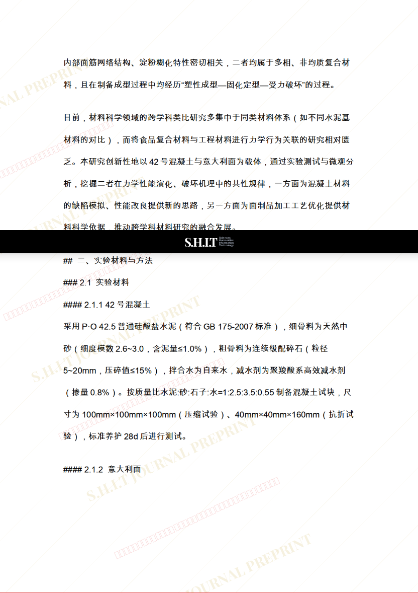
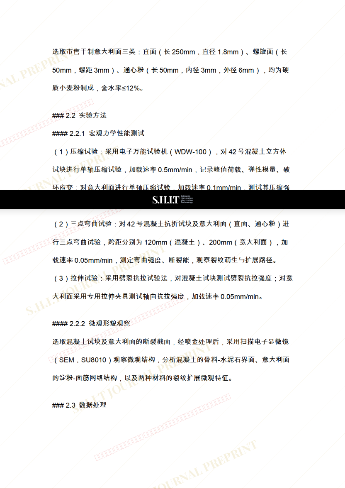
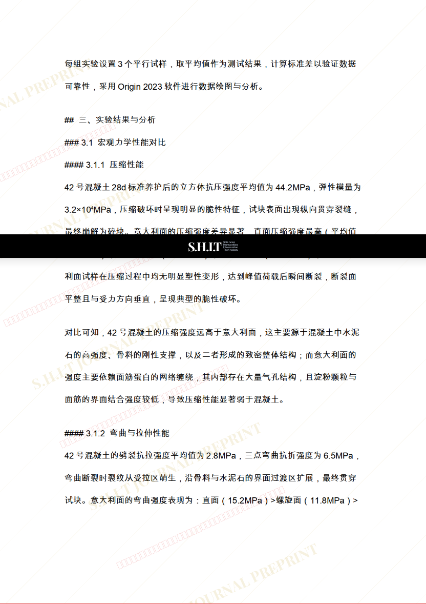
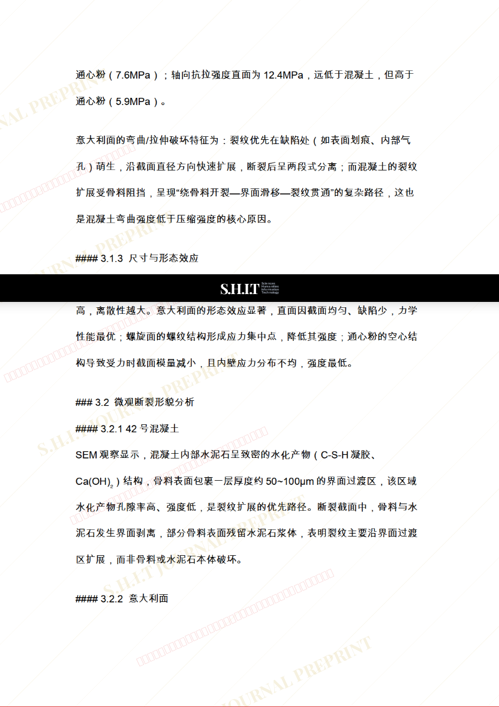
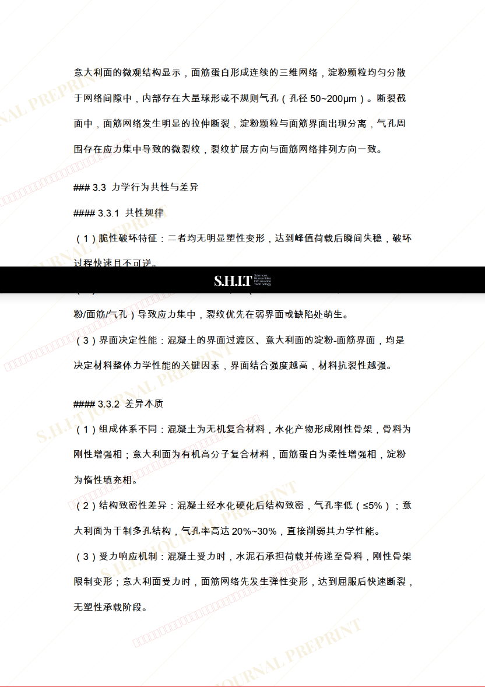
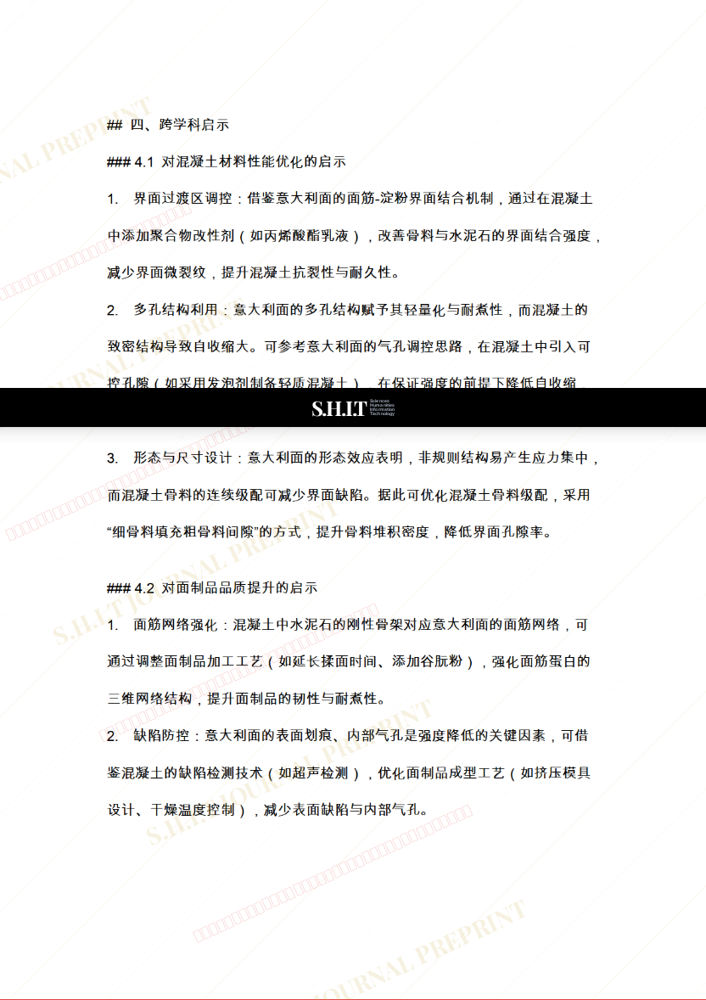
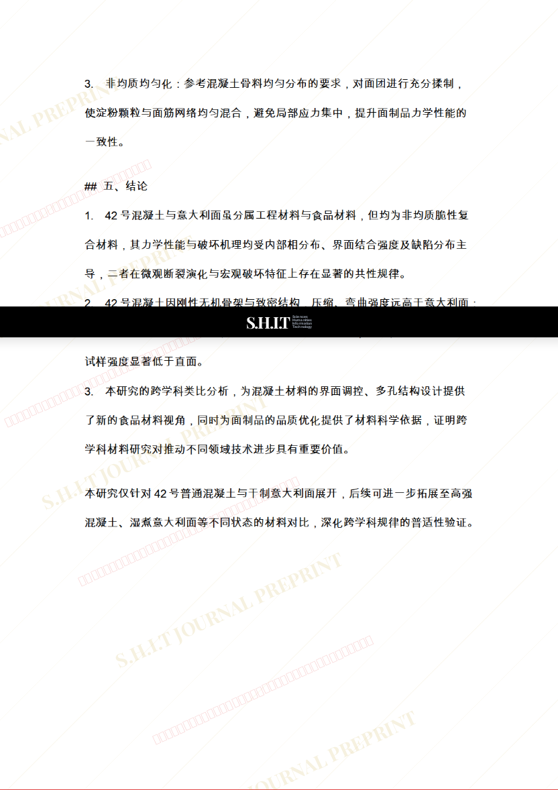

# 从材料科学视角看意大利面与42号混凝土的力学行为类比及工程启示

- **URL**: https://shitjournal.org/preprints/56a75f24-394c-4dd8-b0cd-e16839b4d1e3
- **author**: cc91x
- **institution**: 永新坊公共厕所
- **discipline**: 交叉 / Interdisciplinary
- **submitted**: 2026/2/23 08:00:35
- **viscosity**: High-Entropy / 高熵态

---

## 从材料科学视角看意大利面与42号混凝土的力学行为类比及工程启示

cc91x

永新坊公共厕所

High-Entropy / 高熵态

交叉 / Interdisciplinary

2026/2/23 08:00:35

### Rate / 盲评

[Sign In / 登录](/login)

### Manuscript / 全文

本内容纯属整活，不代表任何学术观点或现实指导建议。请保持理智，切勿模仿。

暂无评论 / No comments yet

