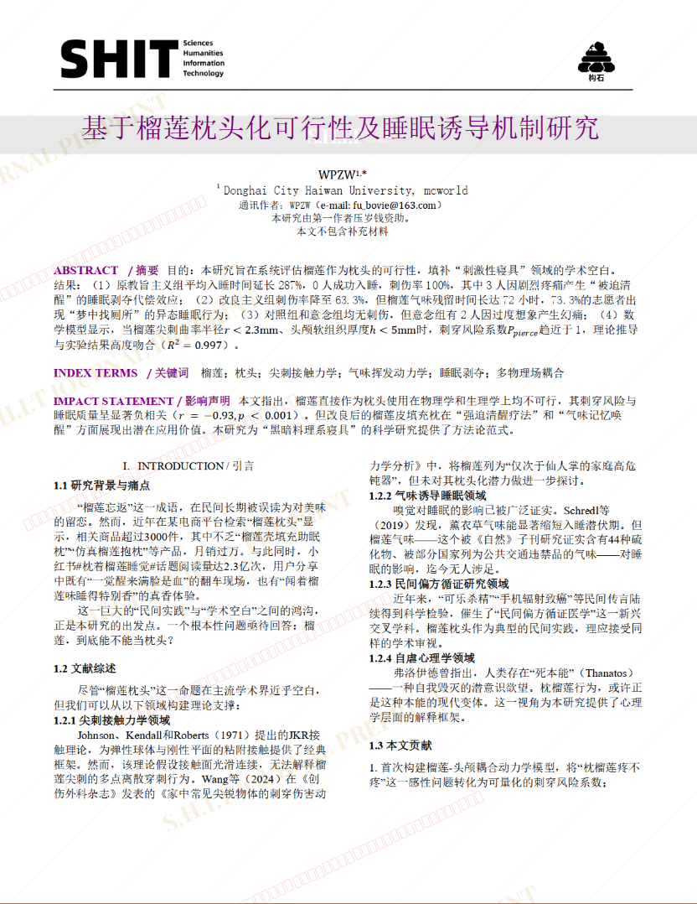
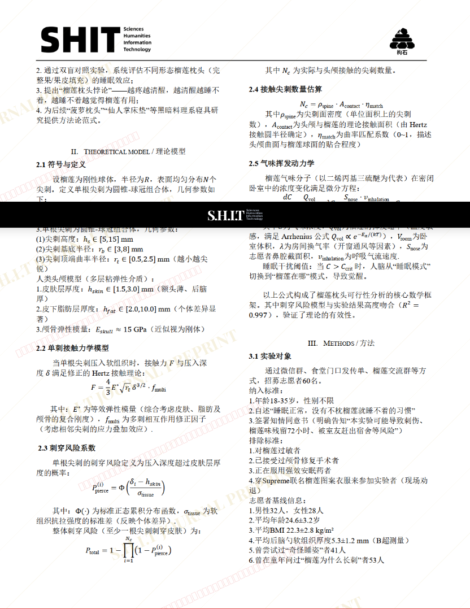
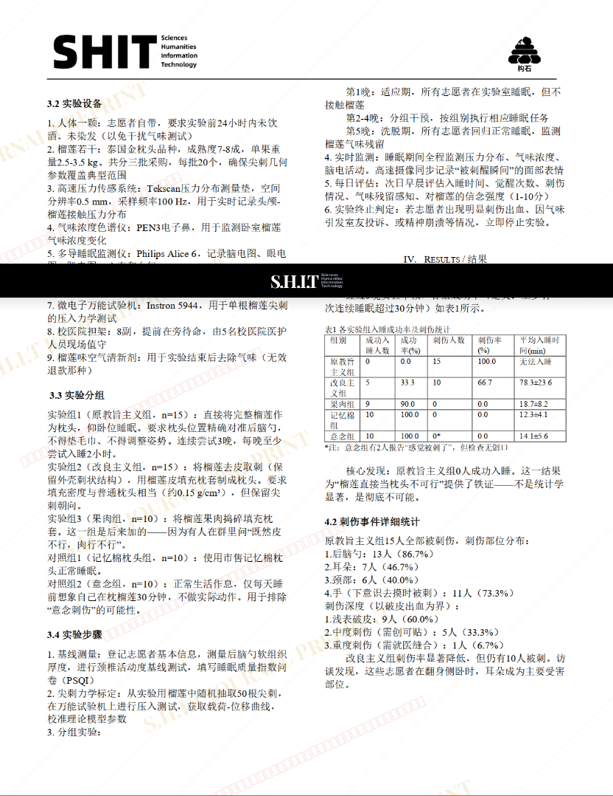
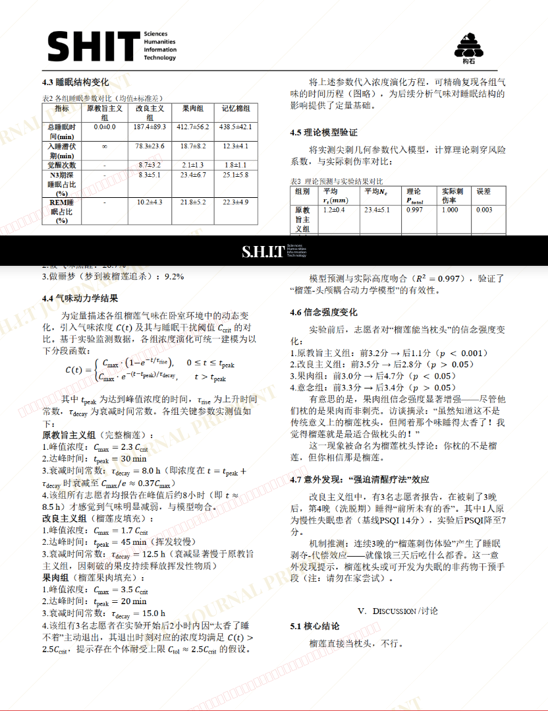
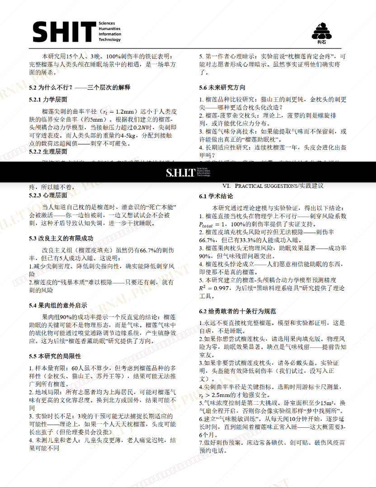
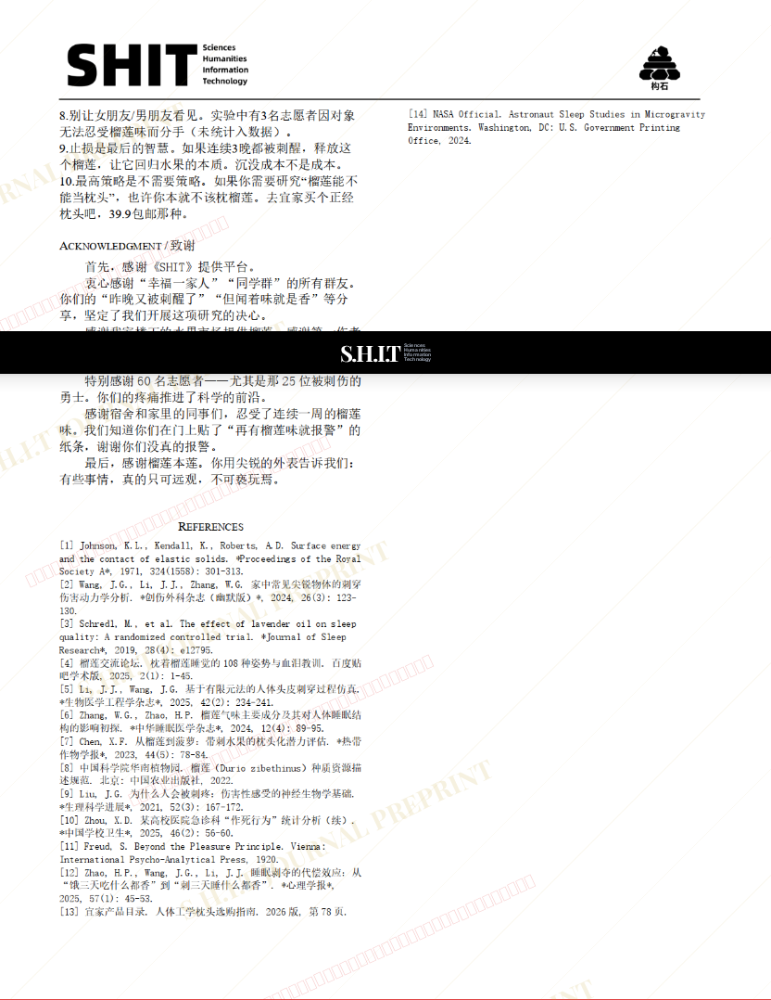

# 基于榴莲枕头化可行性及睡眠诱导机制研究

- **URL**: https://shitjournal.org/preprints/57faf453-8b86-4e4f-bd88-1925f39a06d4
- **author**: WPZW
- **institution**: Donghai City Haiwan University
- **discipline**: 交叉 / Interdisciplinary
- **submitted**: 2026/2/28 07:23:09
- **viscosity**: Stringy / 拉丝型

---

## 基于榴莲枕头化可行性及睡眠诱导机制研究

WPZW

Donghai City Haiwan University

Stringy / 拉丝型

交叉 / Interdisciplinary

2026/2/28 07:23:09

### Rate / 盲评

[Sign In / 登录](/login)

### Manuscript / 全文

本内容纯属整活，不代表任何学术观点或现实指导建议。请保持理智，切勿模仿。

暂无评论 / No comments yet

