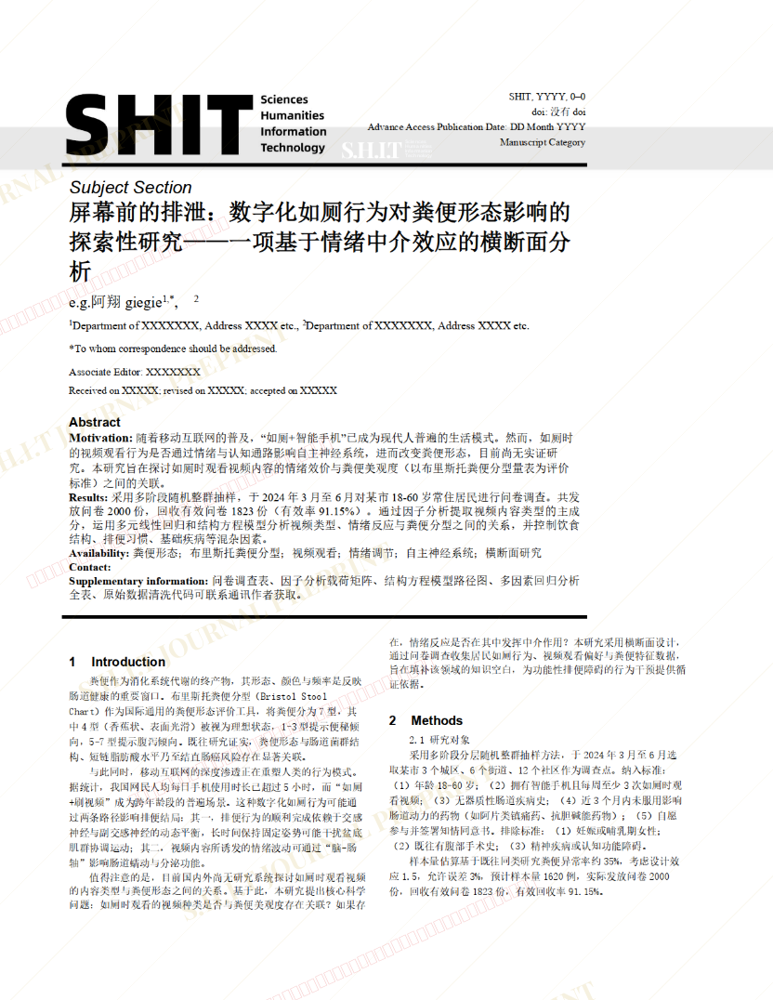
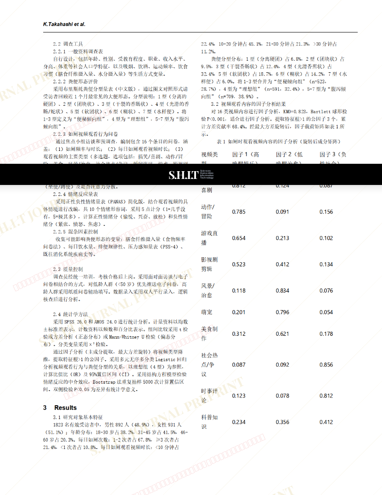
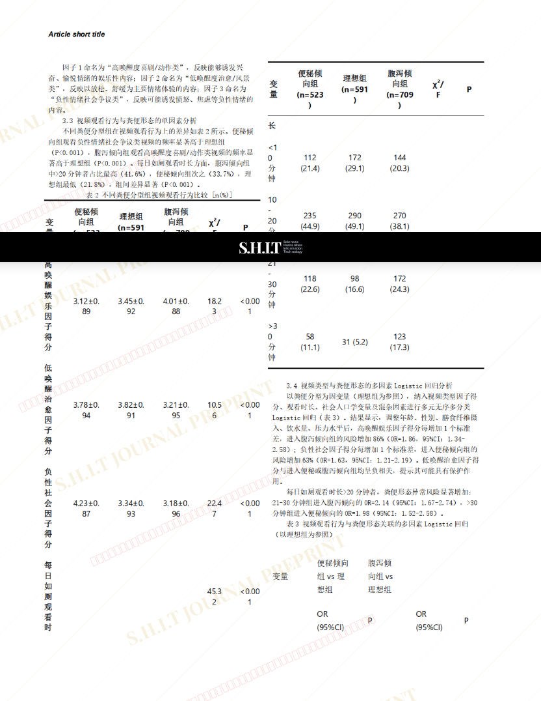
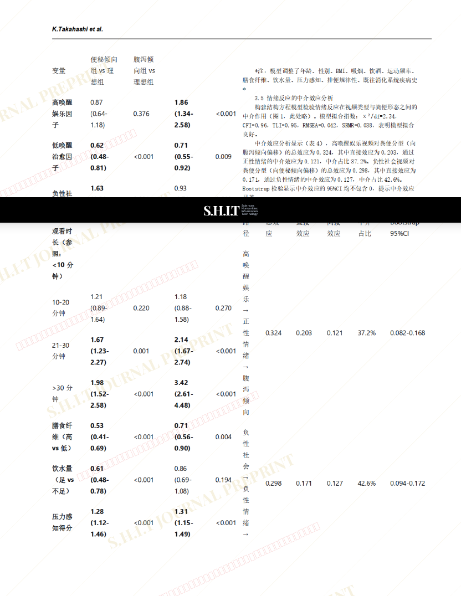
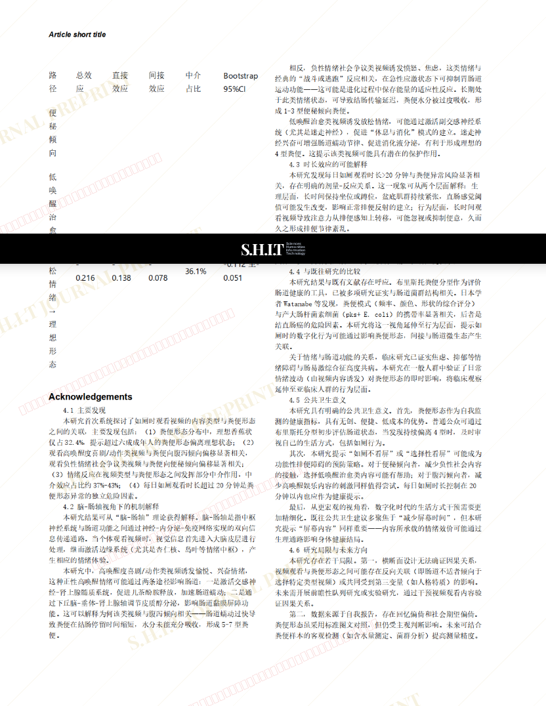
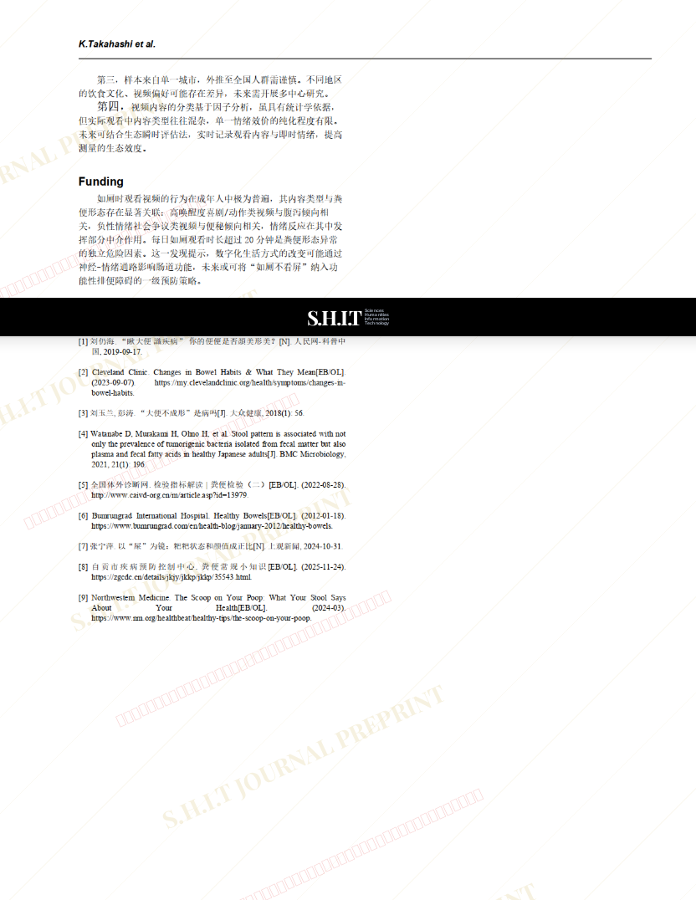

# 屏幕前的排泄：数字化如厕行为对粪便形态影响的探索性研究 ——一项基于情绪中介效应的横断面分析

- **URL**: https://shitjournal.org/preprints/59ebf14f-fe06-48d1-aa62-1ee66f34a7db
- **author**: e.g.阿翔giegie
- **institution**: 屎壳狼研究院西北分院
- **discipline**: 交叉 / Interdisciplinary
- **submitted**: 2026/2/25 05:43:31
- **viscosity**: Semi-solid / 半固态

---

## 屏幕前的排泄：数字化如厕行为对粪便形态影响的探索性研究 ——一项基于情绪中介效应的横断面分析

e.g.阿翔giegie

屎壳狼研究院西北分院

Semi-solid / 半固态

交叉 / Interdisciplinary

2026/2/25 05:43:31

💩 · 屎壳狼研究院西北分院

### Rate / 盲评

[Sign In / 登录](/login)

### Manuscript / 全文

本内容纯属整活，不代表任何学术观点或现实指导建议。请保持理智，切勿模仿。

暂无评论 / No comments yet

