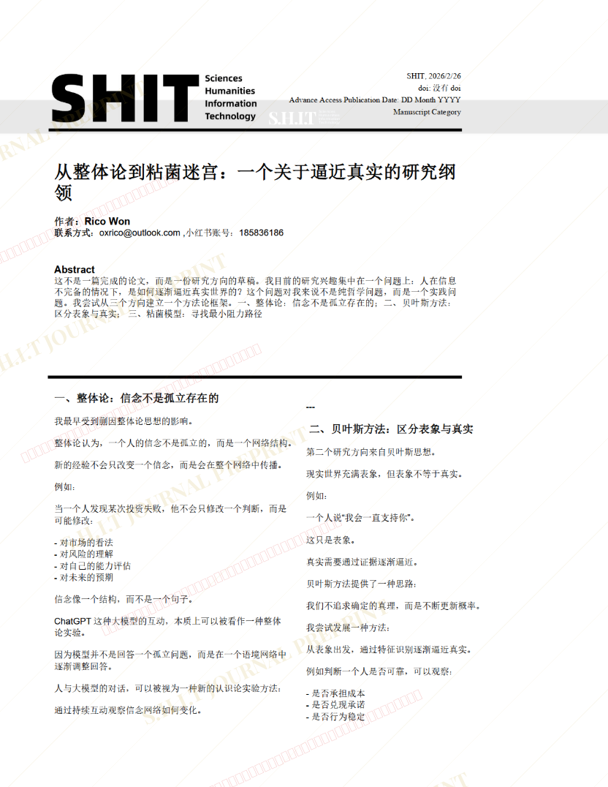
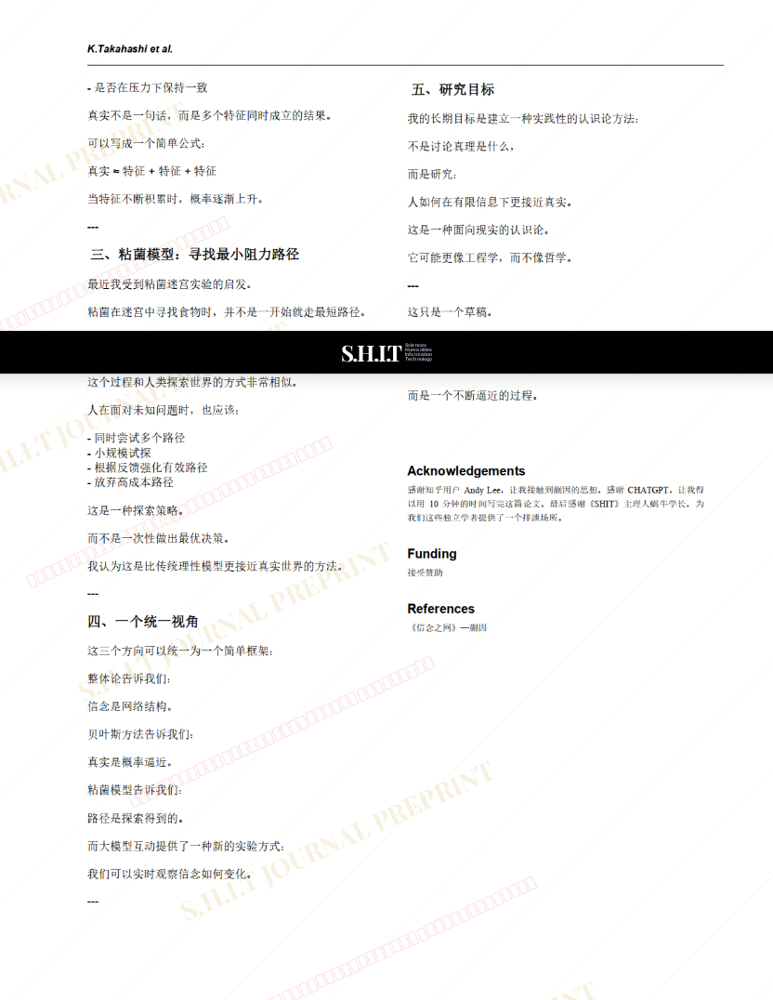

# 基于蒯因整体论下对大模型的研究

- **URL**: https://shitjournal.org/preprints/5aa3b9d6-eda8-41cf-a5f7-c8b26ce65f63
- **author**: Dr.Won
- **institution**: 独立学者
- **discipline**: 交叉 / Interdisciplinary
- **submitted**: 2026/2/26 00:47:07
- **viscosity**: High-Entropy / 高熵态

---

## 基于蒯因整体论下对大模型的研究

Dr.Won

独立学者

High-Entropy / 高熵态

交叉 / Interdisciplinary

2026/2/26 00:47:07

185836186

### Rate / 盲评

[Sign In / 登录](/login)

### Manuscript / 全文

本内容纯属整活，不代表任何学术观点或现实指导建议。请保持理智，切勿模仿。

暂无评论 / No comments yet

