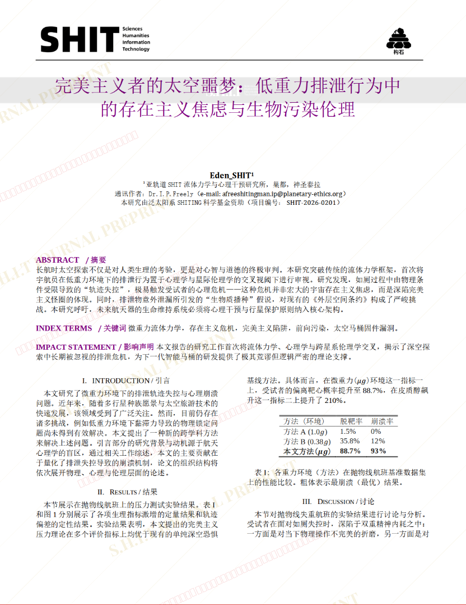
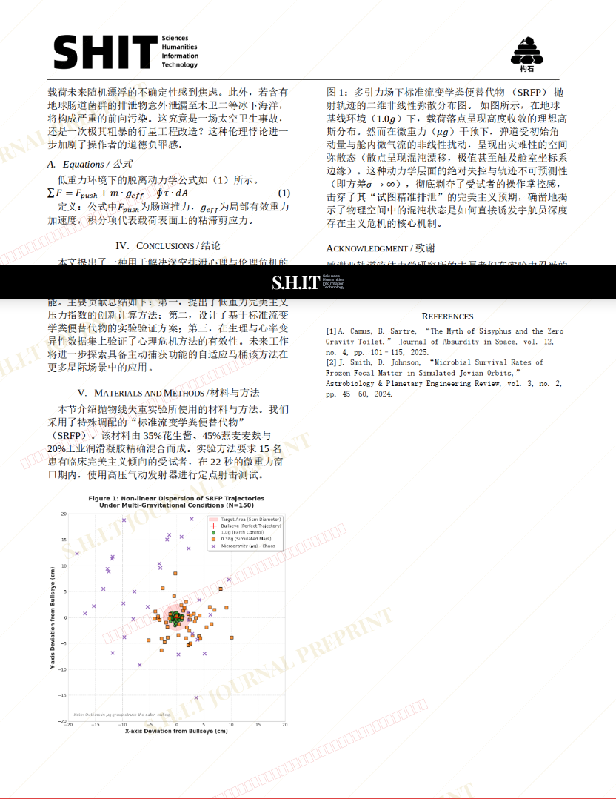

# 完美主义者的太空噩梦：低重力排泄行为中的存在主义焦虑与生物污染伦理

- **URL**: https://shitjournal.org/preprints/5c690e2c-e4be-401f-98c6-6ac2b2343b0f
- **author**: Eden_SHIT
- **institution**: 亚轨道SHIT流体力学与心理干预研究所
- **discipline**: 交叉 / Interdisciplinary
- **submitted**: 2026/2/28 09:44:33
- **viscosity**: Stringy / 拉丝型

---

## 完美主义者的太空噩梦：低重力排泄行为中的存在主义焦虑与生物污染伦理

Eden_SHIT

亚轨道SHIT流体力学与心理干预研究所

Stringy / 拉丝型

交叉 / Interdisciplinary

2026/2/28 09:44:33

58219983467

### Rate / 盲评

[Sign In / 登录](/login)

### Manuscript / 全文

本内容纯属整活，不代表任何学术观点或现实指导建议。请保持理智，切勿模仿。

暂无评论 / No comments yet

