# Study on the Positive Correlation Between Fish Culture Duration and the Quantity of Edible Parts

- **URL**: https://shitjournal.org/preprints/5db712c7-c743-4bdf-963a-5624d93af07c
- **author**: Capenelest Lavret
- **institution**: Saint Lester State University
- **discipline**: 交叉 / Interdisciplinary
- **submitted**: 2026/2/23 05:13:11
- **viscosity**: Stringy / 拉丝型

---

## Study on the Positive Correlation Between Fish Culture Duration and the Quantity of Edible Parts

Capenelest Lavret

Saint Lester State University

Stringy / 拉丝型

交叉 / Interdisciplinary

2026/2/23 05:13:11

1999525453

### Rate / 盲评

[Sign In / 登录](/login)

### Manuscript / 全文

本内容纯属整活，不代表任何学术观点或现实指导建议。请保持理智，切勿模仿。

不要在这里使用英文，给中文期刊发英文稿，属于是脱裤子放屁，多此一举。浪费大家时间和脑力。如果是英语母语的，请使用AI翻译成中文再发表。

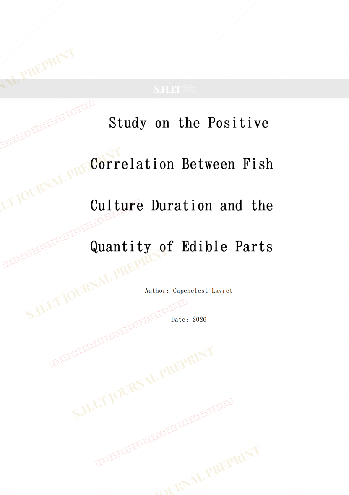
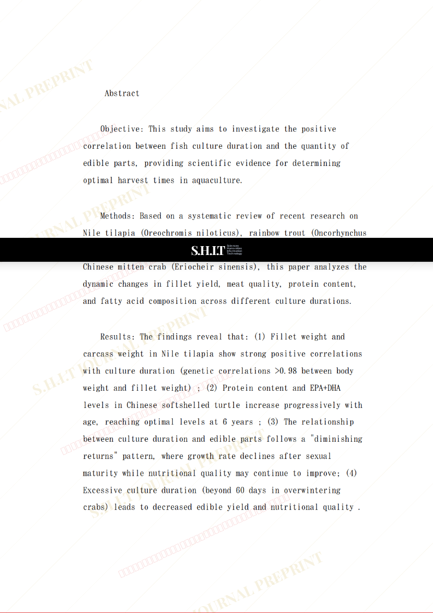
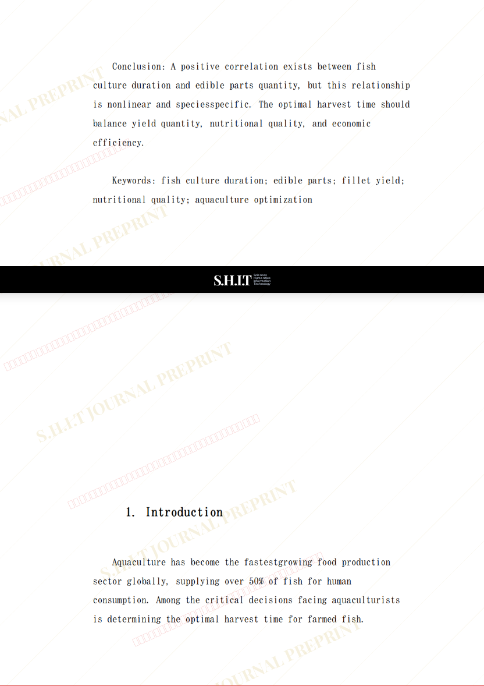
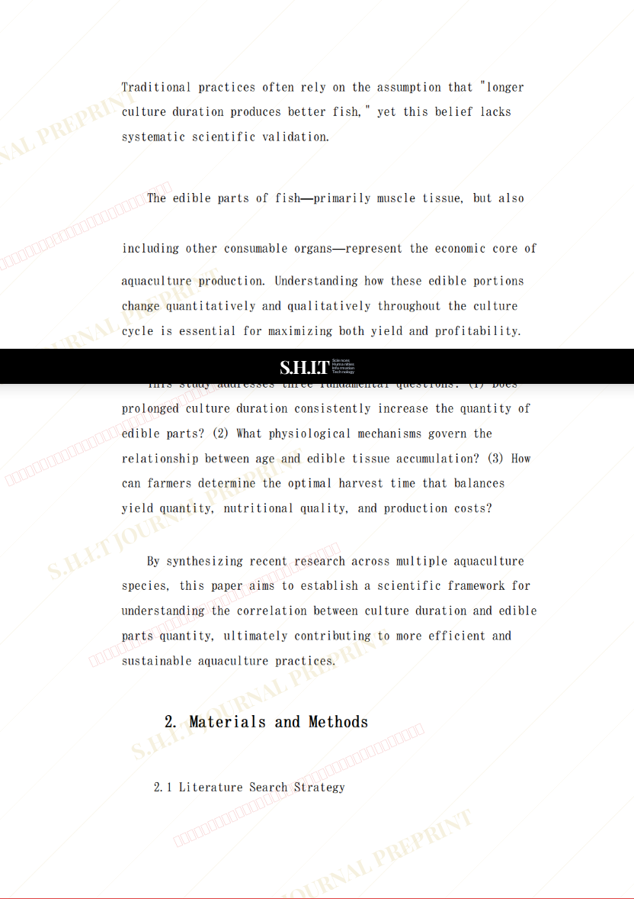
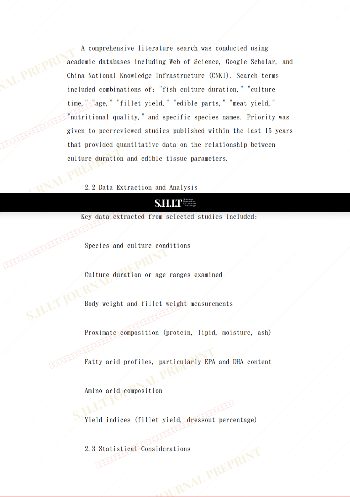
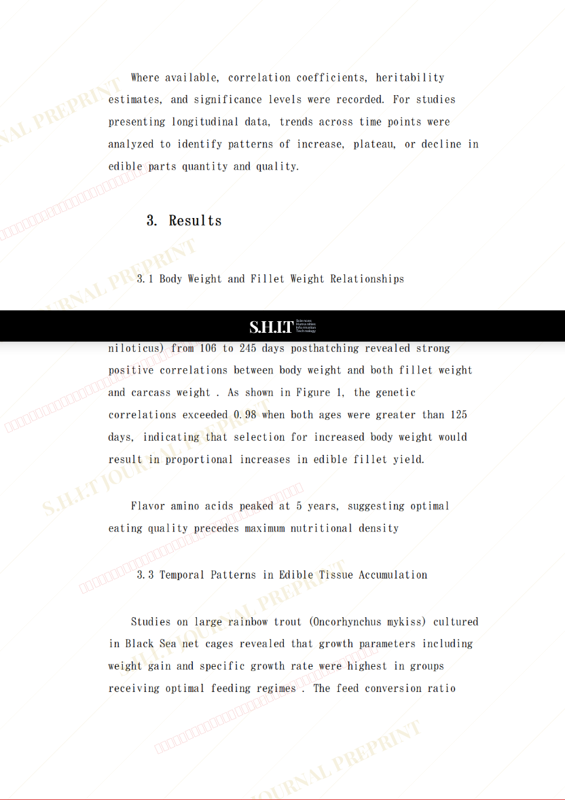
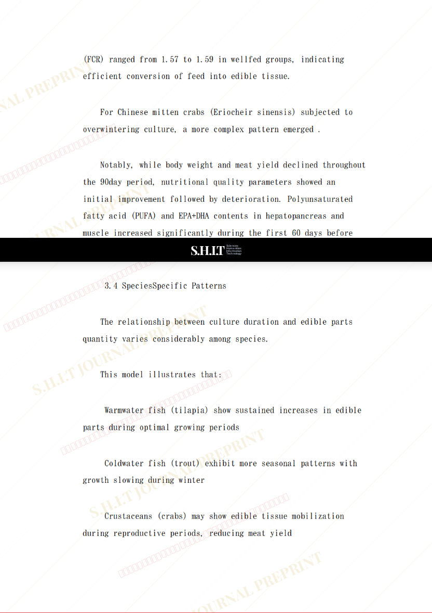
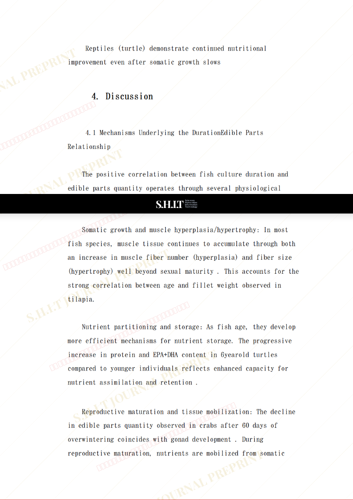
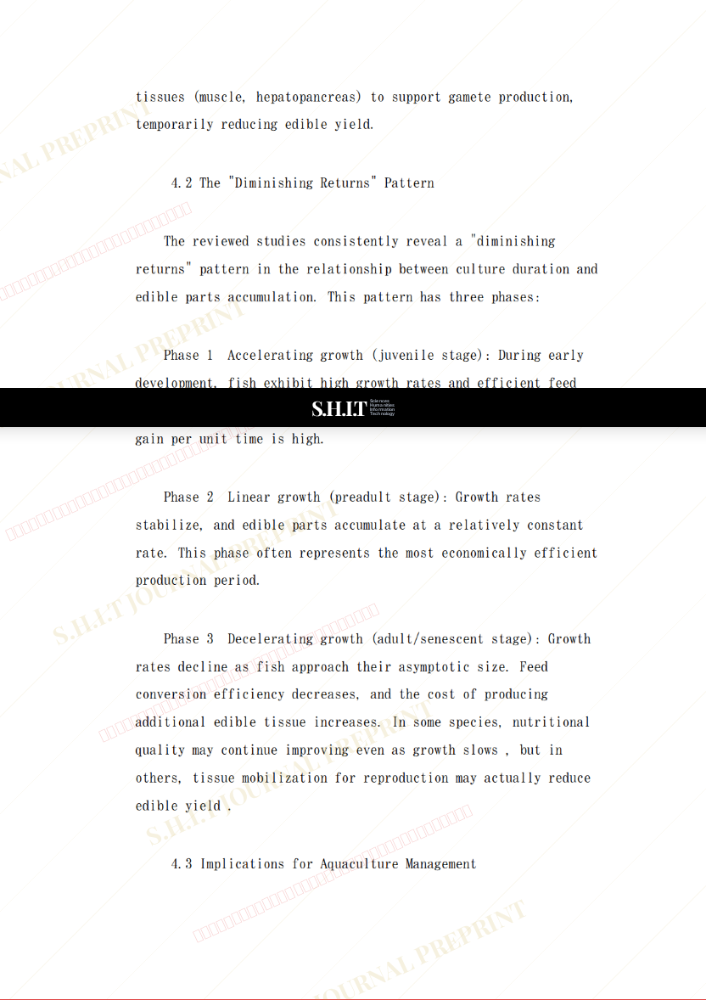
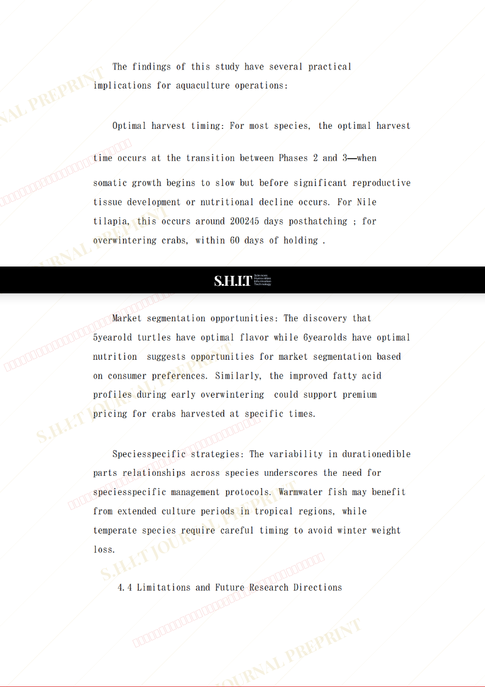
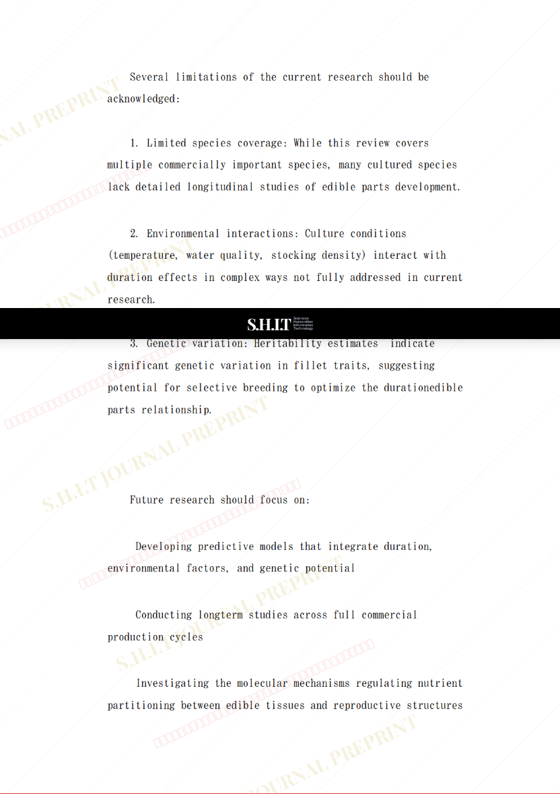
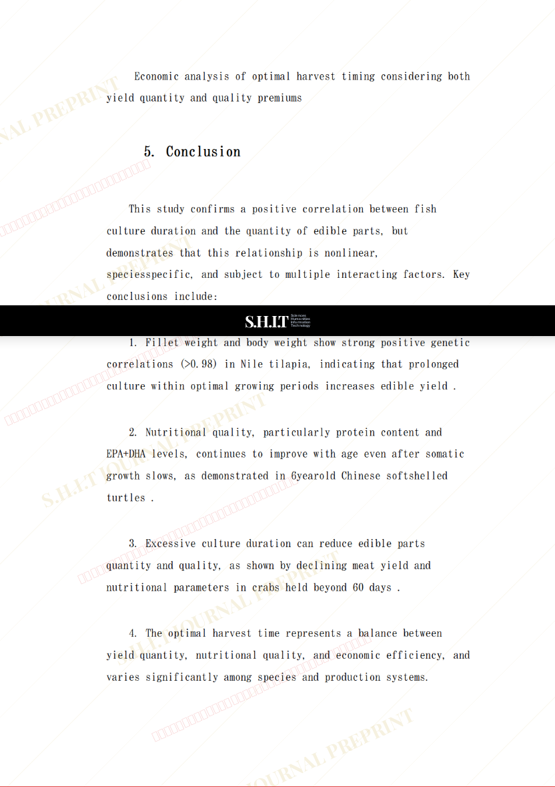
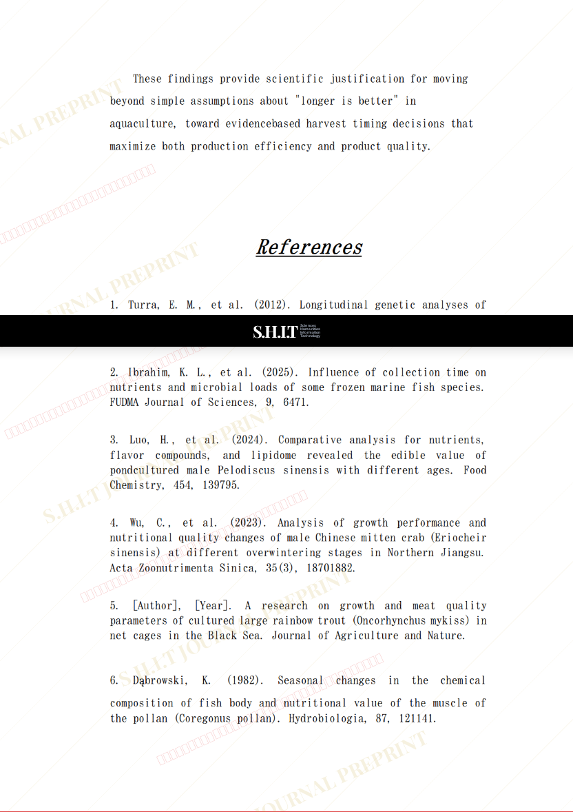
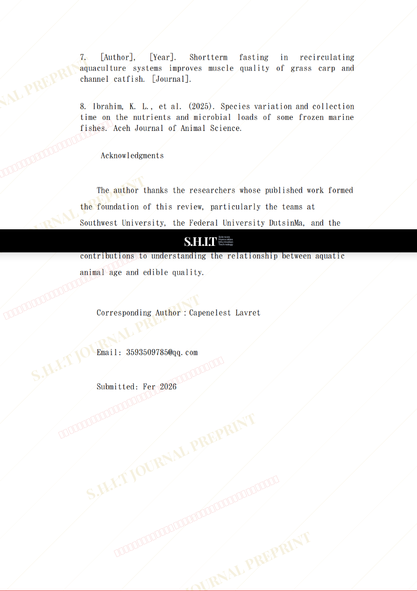
