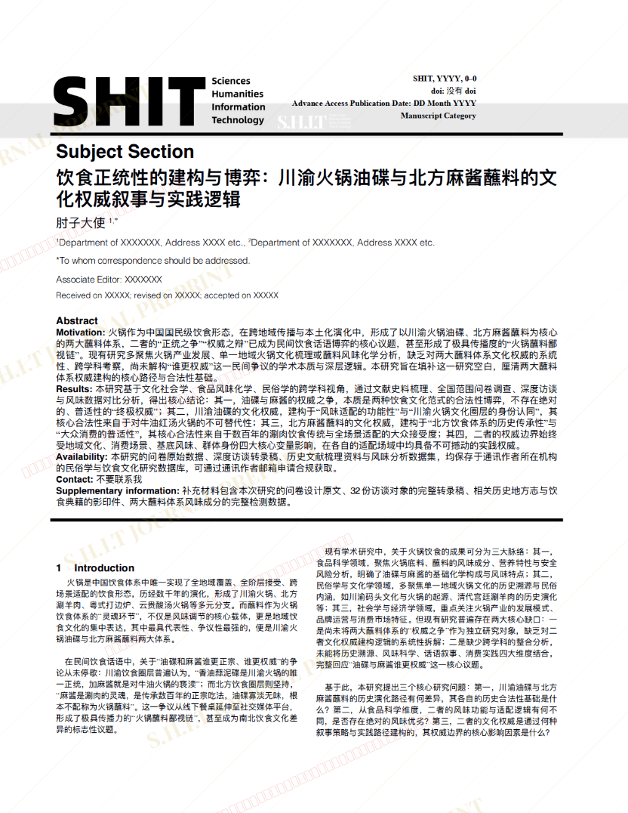
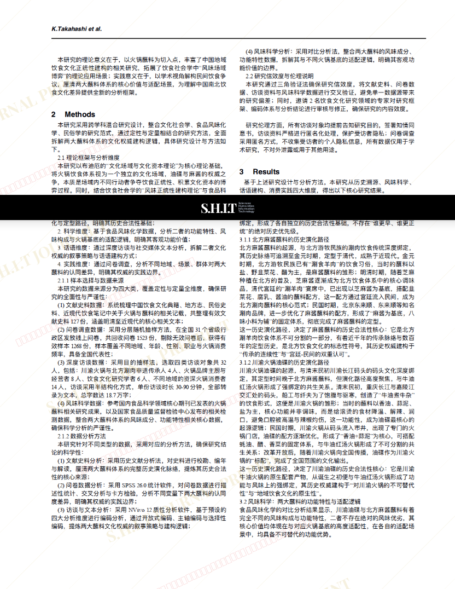
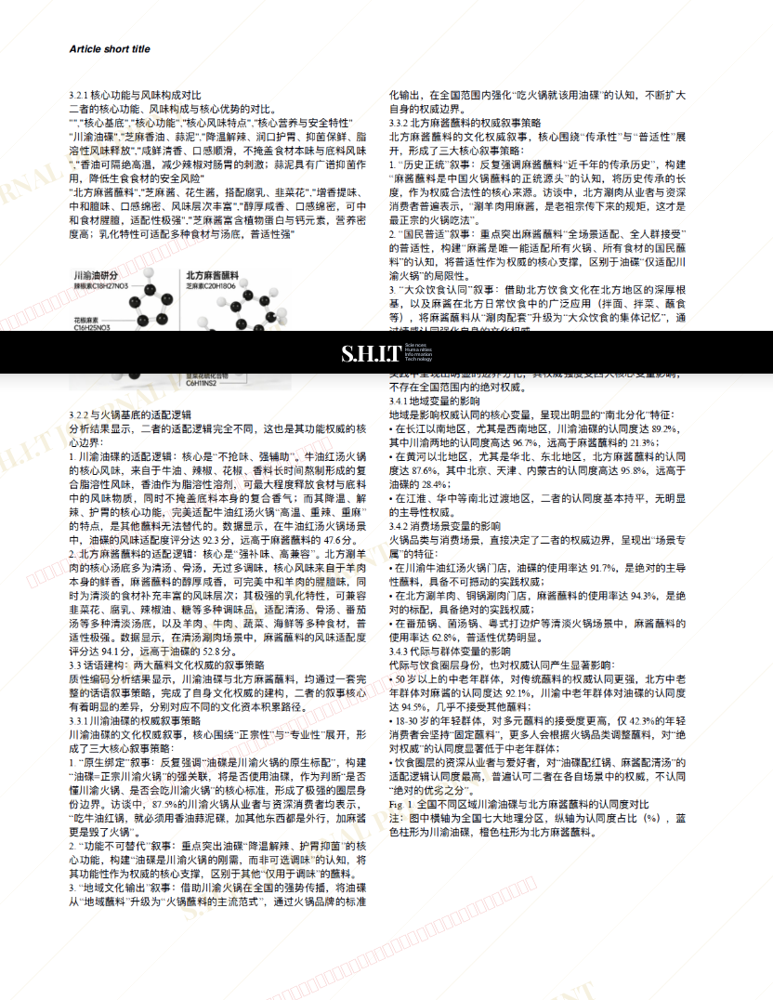
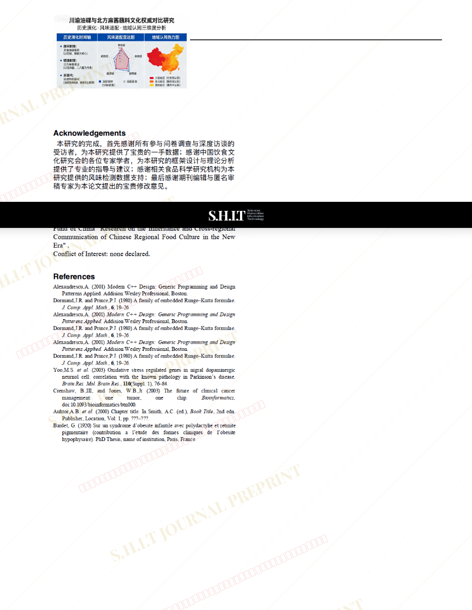

# 饮食正统性的建构与博弈：川渝火锅油碟与北方麻酱蘸料的文化权威叙事与实践逻辑

- **URL**: https://shitjournal.org/preprints/639cdb7e-0706-4c9f-8e8a-94a8075c3f44
- **author**: 肘子大使
- **institution**: 吃拉研究所
- **discipline**: 交叉 / Interdisciplinary
- **submitted**: 2026/2/27 08:17:57
- **viscosity**: Semi-solid / 半固态

---

## 饮食正统性的建构与博弈：川渝火锅油碟与北方麻酱蘸料的文化权威叙事与实践逻辑

肘子大使

吃拉研究所

Semi-solid / 半固态

交叉 / Interdisciplinary

2026/2/27 08:17:57

xhs：zzhzzhzzh0704

### Rate / 盲评

[Sign In / 登录](/login)

### Manuscript / 全文

本内容纯属整活，不代表任何学术观点或现实指导建议。请保持理智，切勿模仿。

可认为学术过端了.......

呜呜呜下次努力不端

