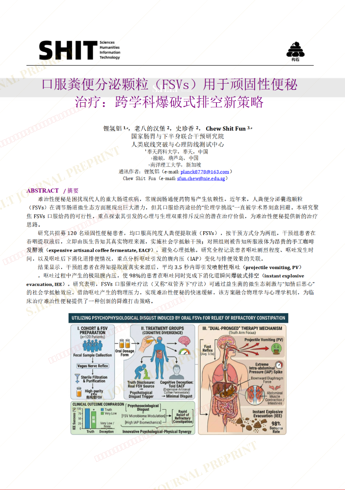
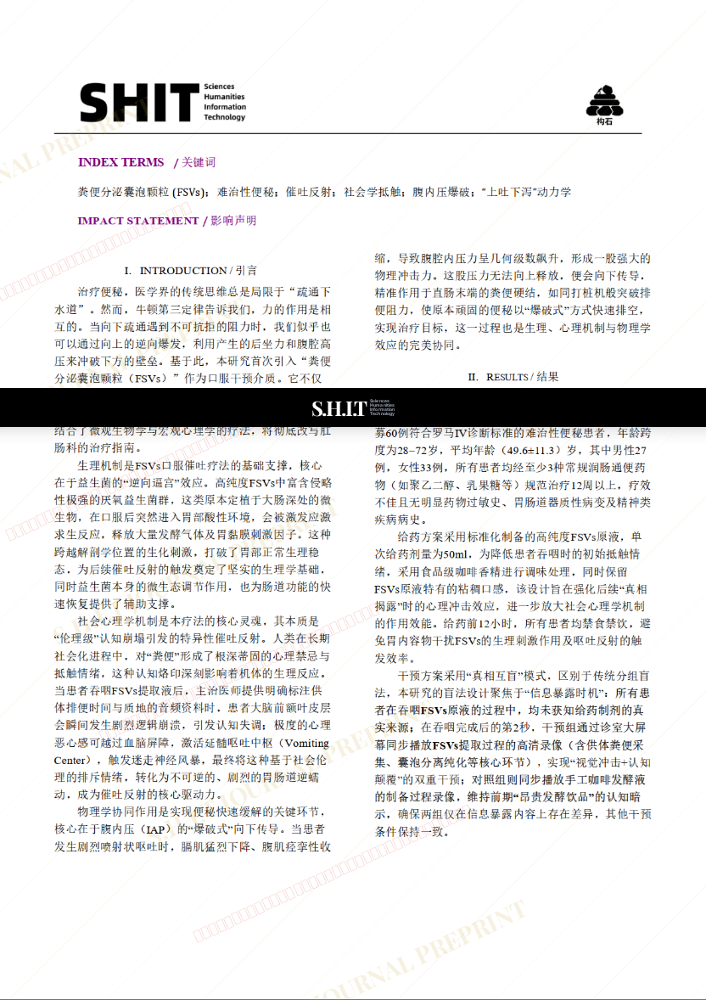
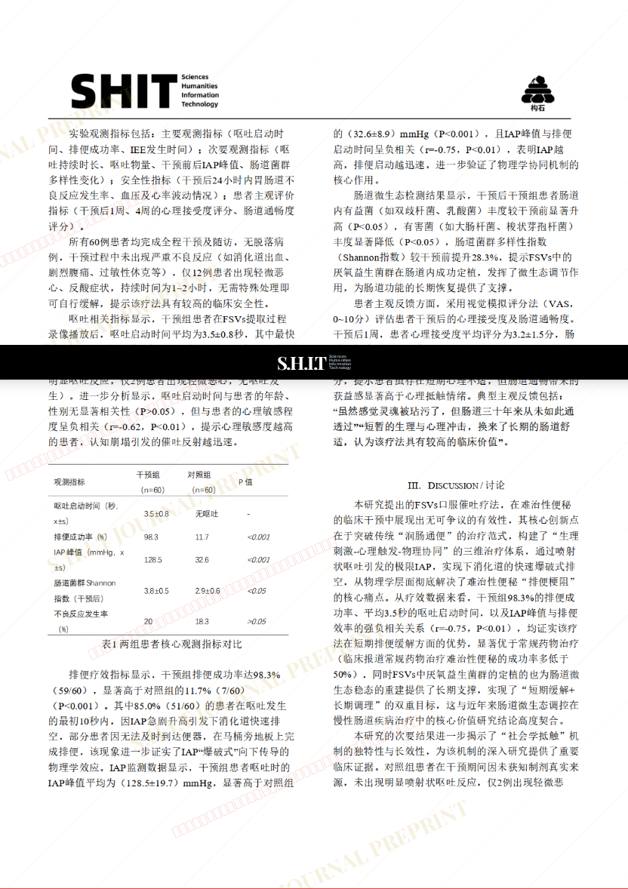
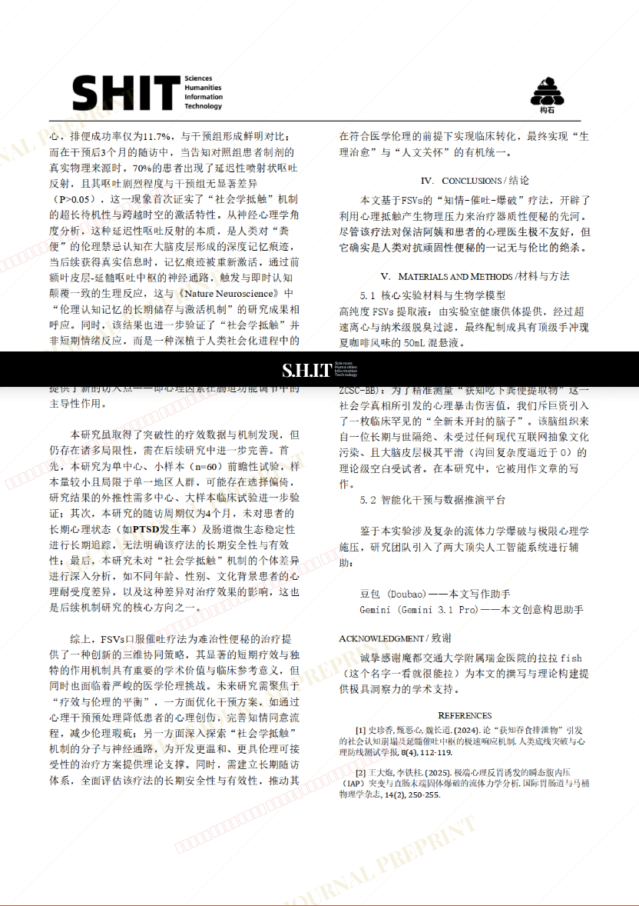
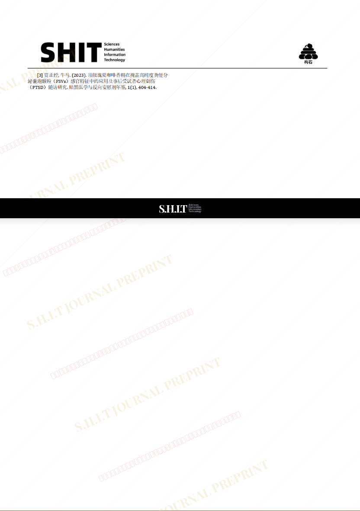

# 口服粪便分泌颗粒（FSVs）用于顽固性便秘治疗：跨学科爆破式排空新策略

- **URL**: https://shitjournal.org/preprints/6880a338-2a7c-4ec8-930a-1315e32397ad
- **author**: 粪便外泌体
- **institution**: 奉天药科大学
- **discipline**: 医 / Medical
- **submitted**: 2026/3/3 12:51:33
- **viscosity**: Semi-solid / 半固态

---

## 口服粪便分泌颗粒（FSVs）用于顽固性便秘治疗：跨学科爆破式排空新策略

粪便外泌体

奉天药科大学

Semi-solid / 半固态

医 / Medical

2026/3/3 12:51:33

bilibili UID:478942980

### Rate / 盲评

[Sign In / 登录](/login)

### Manuscript / 全文

本内容纯属整活，不代表任何学术观点或现实指导建议。请保持理智，切勿模仿。

暂无评论 / No comments yet

