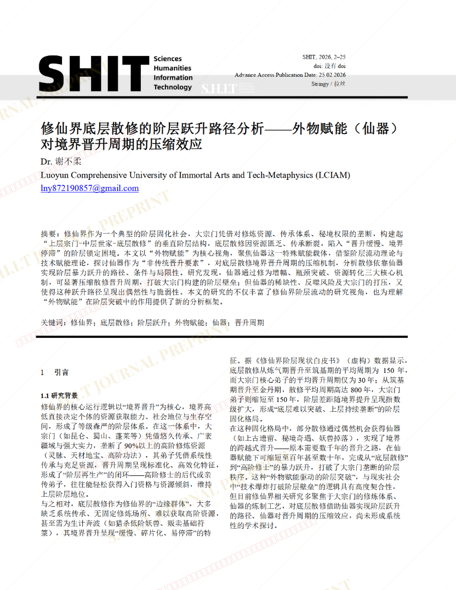
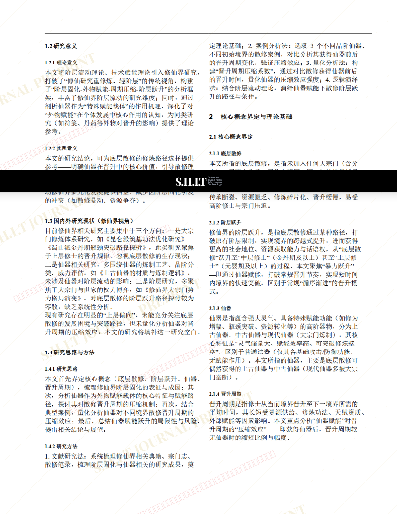
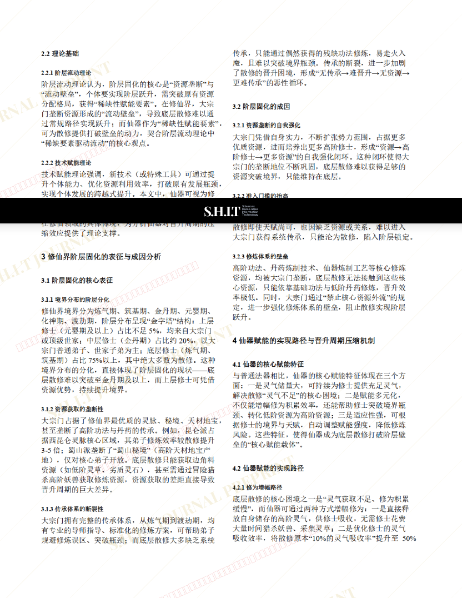
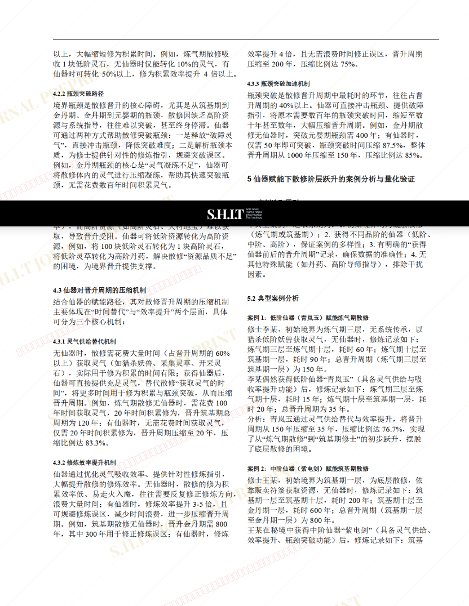
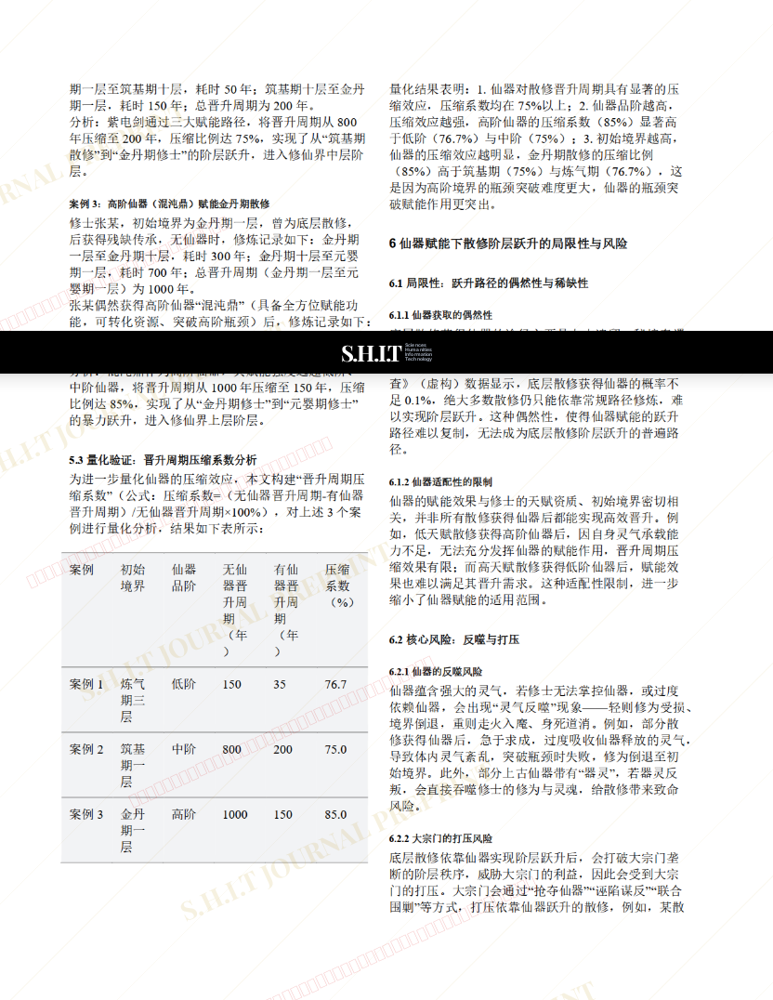
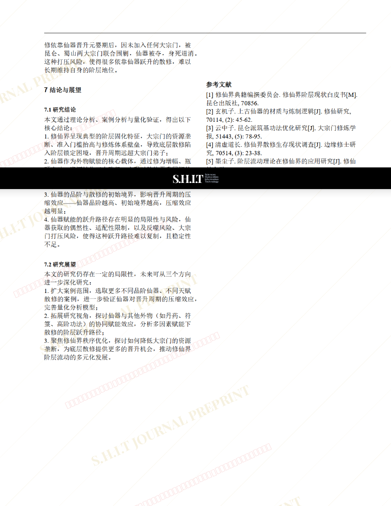

# 修仙界底层散修的阶层跃升路径分析——外物赋能（仙器）对境界晋升周期的压缩效应

- **URL**: https://shitjournal.org/preprints/68b01d3d-6602-4d20-9901-fa09701fc637
- **author**: Dr. 谢不柔
- **institution**: Luoyun Comprehensive University of Immortal Arts and Tech-Metaphysics (LCIAM)
- **discipline**: 交叉 / Interdisciplinary
- **submitted**: 2026/2/25 11:23:45
- **viscosity**: Stringy / 拉丝型

---

## 修仙界底层散修的阶层跃升路径分析——外物赋能（仙器）对境界晋升周期的压缩效应

Dr. 谢不柔

Luoyun Comprehensive University of Immortal Arts and Tech-Metaphysics (LCIAM)

Stringy / 拉丝型

交叉 / Interdisciplinary

2026/2/25 11:23:45

抖音：墨西哥螺旋卷饼暴打西红柿柠檬水

### Rate / 盲评

[Sign In / 登录](/login)

### Manuscript / 全文

本内容纯属整活，不代表任何学术观点或现实指导建议。请保持理智，切勿模仿。

暂无评论 / No comments yet

