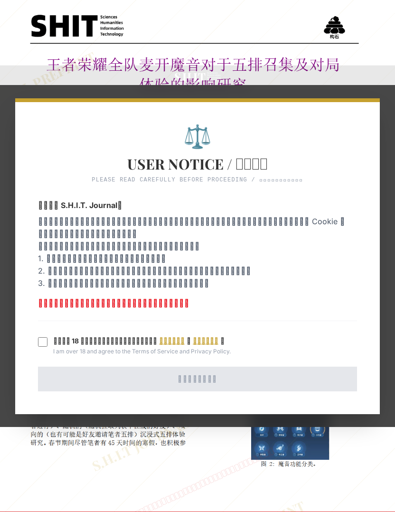

# 王者荣耀全队麦开魔音对于五排召集及对局体验的影响研究

- **URL**: https://shitjournal.org/preprints/6f351410-05e7-41e4-8a8a-c59ac57b8612
- **author**: 甘露糖
- **institution**: 双鸭山大学
- **discipline**: 交叉 / Interdisciplinary
- **submitted**: 2026/3/4 13:43:22
- **viscosity**: Semi-solid / 半固态

---

## 王者荣耀全队麦开魔音对于五排召集及对局体验的影响研究

甘露糖

双鸭山大学

Semi-solid / 半固态

交叉 / Interdisciplinary

2026/3/4 13:43:22

2070720403/2201413068

科里蒂 · 沙坡村职业技术学院共一

物理大神 · 双鸭山大学

### Rate / 评价

[Sign In / 登录](/login)

### Manuscript / 全文

本内容纯属整活，不代表任何学术观点或现实指导建议。请保持理智，切勿模仿。

暂无评论 / No comments yet

