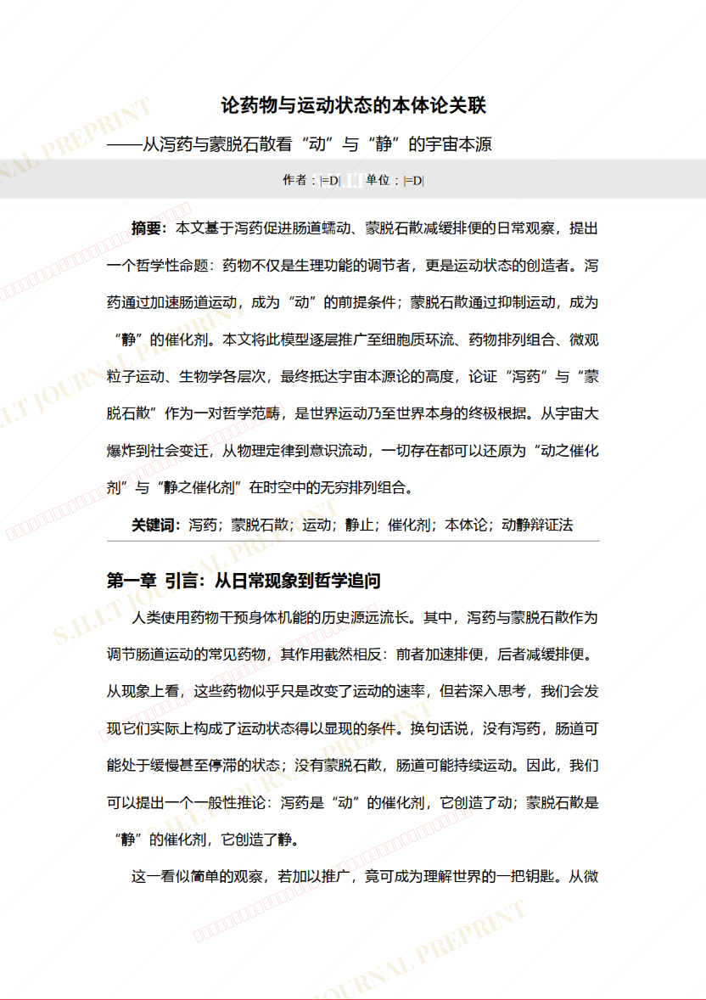
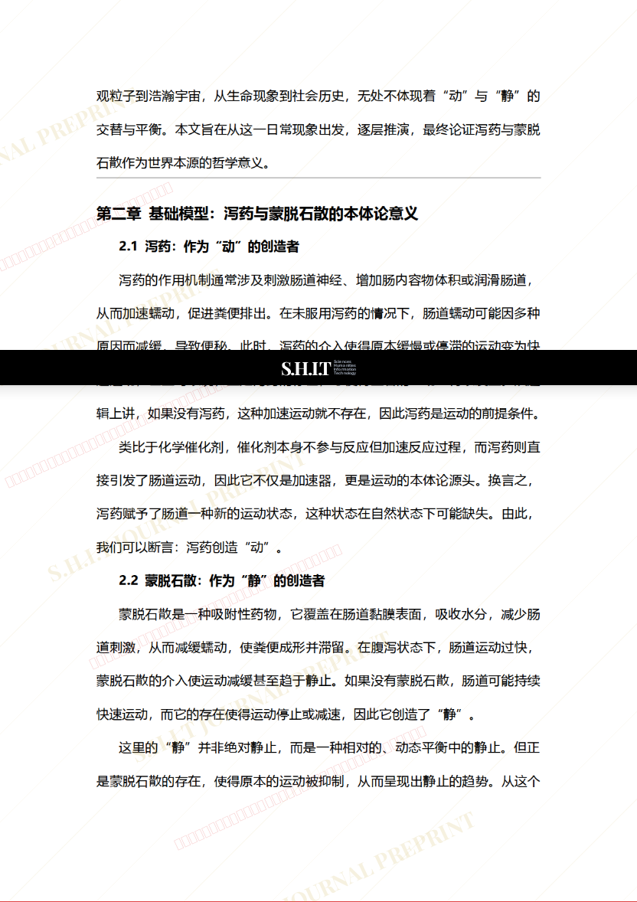
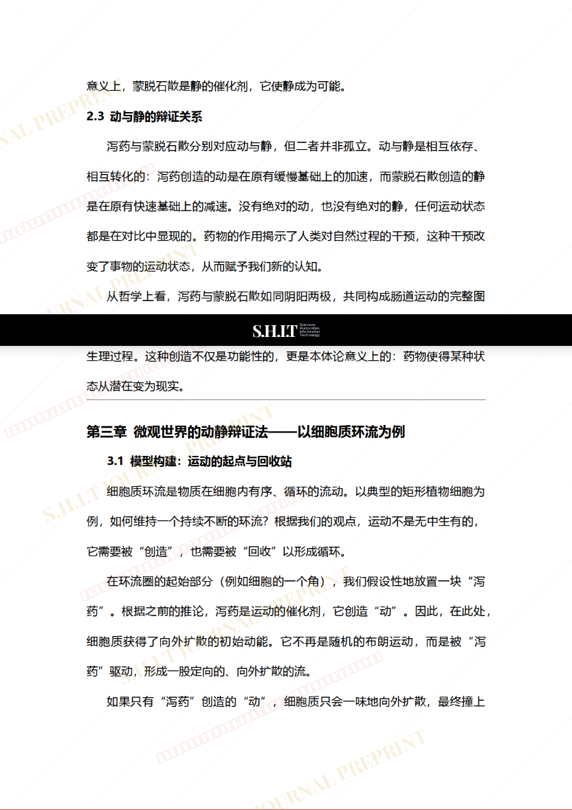
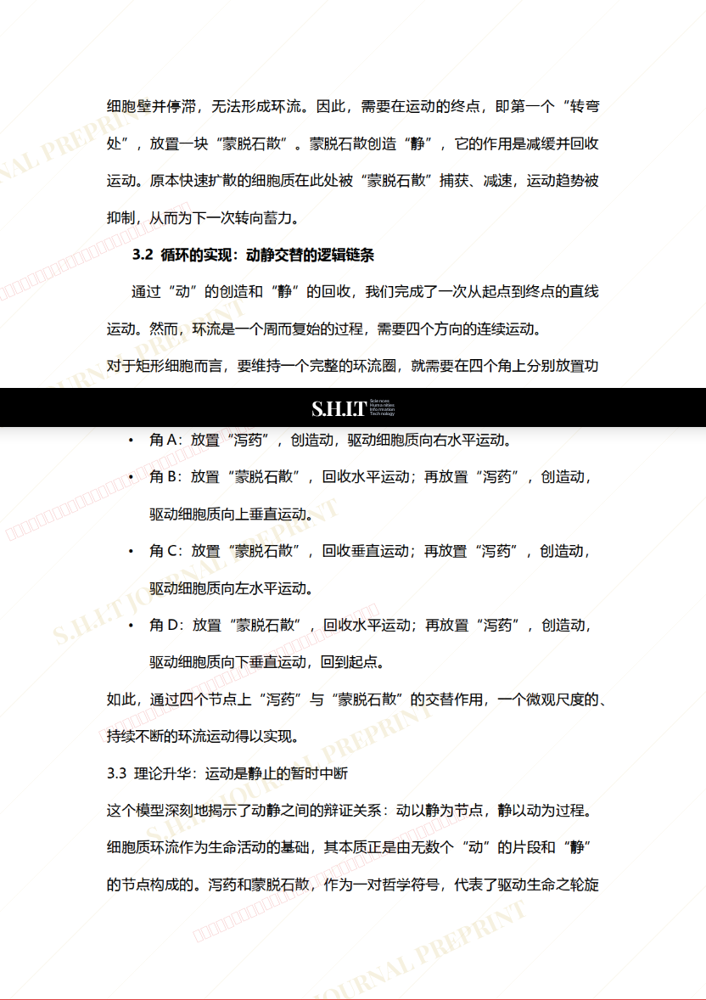
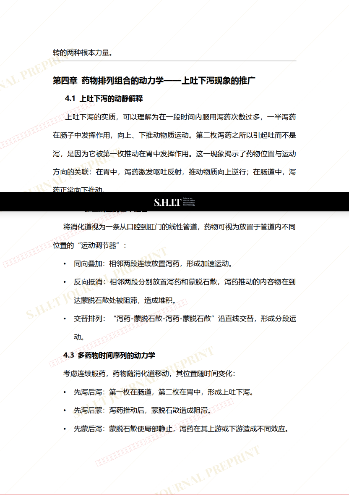
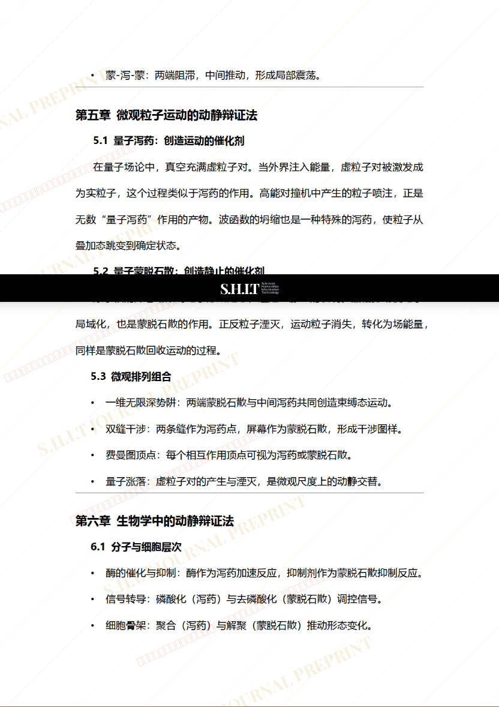
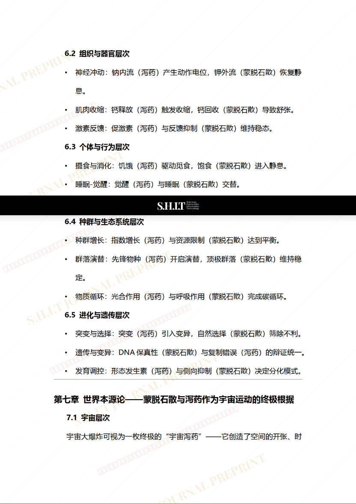
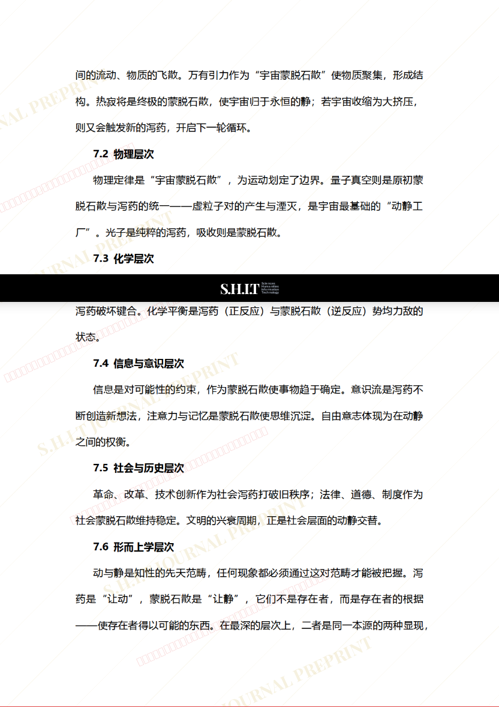
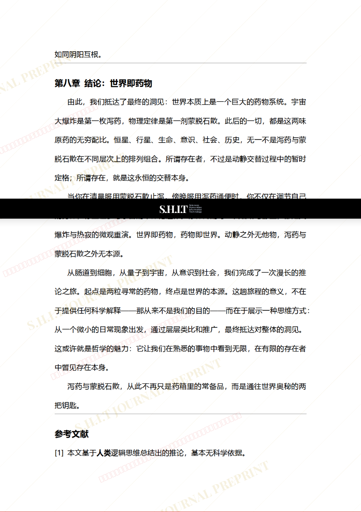
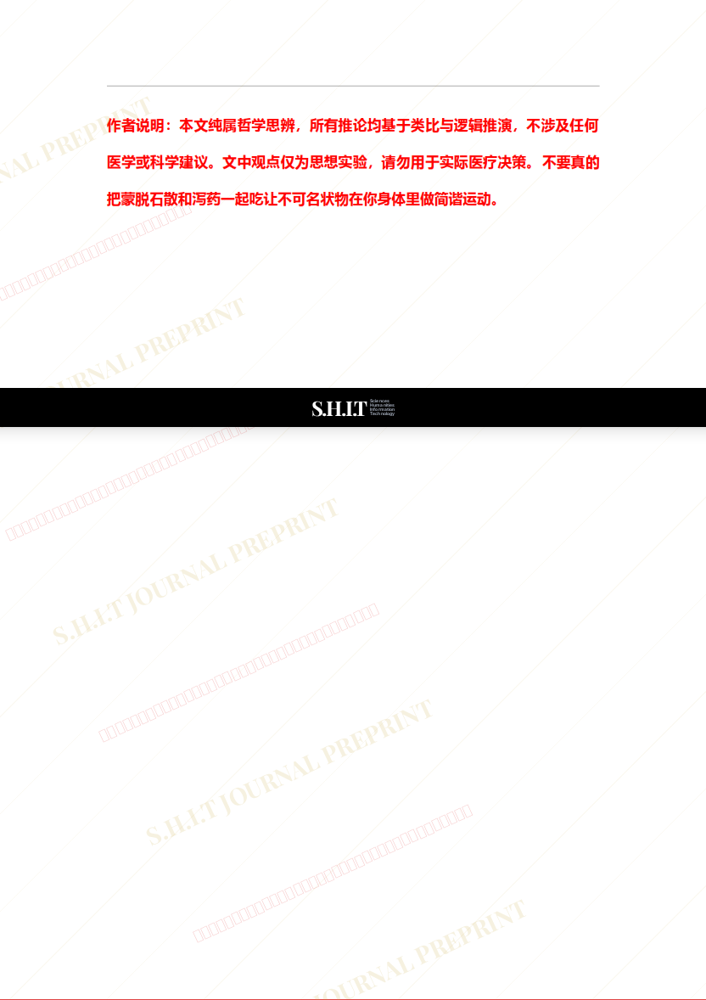

# 论药物与运动状态的本体论关联

- **URL**: https://shitjournal.org/preprints/6f3eb26f-5d7c-44f6-a059-1044e7ec32fa
- **author**: |=D|
- **institution**: 123
- **discipline**: 交叉 / Interdisciplinary
- **submitted**: 2026/2/23 02:03:18
- **viscosity**: Stringy / 拉丝型

---

## 论药物与运动状态的本体论关联

|=D|

123

Stringy / 拉丝型

交叉 / Interdisciplinary

2026/2/23 02:03:18

### Rate / 盲评

[Sign In / 登录](/login)

### Manuscript / 全文

本内容纯属整活，不代表任何学术观点或现实指导建议。请保持理智，切勿模仿。

暂无评论 / No comments yet

