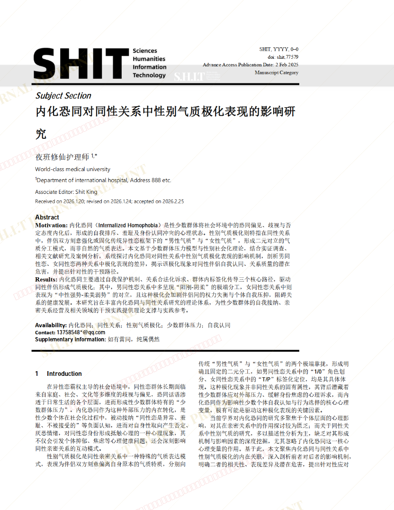
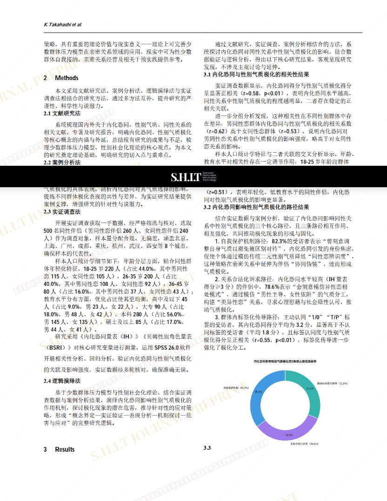
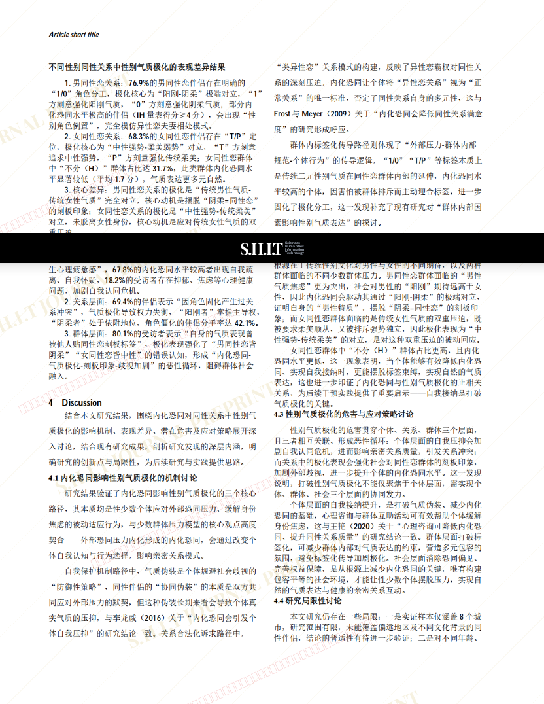
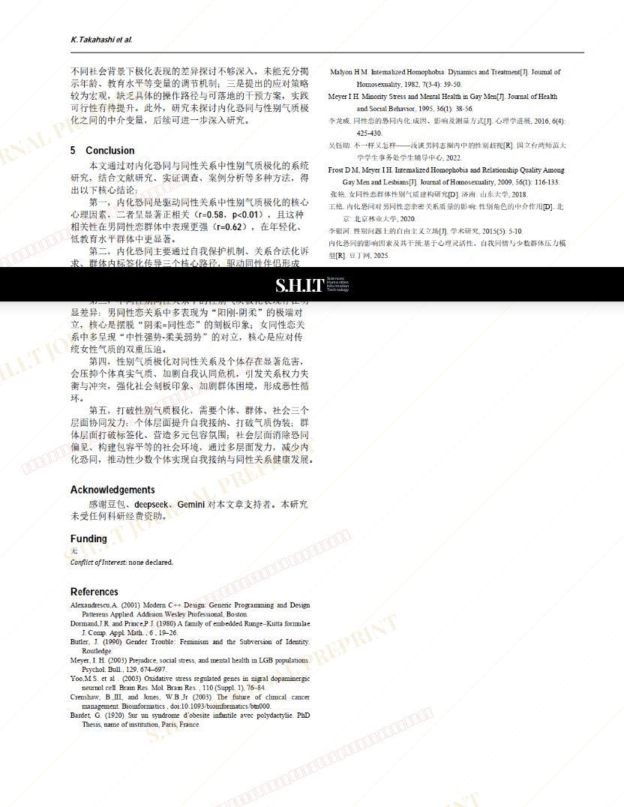

# 内化恐同对同性关系中性别气质极化表现的影响研究

- **URL**: https://shitjournal.org/preprints/7056fff0-2e2f-4fd1-a44b-3aa082bf6933
- **author**: 夜班修仙护理师
- **institution**: World-class medical university
- **discipline**: 交叉 / Interdisciplinary
- **submitted**: 2026/2/25 12:04:09
- **viscosity**: High-Entropy / 高熵态

---

## 内化恐同对同性关系中性别气质极化表现的影响研究

夜班修仙护理师

World-class medical university

High-Entropy / 高熵态

交叉 / Interdisciplinary

2026/2/25 12:04:09

### Rate / 盲评

[Sign In / 登录](/login)

### Manuscript / 全文

本内容纯属整活，不代表任何学术观点或现实指导建议。请保持理智，切勿模仿。

暂无评论 / No comments yet

