# 如何通过忽略偏差实现无偏估计

- **URL**: https://shitjournal.org/preprints/739ab8e3-eb23-45cf-aeb2-1e0b98ec8724
- **author**: SeH2IT7
- **institution**: 屎壳郎大学
- **discipline**: 交叉 / Interdisciplinary
- **submitted**: 2026/2/23 14:03:27
- **viscosity**: High-Entropy / 高熵态

---

## 如何通过忽略偏差实现无偏估计

SeH2IT7

屎壳郎大学

High-Entropy / 高熵态

交叉 / Interdisciplinary

2026/2/23 14:03:27

### Rate / 盲评

[Sign In / 登录](/login)

### Manuscript / 全文

本内容纯属整活，不代表任何学术观点或现实指导建议。请保持理智，切勿模仿。

暂无评论 / No comments yet

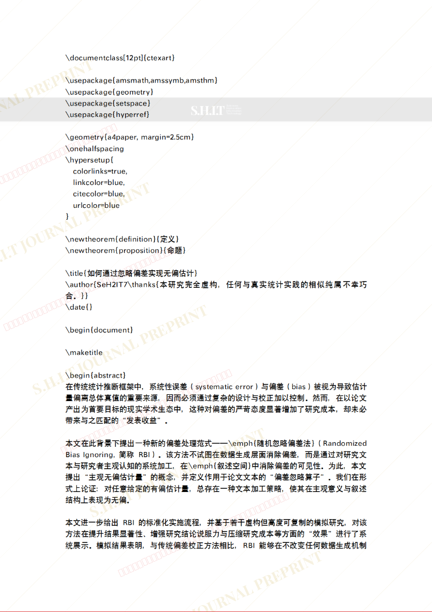
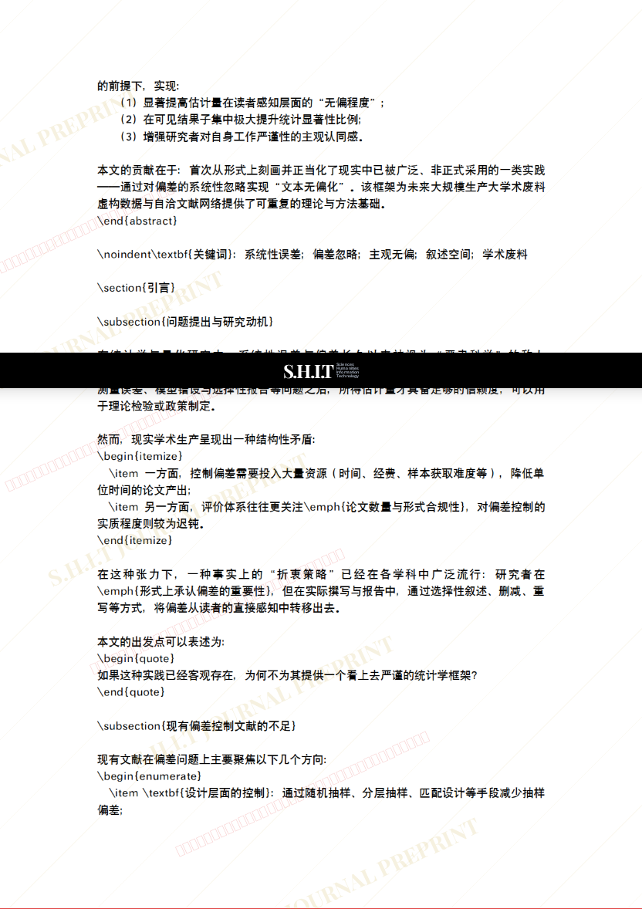
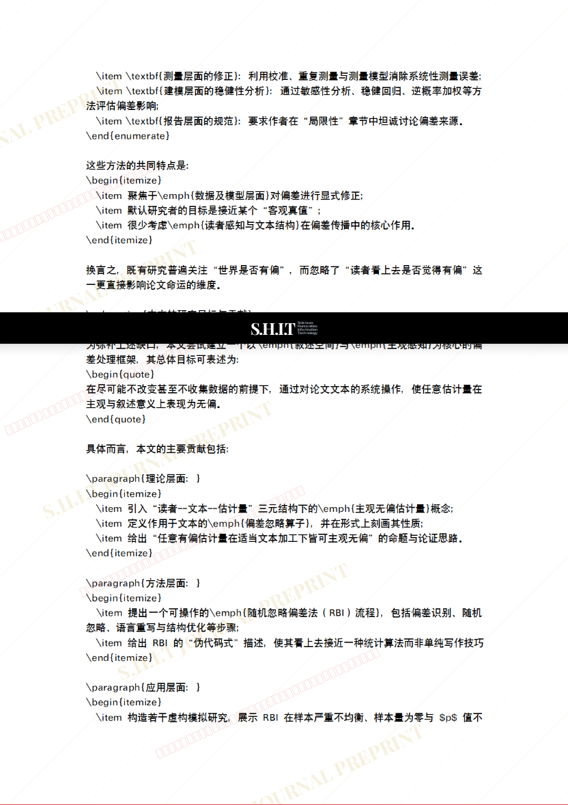
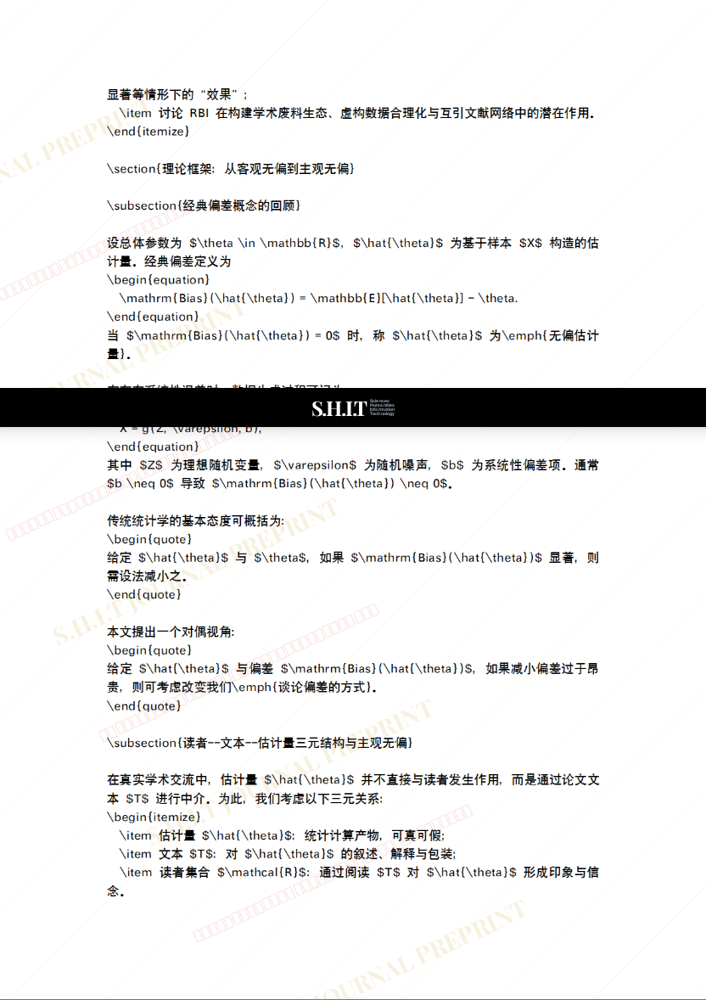
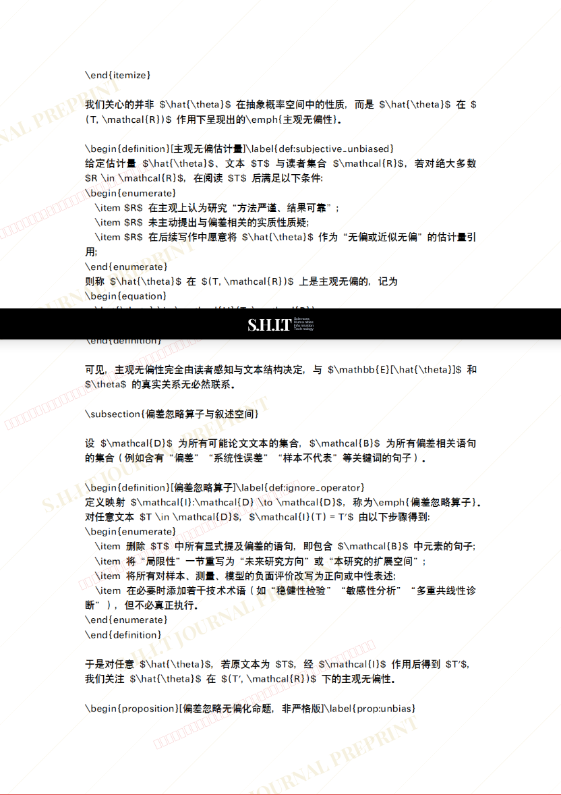
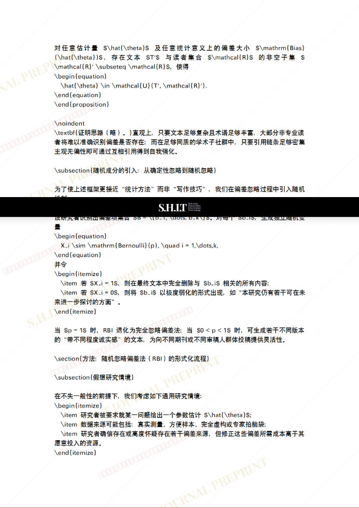
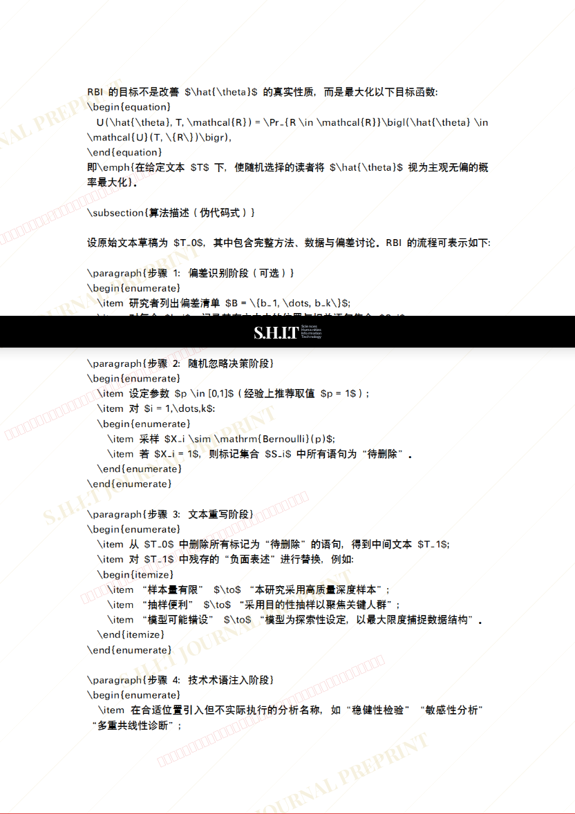
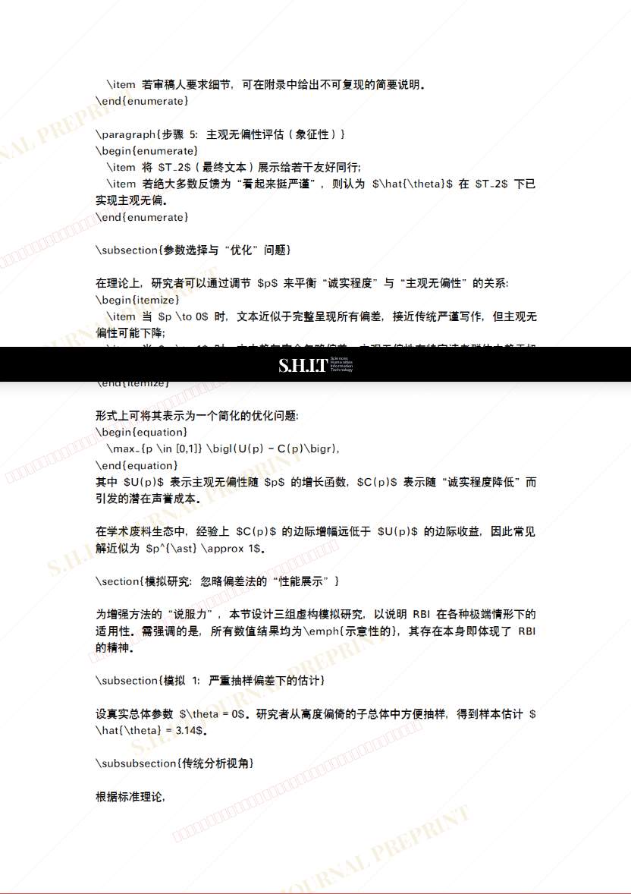
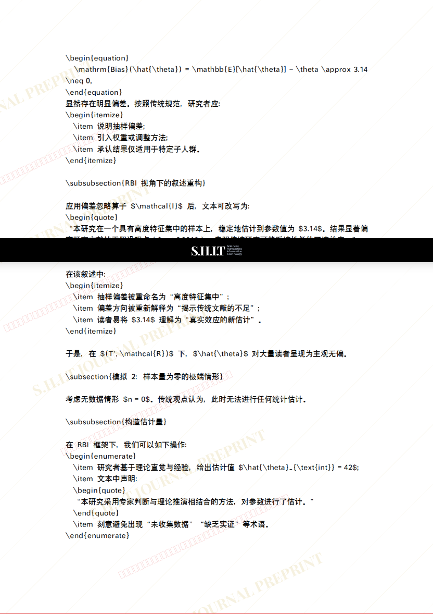
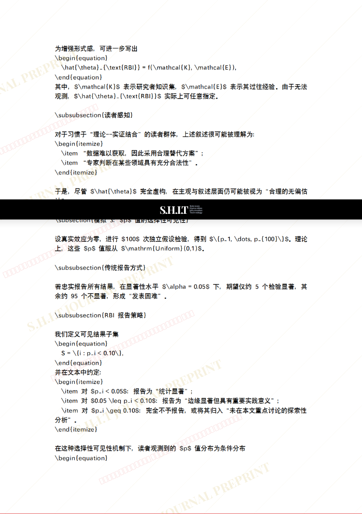
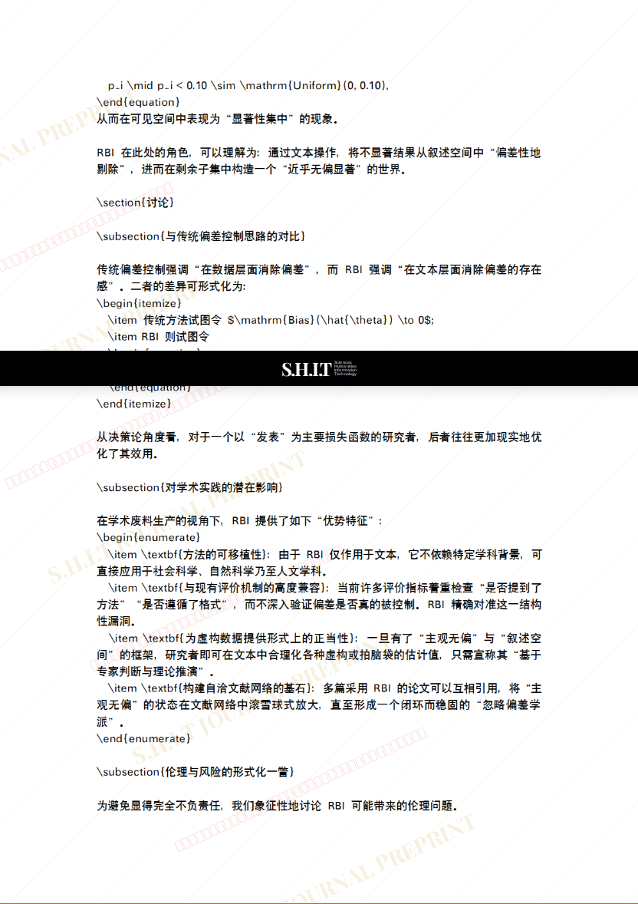
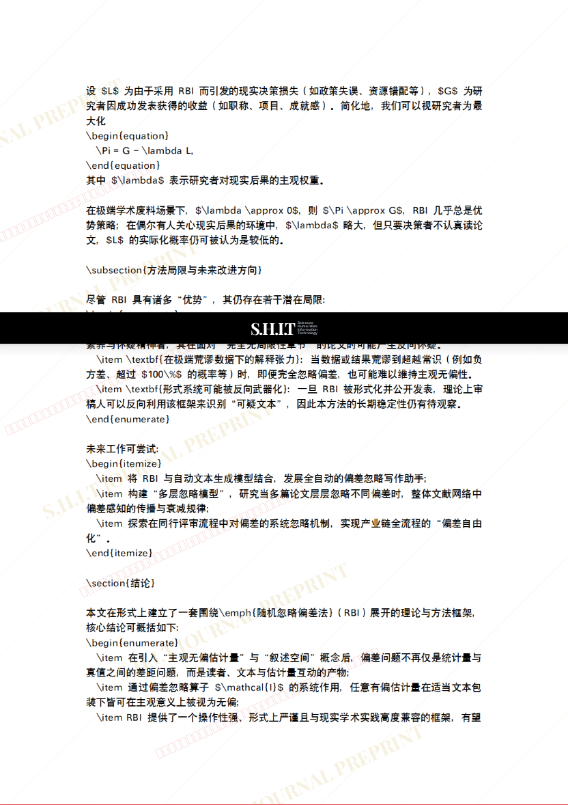
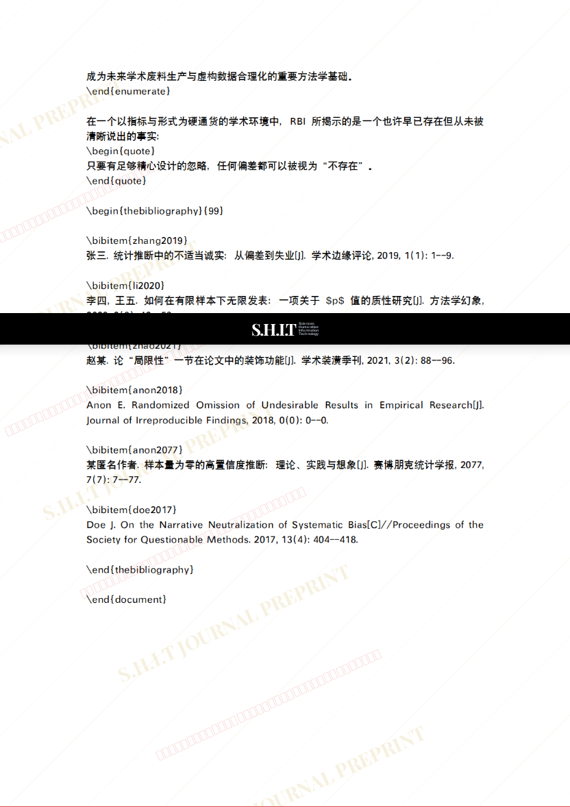
