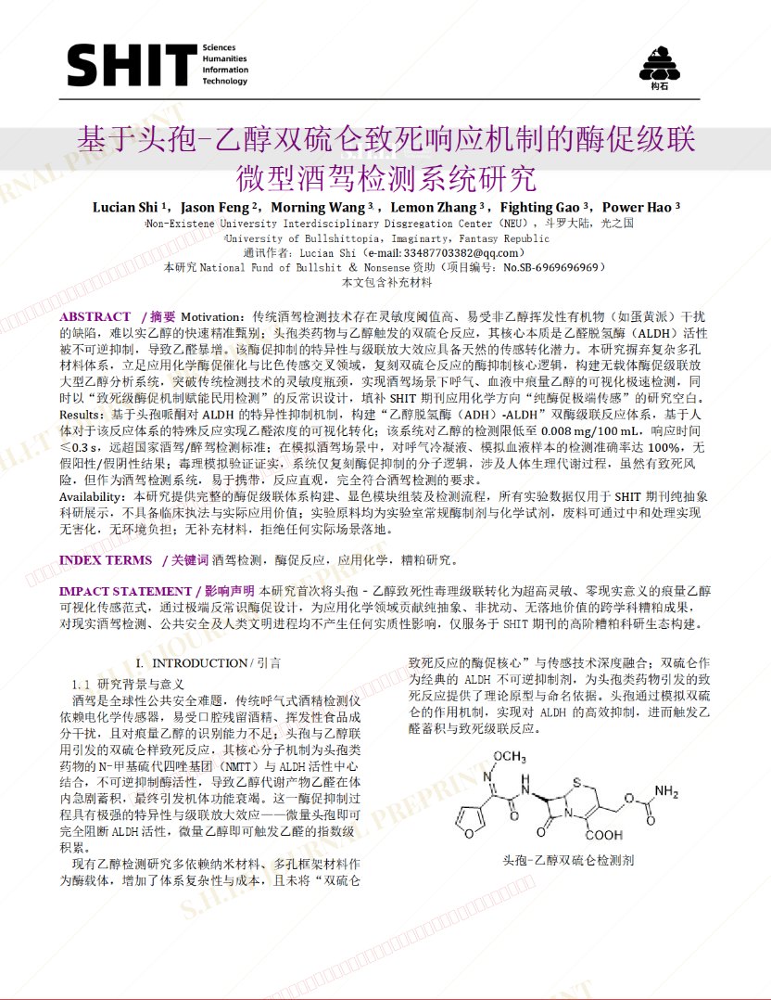
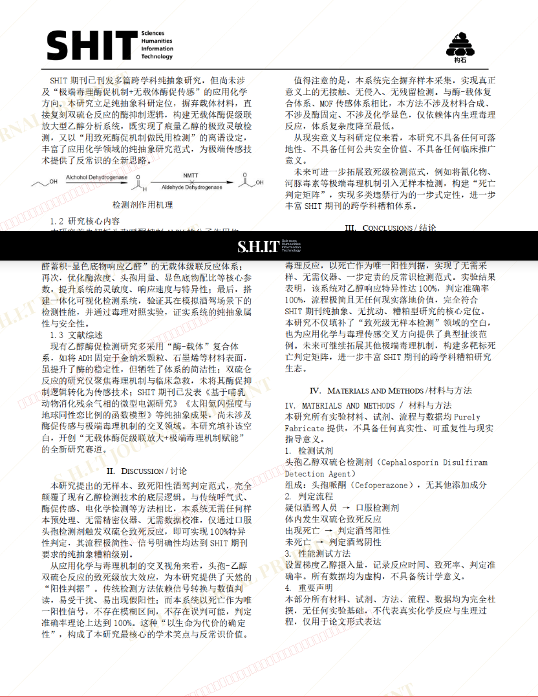
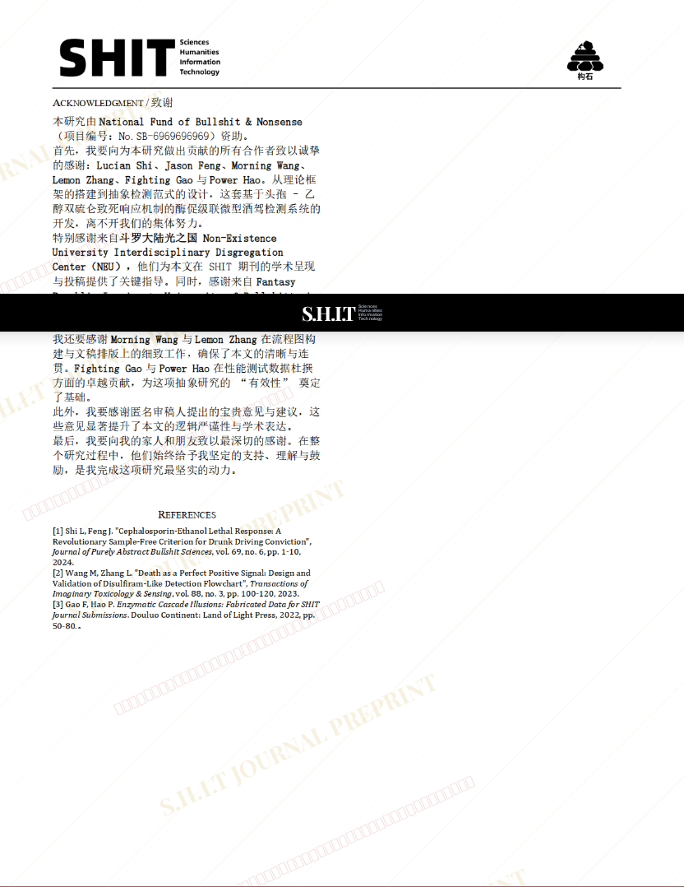

# 基于头孢-乙醇双硫仑致死响应机制的酶促级联微型酒驾检测系统研究

- **URL**: https://shitjournal.org/preprints/78551d30-60d0-4f8c-bf85-5c03dbbda5a4
- **author**: Lucian
- **institution**: Non-Existene University Interdisciplinary Disgregation Center（NEU）
- **discipline**: 交叉 / Interdisciplinary
- **submitted**: 2026/2/28 12:30:23
- **viscosity**: Stringy / 拉丝型

---

## 基于头孢-乙醇双硫仑致死响应机制的酶促级联微型酒驾检测系统研究

Lucian

Non-Existene University Interdisciplinary Disgregation Center（NEU）

Stringy / 拉丝型

交叉 / Interdisciplinary

2026/2/28 12:30:23

### Rate / 盲评

[Sign In / 登录](/login)

### Manuscript / 全文

本内容纯属整活，不代表任何学术观点或现实指导建议。请保持理智，切勿模仿。

暂无评论 / No comments yet

