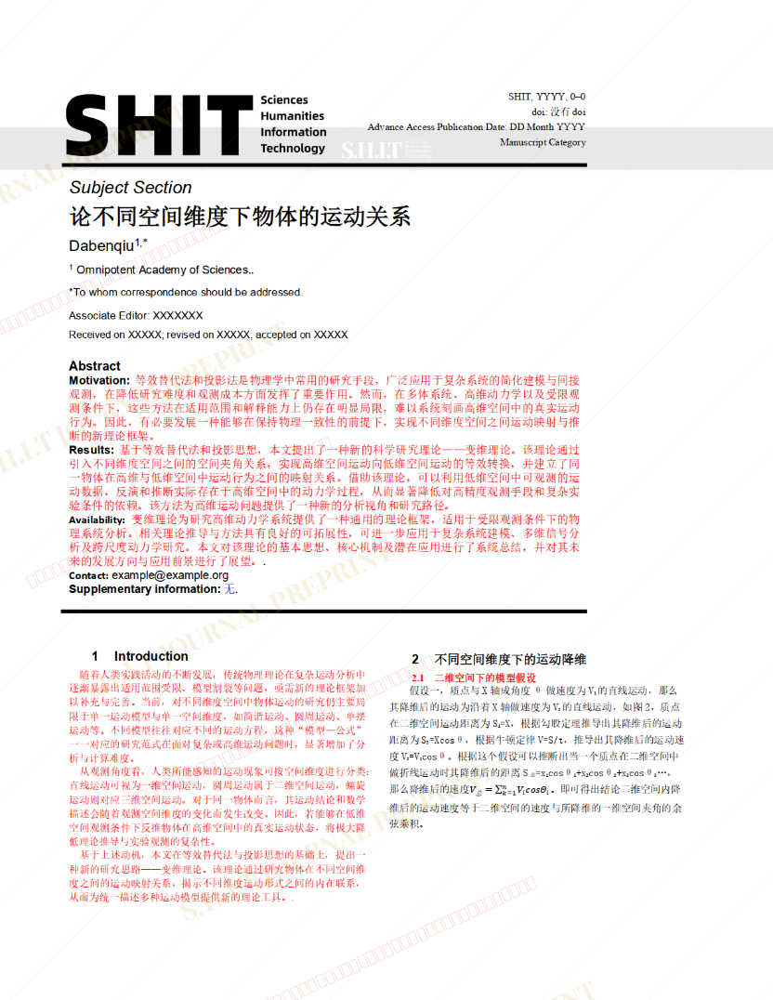
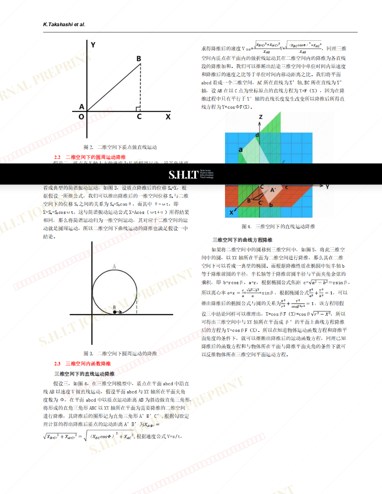
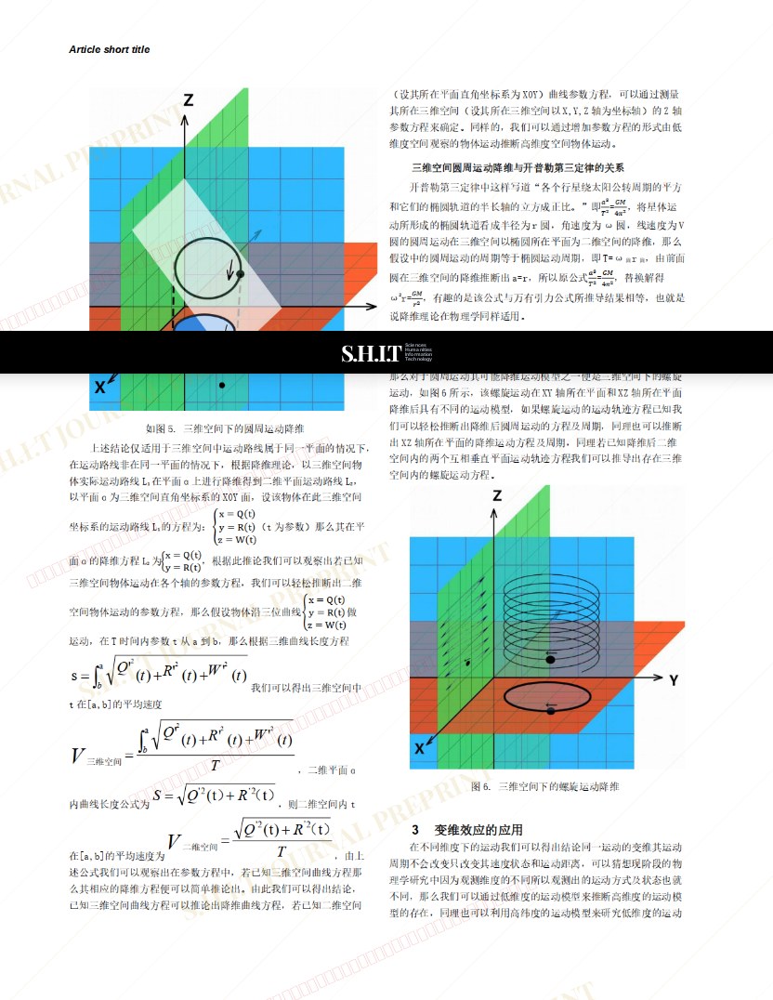
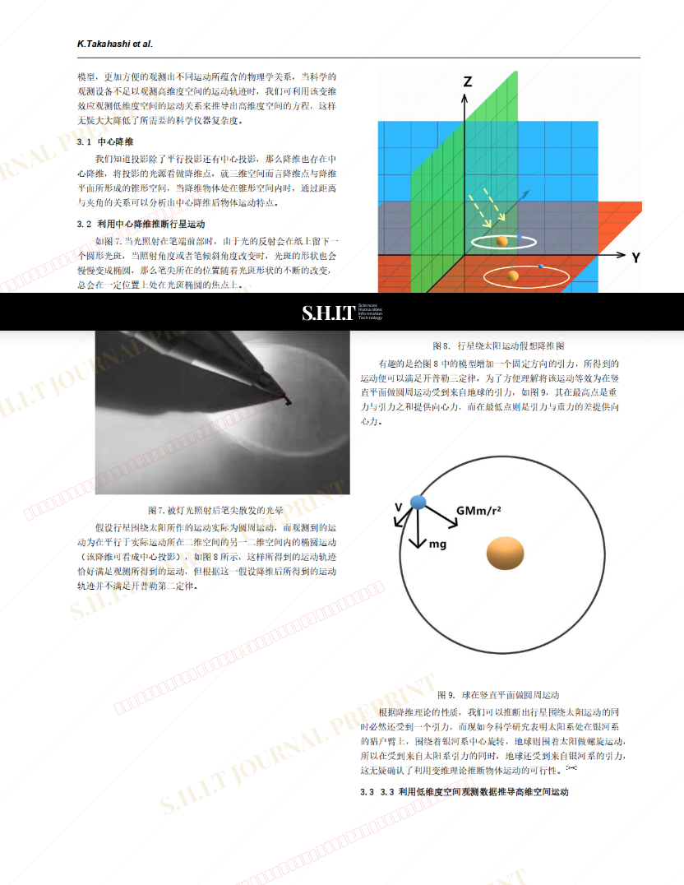
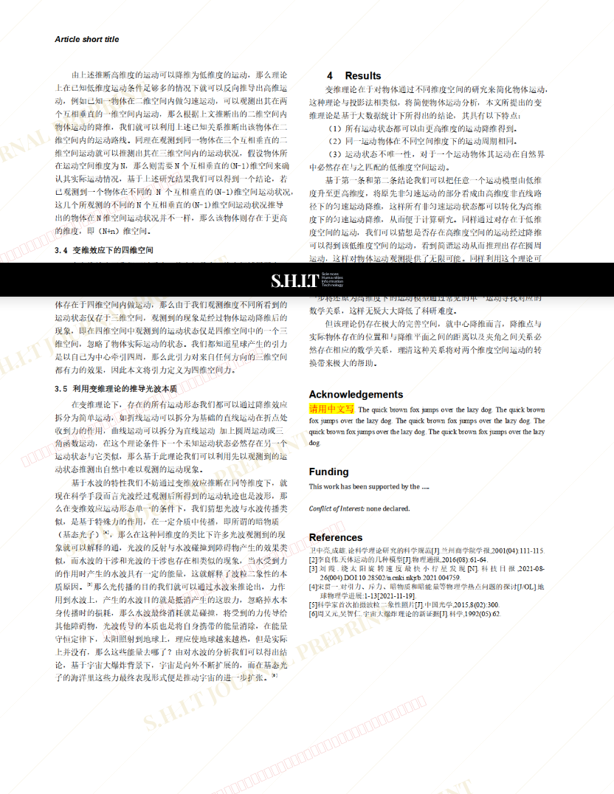

# 论不同空间维度下物体的运动关系

- **URL**: https://shitjournal.org/preprints/78ab68f5-49d8-44eb-81ab-3ea34097f380
- **author**: 六边形科学
- **institution**: 全能科学院
- **discipline**: 交叉 / Interdisciplinary
- **submitted**: 2026/2/27 06:05:32
- **viscosity**: High-Entropy / 高熵态

---

## 论不同空间维度下物体的运动关系

六边形科学

全能科学院

High-Entropy / 高熵态

交叉 / Interdisciplinary

2026/2/27 06:05:32

小红书号：5034370315

### Rate / 盲评

[Sign In / 登录](/login)

### Manuscript / 全文

本内容纯属整活，不代表任何学术观点或现实指导建议。请保持理智，切勿模仿。

暂无评论 / No comments yet

