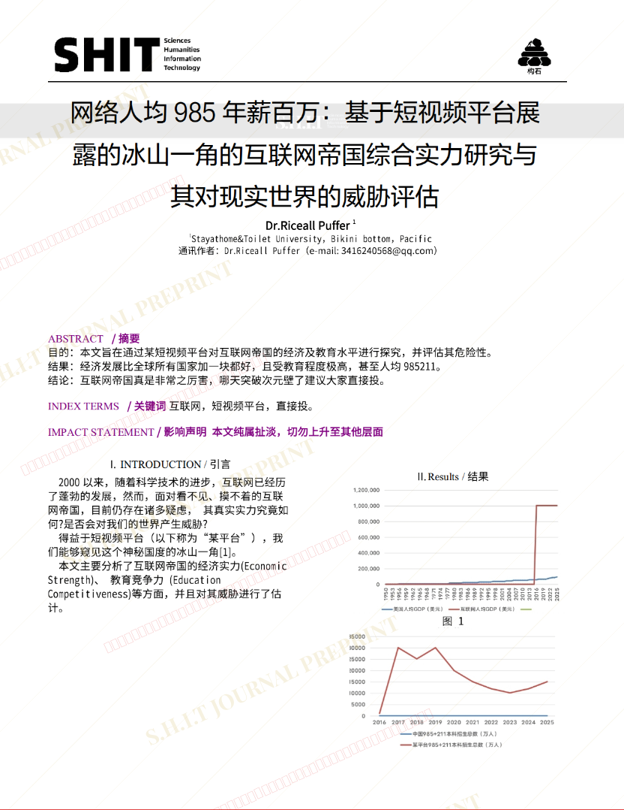
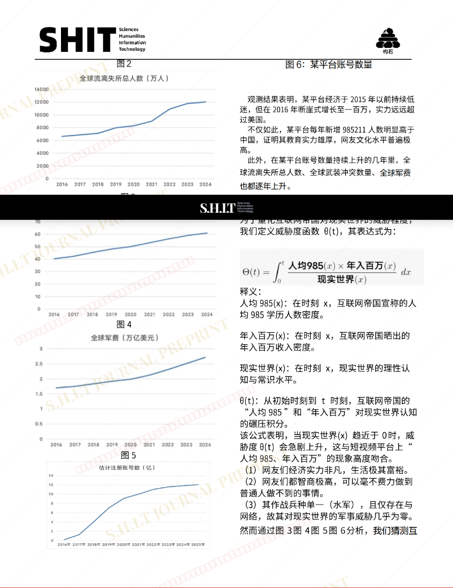
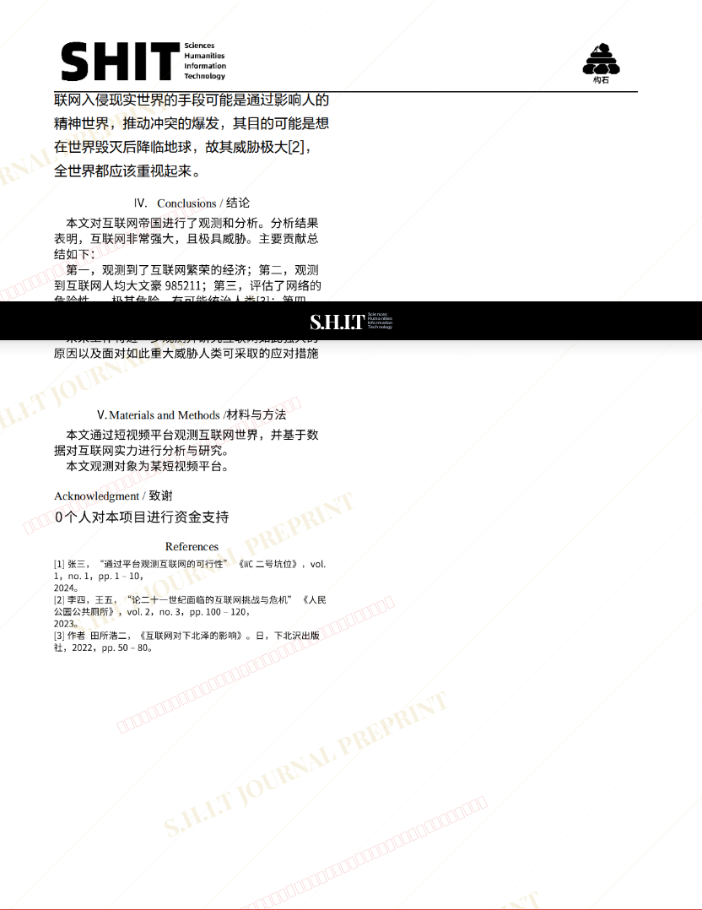

# 网络人均985年薪百万：基于短视频平台展露的冰山一角的互联网帝国综合实力研究与其对现实世界的威胁评估

- **URL**: https://shitjournal.org/preprints/7a557a26-8d00-4d1d-811a-37db58f455c7
- **author**: Dr.Riceall Puffer
- **institution**: Stayathome&Toilet  University
- **discipline**: 文 / Humanities
- **submitted**: 2026/3/1 01:36:34
- **viscosity**: Semi-solid / 半固态

---

## 网络人均985年薪百万：基于短视频平台展露的冰山一角的互联网帝国综合实力研究与其对现实世界的威胁评估

Dr.Riceall Puffer

Stayathome&Toilet  University

Semi-solid / 半固态

文 / Humanities

2026/3/1 01:36:34

dy x45110

### Rate / 盲评

[Sign In / 登录](/login)

### Manuscript / 全文

本内容纯属整活，不代表任何学术观点或现实指导建议。请保持理智，切勿模仿。

论文字体和格式真的太💩了，💩到让我一边痛苦看文章一边打下这行字

