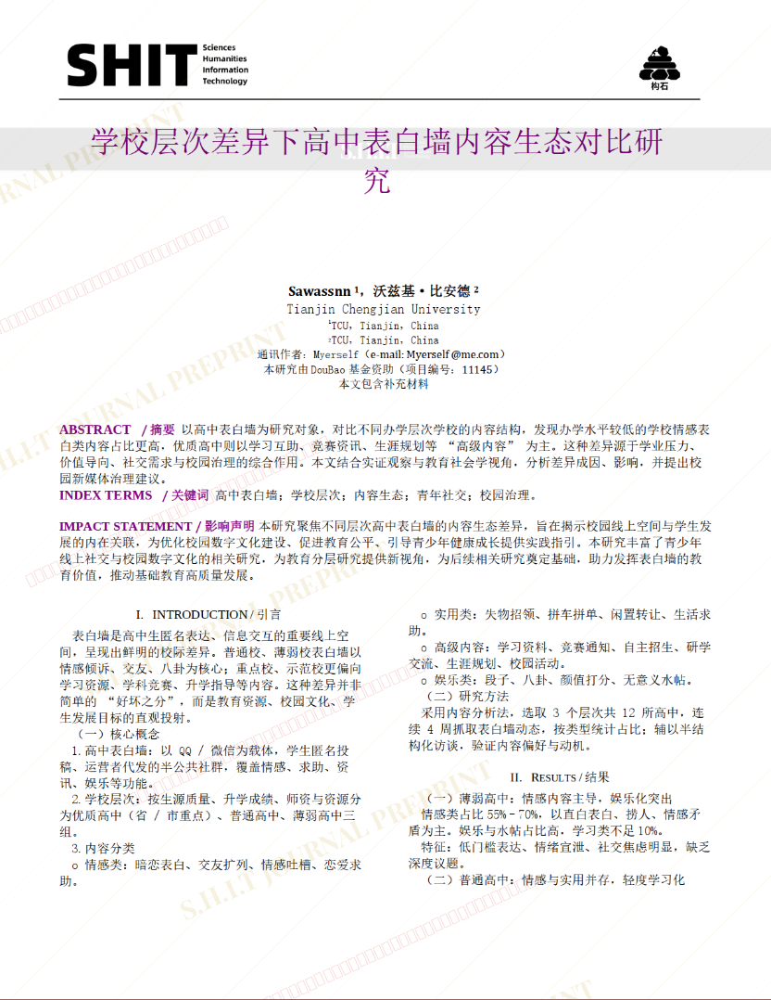

# 学校层次差异下高中表白墙内容生态对比研究

## 元信息

- **作者**: SAwassnn
- **机构**: 
- **分区**: sediment
- **学科**: law_social
- **标签**: meme
- **提交时间**: 2026-03-03T16:08:58.733395Z
- **评分**: 3.29 / 5（66 人）

## 链接

- [网站原始文章](https://shitjournal.org/preprints/7f5b15f0-411b-4832-a704-860a186f7df7)
- [PDF](https://files.shitjournal.org/7f5b15f0-411b-4832-a704-860a186f7df7.pdf)
- [文章元信息](7f5b15f0-411b-4832-a704-860a186f7df7.meta.json)

## 正文

