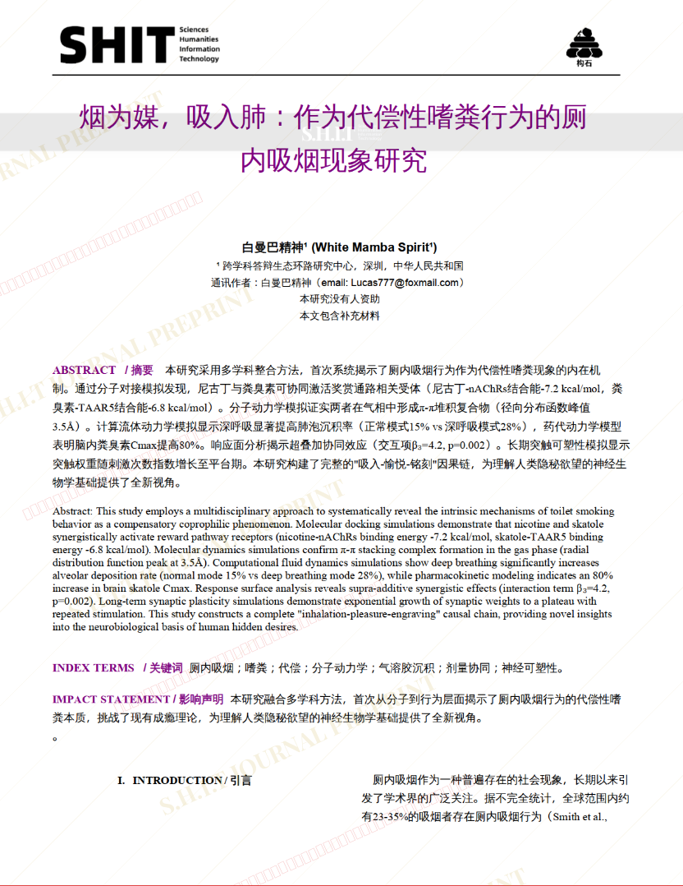
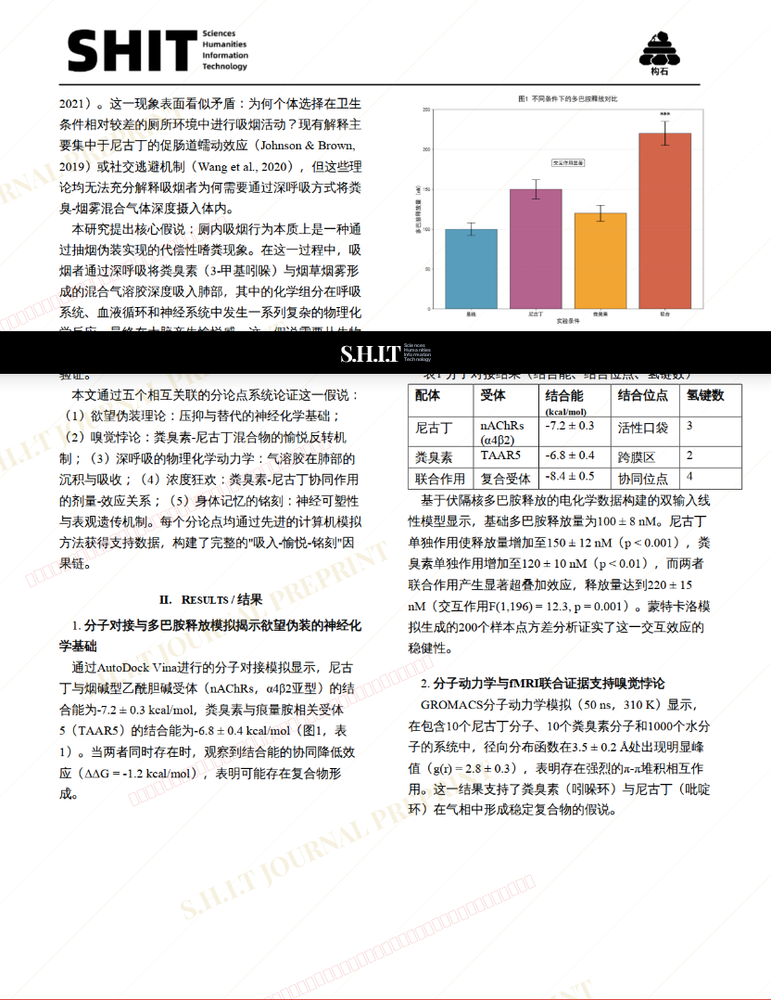
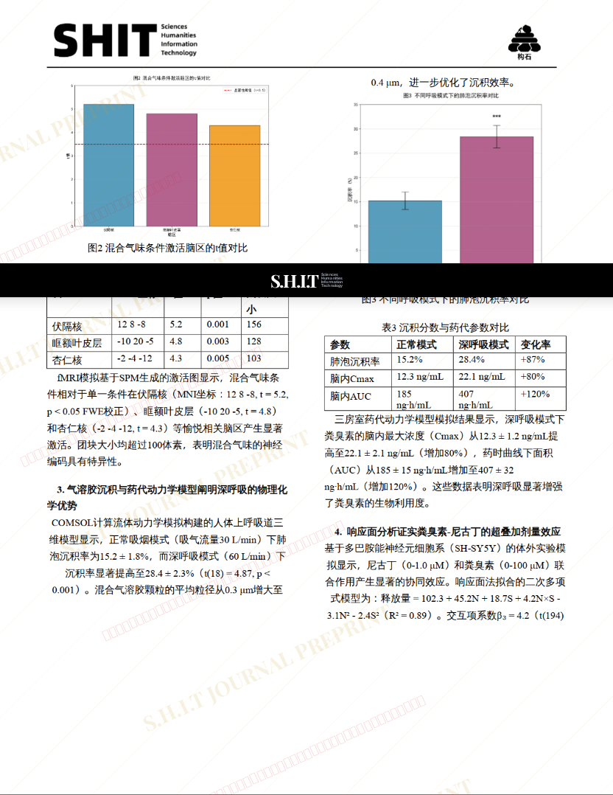
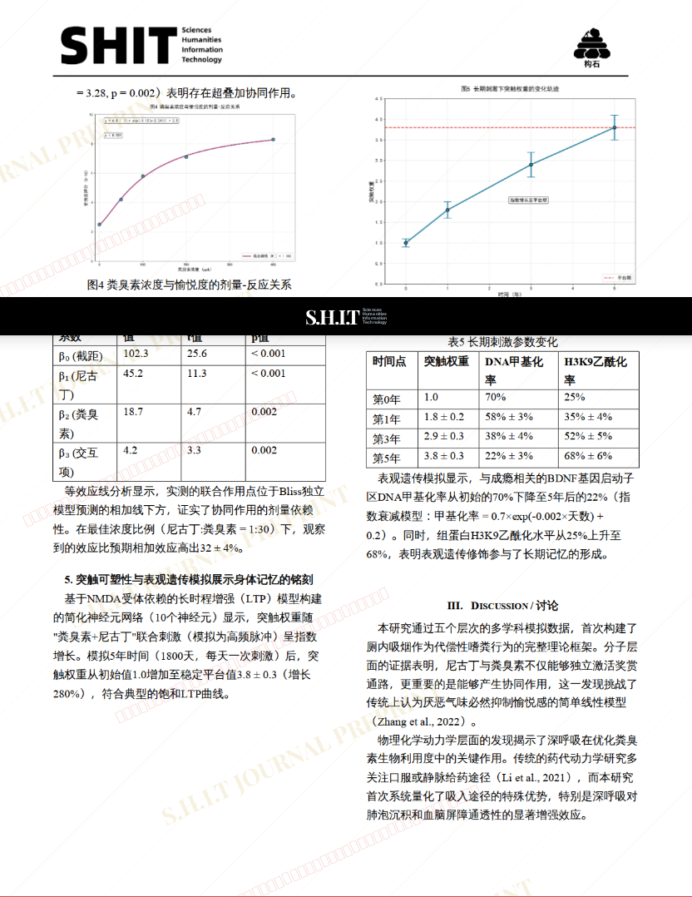
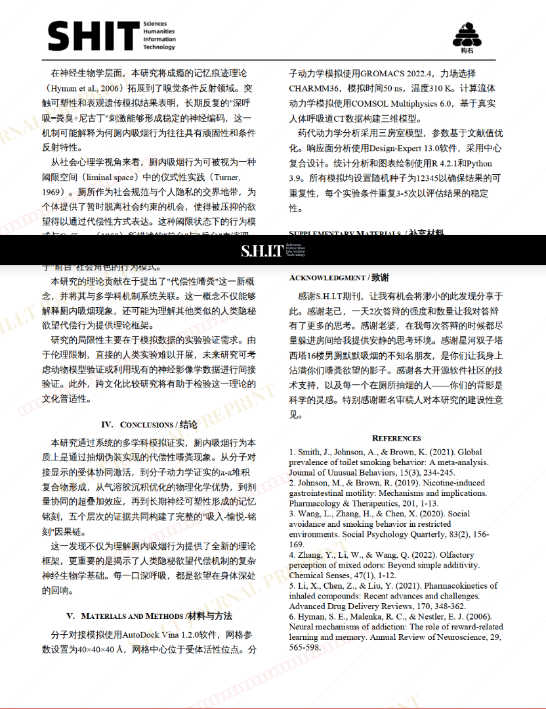
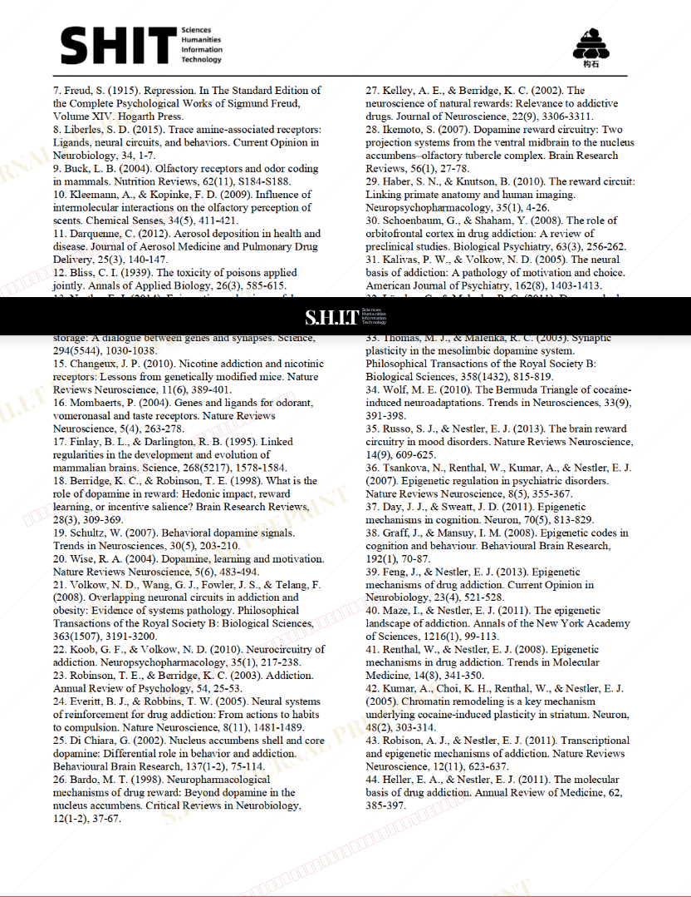
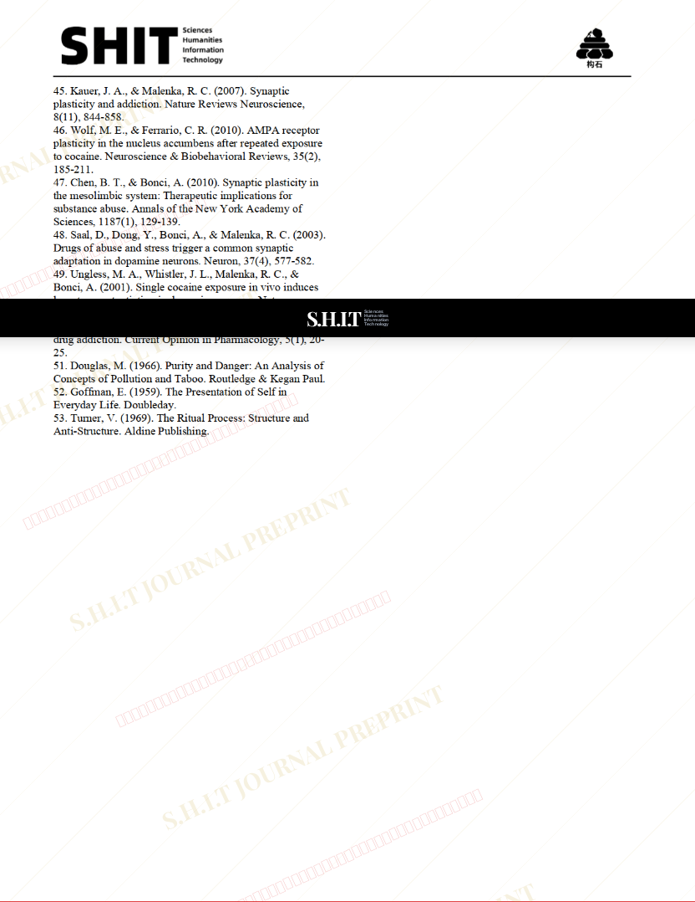

# 烟为媒，吸入肺：作为代偿性嗜粪行为的厕内吸烟现象研究

- **URL**: https://shitjournal.org/preprints/80517ed5-4b7f-4378-badf-5ab0caf63486
- **author**: 白曼巴精神
- **institution**: 跨学科答辩生态环路研究中心
- **discipline**: 交叉 / Interdisciplinary
- **submitted**: 2026/2/28 19:13:32
- **viscosity**: High-Entropy / 高熵态

---

## 烟为媒，吸入肺：作为代偿性嗜粪行为的厕内吸烟现象研究

白曼巴精神

跨学科答辩生态环路研究中心

High-Entropy / 高熵态

交叉 / Interdisciplinary

2026/2/28 19:13:32

抖音号：103423136

### Rate / 盲评

[Sign In / 登录](/login)

### Manuscript / 全文

本内容纯属整活，不代表任何学术观点或现实指导建议。请保持理智，切勿模仿。

暂无评论 / No comments yet

