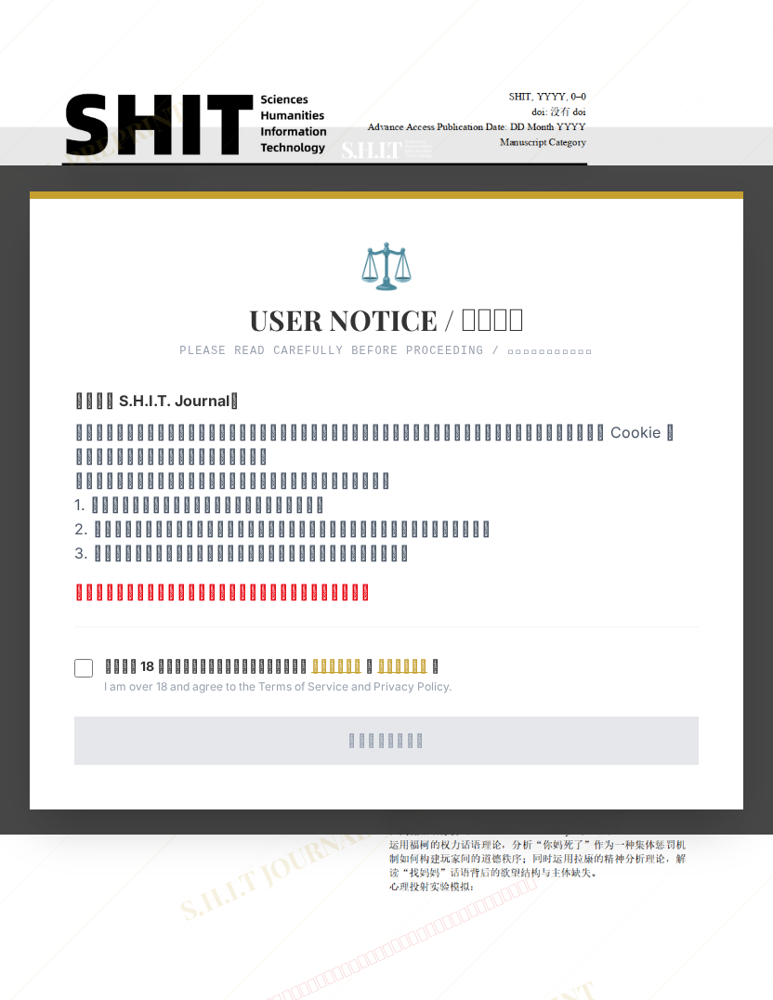

# 论三角洲中“堵桥者被咒杀双亲”与打瓦里“找妈妈”的本体论对冲

- **URL**: https://shitjournal.org/preprints/823b64d9-94cc-4d65-b3f7-8277d8f74489
- **author**: 小宋在种地
- **institution**: 家里蹲大学
- **discipline**: 交叉 / Interdisciplinary
- **submitted**: 2/27/2026, 1:14:23 PM

---

## 论三角洲中“堵桥者被咒杀双亲”与打瓦里“找妈妈”的本体论对冲

小宋在种地

家里蹲大学

纯享整活

交叉 / Interdisciplinary

2/27/2026, 1:14:23 PM

[登录](/login)

### Manuscript / 全文

本内容纯属整活，不代表任何学术观点或现实指导建议。请保持理智，切勿模仿。

暂无评论 / No comments yet

## USER NOTICE / 用户须知

Please read carefully before proceeding / 使用本网站前请仔细阅读

欢迎访问 S.H.I.T. Journal。

本平台为非营利性学术与文化讨论社区。为保障平台的正常运行、防范恶意攻击及履行必要的合规义务，本网站需使用 Cookie 及同类技术来维持登录状态及安全防护机制。

鉴于本平台内容的特殊性，您在进入本网站前，必须明确知悉并同意：1. 本网站内容仅代表作者个人观点，不代表平台立场。2. 您应当遵守适用法律法规，平台有权根据规则对违规内容采取清理、折叠或移交等措施。3. 您在使用本平台服务时产生的一切数据交互，均受本站法律条款约束。

如您拒绝接受本声明，请立即关闭浏览器标签页并停止访问本站。

[《用户协议》](/terms)
[《隐私政策》](/privacy)

