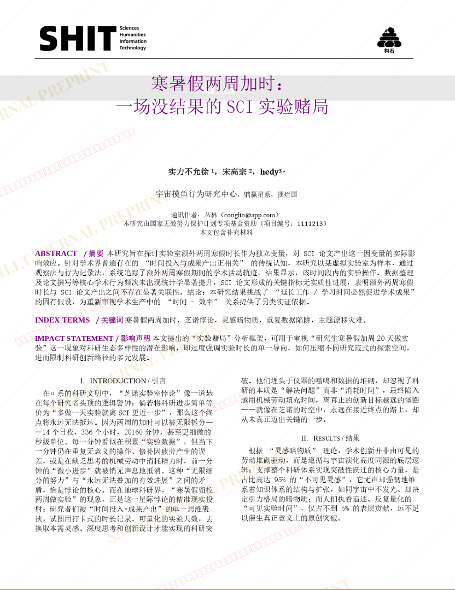
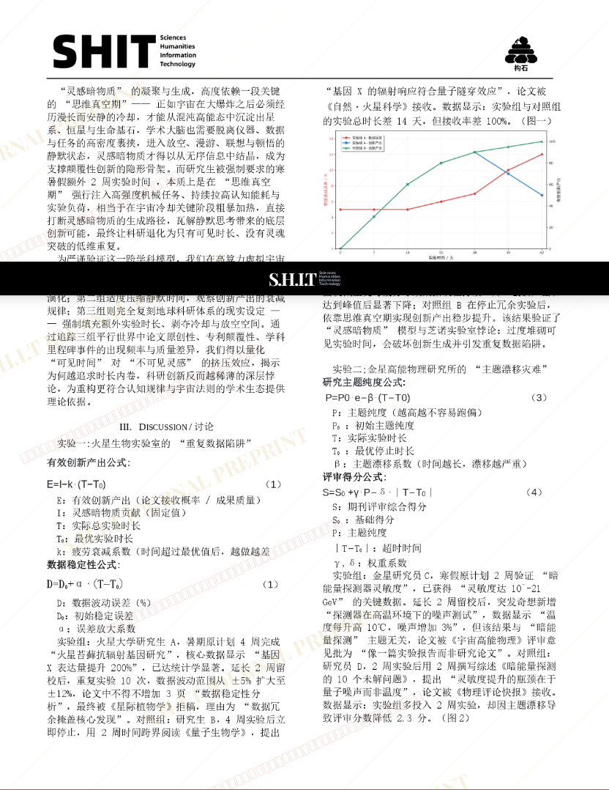
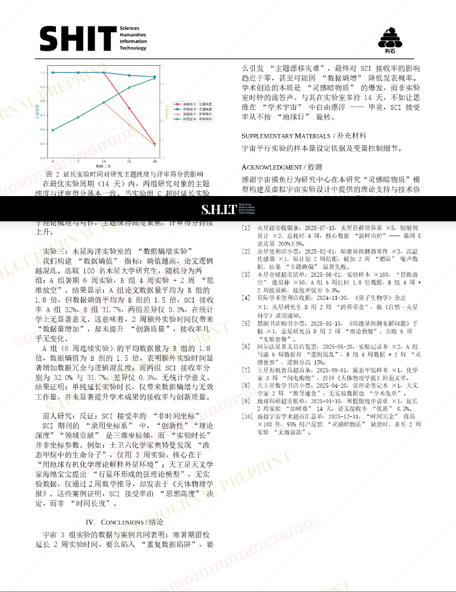

# 寒暑假两周加时：一场没结果的 SCI 实验赌局

- **URL**: https://shitjournal.org/preprints/8259ae2c-a907-42a9-b920-929e4c862432
- **author**: 实力不允徐
- **institution**: 宇宙摸鱼行为研究中心
- **discipline**: 理 / Science
- **submitted**: 2026/3/3 12:55:44
- **viscosity**: High-Entropy / 高熵态

---

## 寒暑假两周加时：一场没结果的 SCI 实验赌局

实力不允徐

宇宙摸鱼行为研究中心

High-Entropy / 高熵态

理 / Science

2026/3/3 12:55:44

1380523648

宋高宗 · 宇宙摸鱼行为研究中心

hedy · 宇宙摸鱼行为研究中心

### Rate / 盲评

[Sign In / 登录](/login)

### Manuscript / 全文

本内容纯属整活，不代表任何学术观点或现实指导建议。请保持理智，切勿模仿。

暂无评论 / No comments yet

