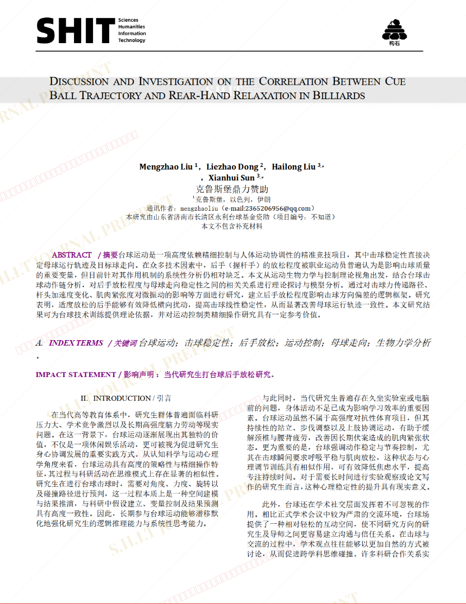
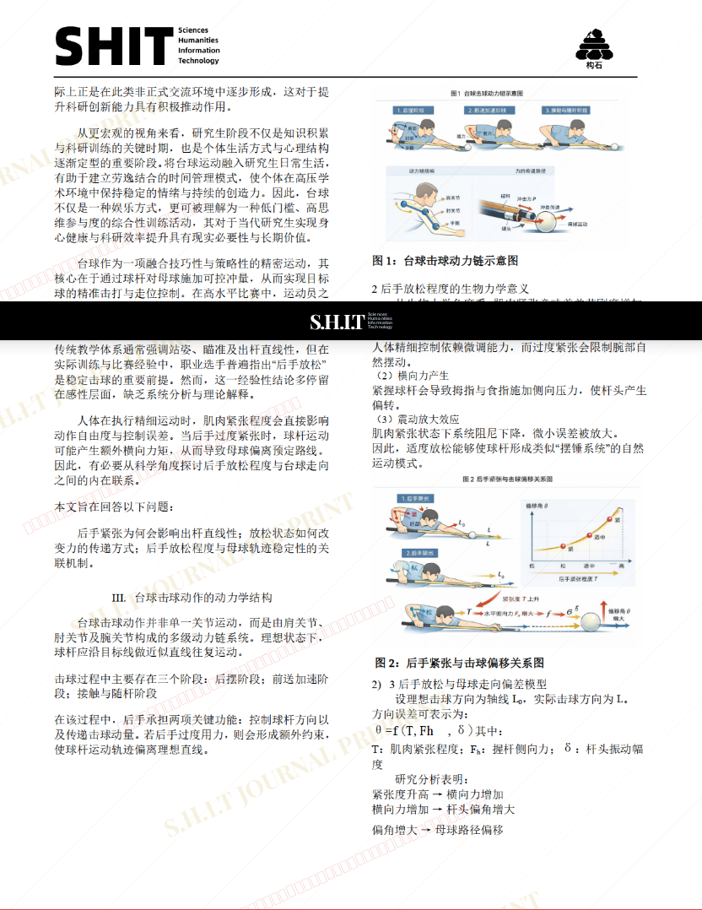
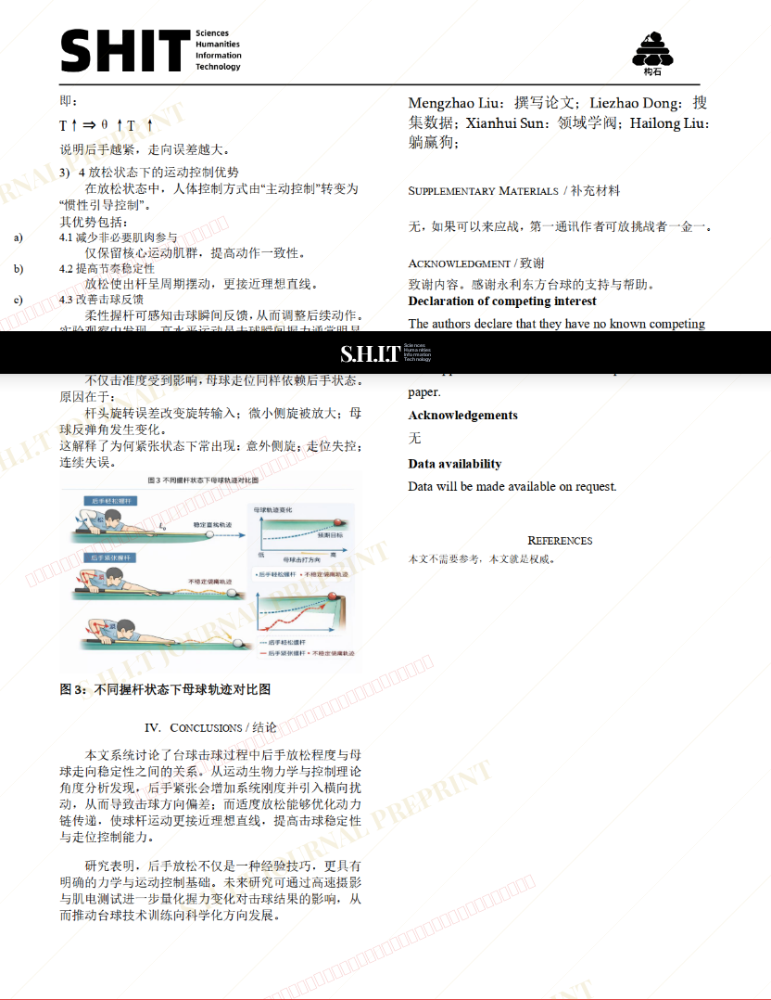

# Discussion and Investigation on the Correlation Between Cue Ball Trajectory and Rear-Hand Relaxation in Billiards

- **URL**: https://shitjournal.org/preprints/826ffe62-1d15-49f7-bec8-5d81cf465476
- **author**: 气功大最后的温柔
- **institution**: 气功大
- **discipline**: 理 / Science
- **submitted**: 2026/3/3 13:20:27
- **viscosity**: Semi-solid / 半固态

---

## Discussion and Investigation on the Correlation Between Cue Ball Trajectory and Rear-Hand Relaxation in Billiards

气功大最后的温柔

气功大

Semi-solid / 半固态

理 / Science

2026/3/3 13:20:27

332969531

xianhuisun · 气功大

dongliezhao · 气功大共一

liuhailong · 气功大

### Rate / 盲评

[Sign In / 登录](/login)

### Manuscript / 全文

本内容纯属整活，不代表任何学术观点或现实指导建议。请保持理智，切勿模仿。

暂无评论 / No comments yet

