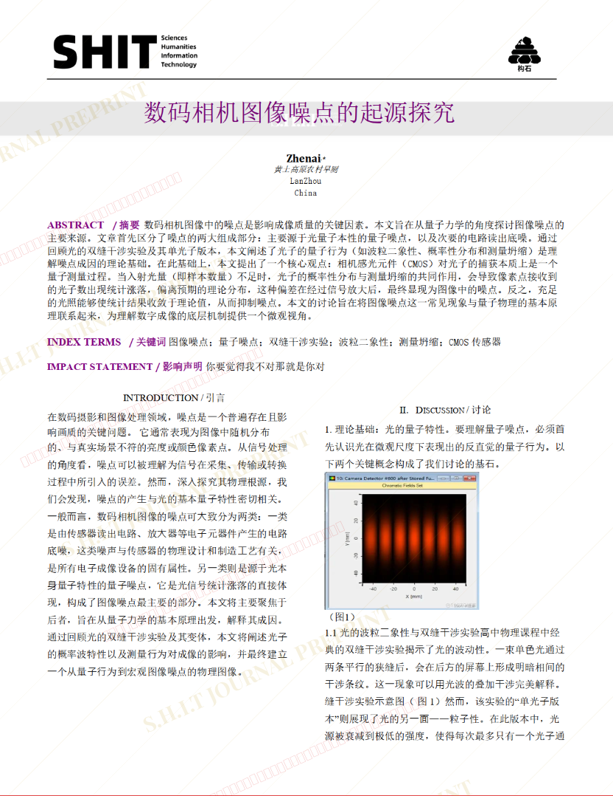

# 数码相机图像噪点的起源探究

## 元信息

- **作者**: 浪漫的真爱
- **机构**: 黄土高原农村旱厕
- **社交媒体**: B站：浪漫的真爱  UID:516691966
- **分区**: sediment
- **学科**: science
- **标签**: meme
- **提交时间**: 2026-03-03T16:51:29.573490Z
- **评分**: 3.52 / 5（42 人）

## 链接

- [网站原始文章](https://shitjournal.org/preprints/8467626b-bffd-49c0-aa5c-49d5f4ca09c2)
- [PDF](https://files.shitjournal.org/8467626b-bffd-49c0-aa5c-49d5f4ca09c2.pdf)
- [文章元信息](8467626b-bffd-49c0-aa5c-49d5f4ca09c2.meta.json)

## 正文

