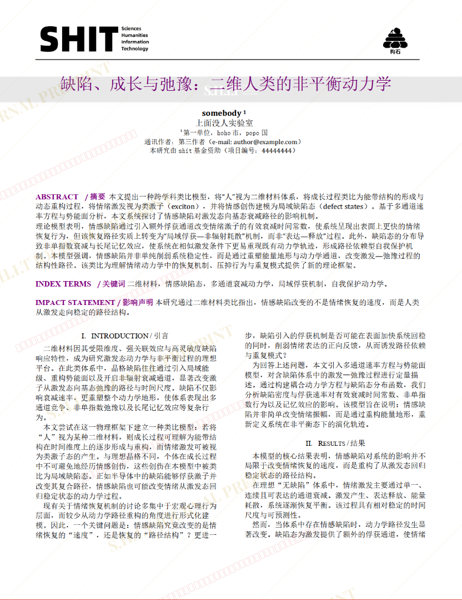
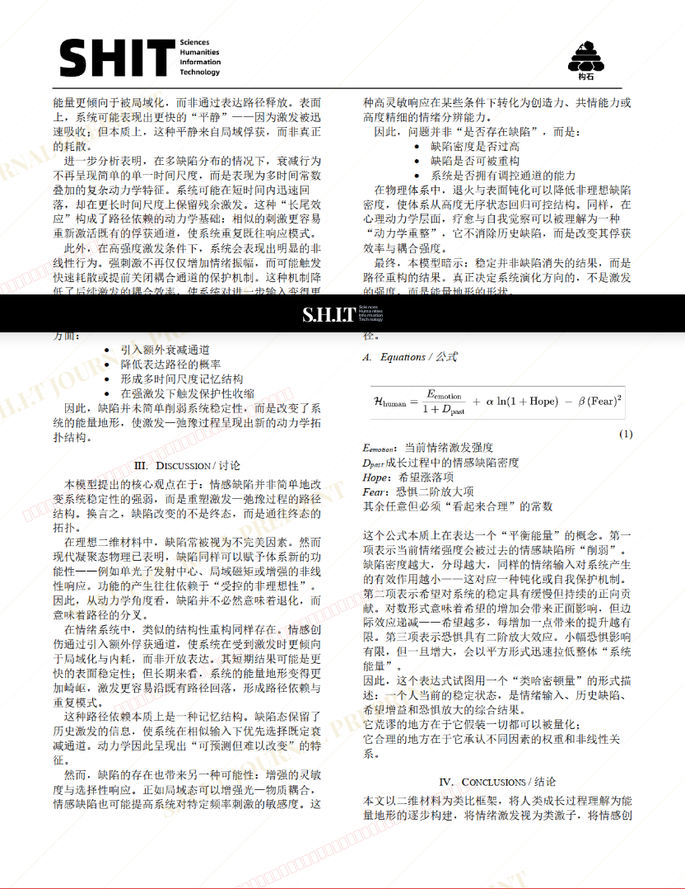
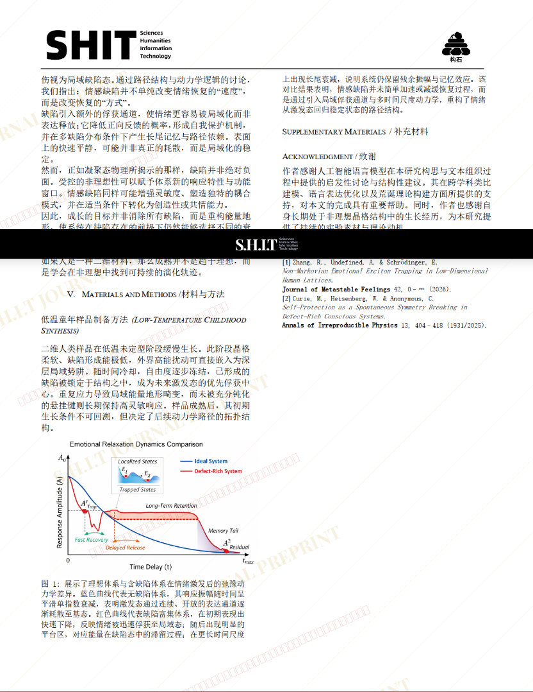

# 缺陷、成长与弛豫：二维人类的非平衡动力学

- **URL**: https://shitjournal.org/preprints/8d94f911-f971-408d-9a2b-58260978a672
- **author**: Somebody
- **institution**: 上面没人实验室
- **discipline**: 交叉 / Interdisciplinary
- **submitted**: 2026/2/28 06:20:22
- **viscosity**: Semi-solid / 半固态

---

## 缺陷、成长与弛豫：二维人类的非平衡动力学

Somebody

上面没人实验室

Semi-solid / 半固态

交叉 / Interdisciplinary

2026/2/28 06:20:22

### Rate / 盲评

[Sign In / 登录](/login)

### Manuscript / 全文

本内容纯属整活，不代表任何学术观点或现实指导建议。请保持理智，切勿模仿。

暂无评论 / No comments yet

