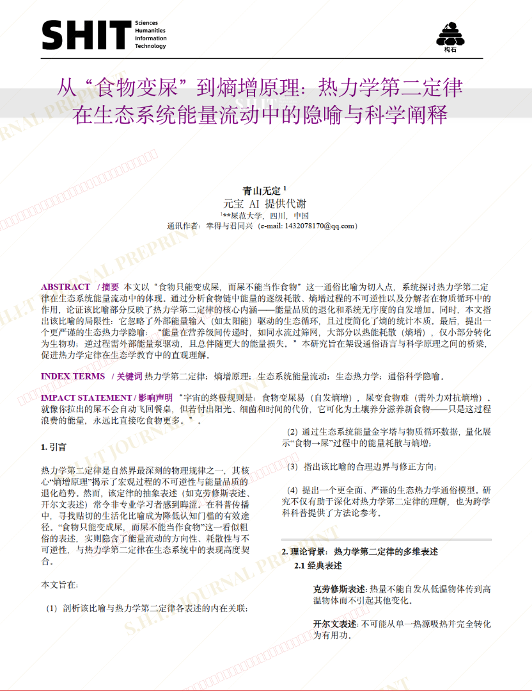
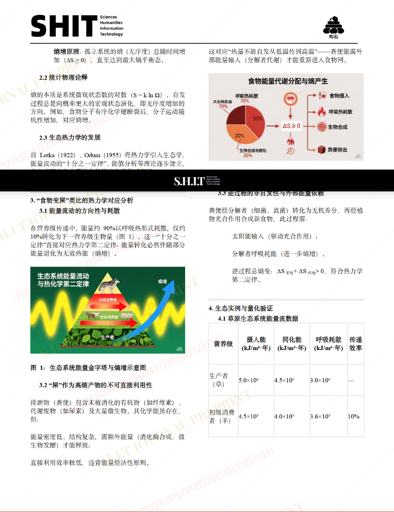
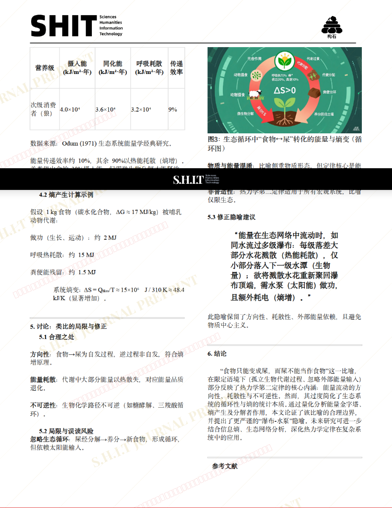
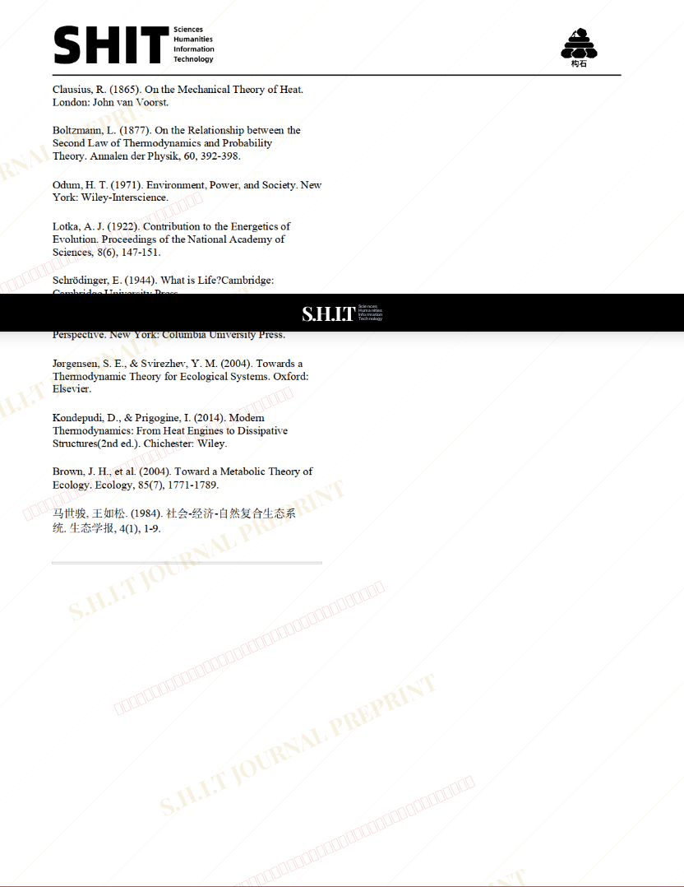

# 从“食物变屎”到熵增原理：热力学第二定律在生态系统能量流动中的隐喻与科学阐释

- **URL**: https://shitjournal.org/preprints/8f374d59-cf29-4ea4-800a-384b48522a9d
- **author**: 青山无定
- **institution**: **屎范大学
- **discipline**: 交叉 / Interdisciplinary
- **submitted**: 2026/2/28 07:14:52
- **viscosity**: High-Entropy / 高熵态

---

## 从“食物变屎”到熵增原理：热力学第二定律在生态系统能量流动中的隐喻与科学阐释

青山无定

**屎范大学

High-Entropy / 高熵态

交叉 / Interdisciplinary

2026/2/28 07:14:52

幸得与君同行

### Rate / 盲评

[Sign In / 登录](/login)

### Manuscript / 全文

本内容纯属整活，不代表任何学术观点或现实指导建议。请保持理智，切勿模仿。

暂无评论 / No comments yet

